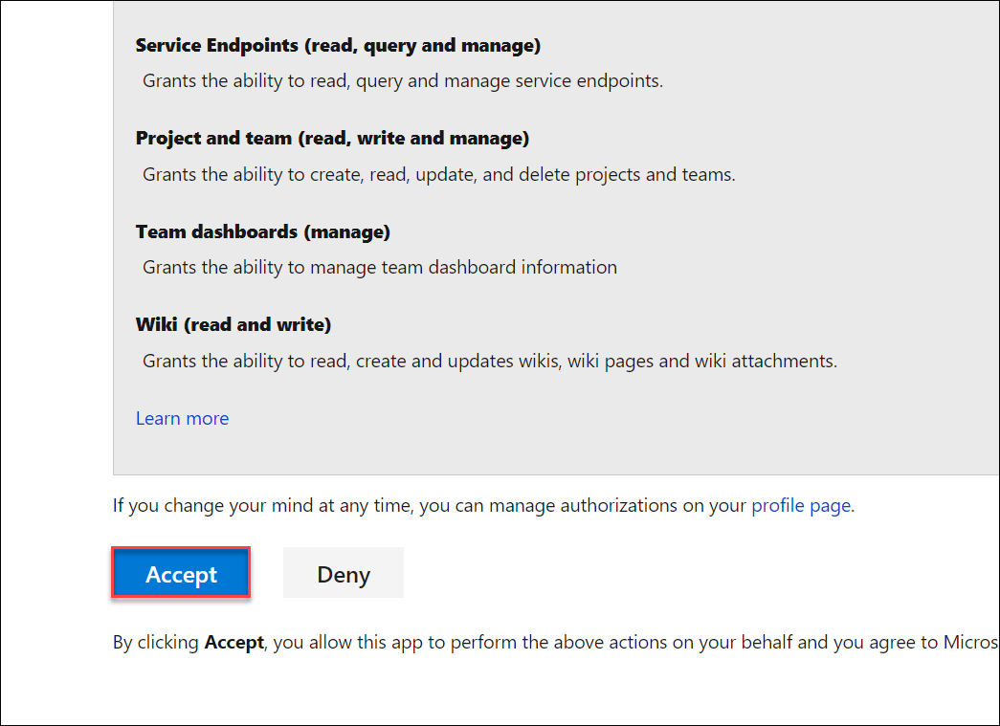
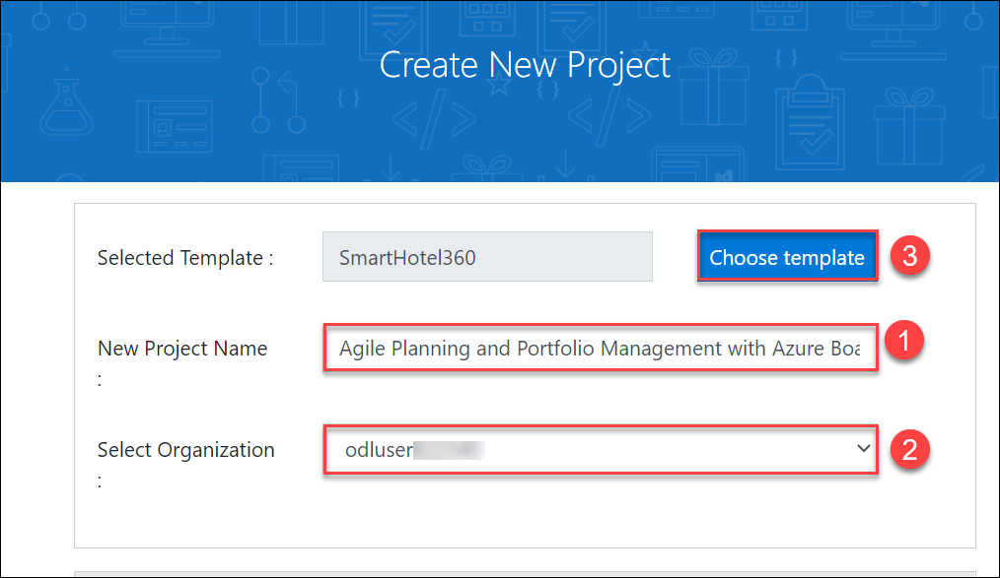
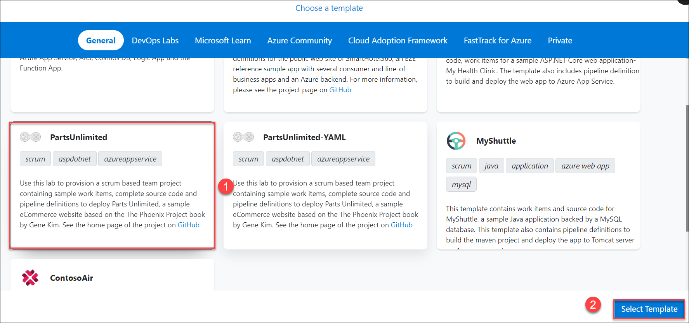
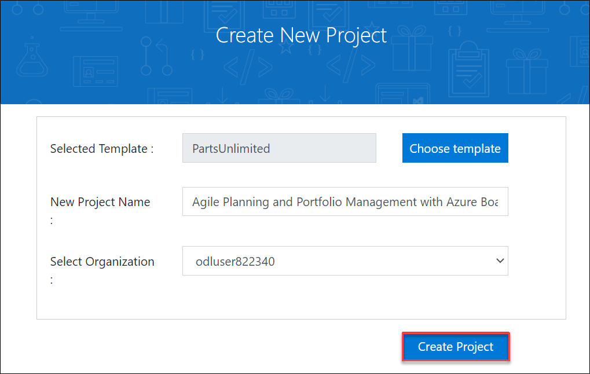
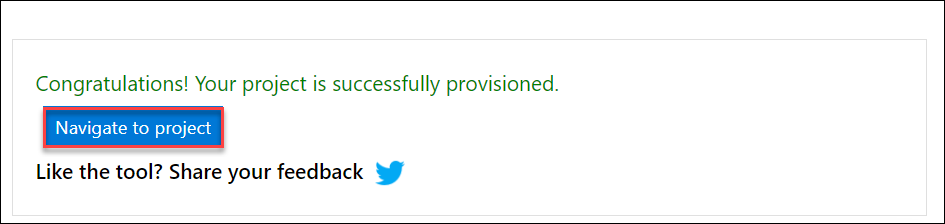

---
lab:
    title: 'Lab 00: Validate lab environment'
    module: 'Module 0: Welcome'
---

# Lab 00: Validate lab environment

# Student lab manual

## Instructions

> **Note**: Start at step 4, if you do already have a **personal Microsoft Account** setup and an active Microsoft Azure Pass subscription linked to that account.

1. Get a new **Azure Pass promocode** from the instructor or other source.
1. Use a private browser session to get a new **personal Microsoft Account (MSA)** at [https://account.microsoft.com](https://account.microsoft.com).
1. Using the same browser session, go to [https://www.microsoftazurepass.com](https://www.microsoftazurepass.com) to redeem your Azure Pass using your Microsoft Account (MSA). For details, see [Redeem a Microsoft Azure Pass](https://www.microsoftazurepass.com/Home/HowTo?Length=5). Follow the instructions for redemption. 

1. Open a browser and navigate to [https://portal.azure.com](https://portal.azure.com), then search at the top of the Azure portal screen for **Azure DevOps**. In the resulting page, click **Azure DevOps organizations**. 
1. Next, click on the link labelled **My Azure DevOps Organizations** or navigate directly to [https://aex.dev.azure.com](https://aex.dev.azure.com).
1. On the **We need a few more details** page, select **Continue**.
1. In the drop-down box on the left, choose **Default Directory**, instead of “Microsoft Account”.
1. If prompted (*"We need a few more details"*), provide your name, e-mail address, and location and click **Continue**.
1. Back at [https://aex.dev.azure.com](https://aex.dev.azure.com) with **Default Directory** selected click the blue button **Create new organization**.
1. Accept the *Terms of Service* by clicking **Continue**.
1. If prompted (*"Almost done"*), leave the name for the Azure DevOps organization at default (it needs to be a globally unique name) and pick a hosting location close to you from the list.
1. Once the newly created organization opens in **Azure DevOps**, click **Organization settings** in the bottom left corner.
1. At the **Organization settings** screen click **Billing** (opening this screen takes a few seconds).
1. Click **Setup billing** and on the right-hand side of the screen select the **Azure Pass - Sponsorship** subscription and click **Save** to link the subscription with the organization.
1. Once the screen shows the linked Azure Subscription ID at the top, change the number of **Paid parallel jobs** for **MS Hosted CI/CD** from 0 to **1**. Then click the **SAVE** button at the bottom. 
1. In **Organization Settings**, go to section **Security** and click **Policies**.
1. Toggle the switch to **On** for **Third-party application access via OAuth**
    > Note: The OAuth setting helps enable tools such as the DemoDevOpsGenerator to register extensions. Without this, several labs may fail due to a lack of the required extensions.
1. Toggle the switch to **On** for **Allow public projects**
    > Note: Extensions used in some labs might require a public project to allow using the free version.
1. **Wait at least 3 hours before using the CI/CD capabilities** so that the new settings are reflected in the backend. Otherwise, you will still see the message *"No hosted parallelism has been purchased or granted"*.

### Exercise 0: Configure the lab prerequisites

In this exercise, you will set up the prerequisite for the lab, which consists of the preconfigured Parts Unlimited team project based on an Azure DevOps Demo Generator template.

#### Task 1: Configure the team project

In this task, you will use Azure DevOps Demo Generator to generate a new project based on the **Parts Unlimited** template.

1. In a new tab of Edge browser navigate to https://azuredevopsdemogenerator.azurewebsites.net. This utility site will automate the process of creating a new Azure DevOps project within your account that is prepopulated with content (work items, repos, etc.) required for the lab. 

    > **Note**: For more information on the site, see https://docs.microsoft.com/en-us/azure/devops/demo-gen.

1. Click **Sign in** and if prompted sign with the credentials provided in environment details tab.

    

1. If required, on the **Azure DevOps Demo Generator** page, click **Accept** to accept the permission requests for accessing your Azure DevOps subscription.

   
 
1. On the **Create New Project** page, in the **New Project Name** textbox, type **Agile Planning and Portfolio Management with Azure Boards** (1), in the **Select organization** (2) dropdown list, select your Azure DevOps organization, and then click **Choose template** (3).

   

1. In the list of templates, locate the **PartsUnlimited** (1) template and click **Select Template** (2).

    

1. Back on the **Create New Project** page, click **Create Project**

    

    > **Note**: Wait for the process to complete. This should take about 2 minutes. In case the process fails, navigate to your Azure DevOps organization, delete the project, and try again.

1. On the **Create New Project** page, click **Navigate to project**.

    
