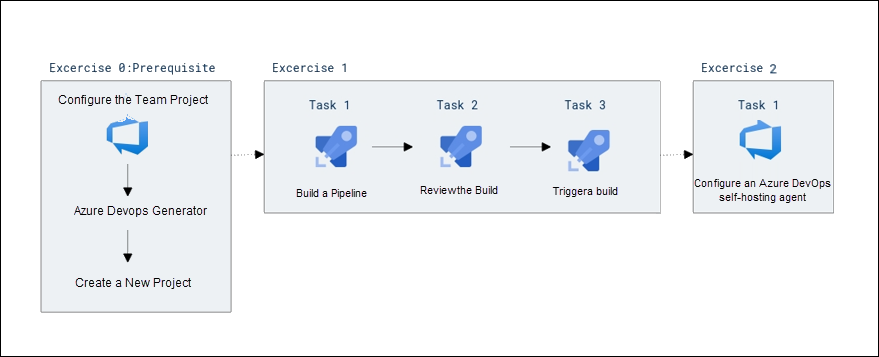

# Lab 01: Configuring Agent Pools and Understanding Pipeline Styles

## Lab overview

YAML-based pipelines allow you to fully implement CI/CD as code, in which pipeline definitions reside in the same repository as the code that is part of your Azure DevOps project. YAML-based pipelines support a wide range of features that are part of the classic pipelines, such as pull requests, code reviews, history, branching, and templates. 

Regardless of the choice of the pipeline style, to build your code or deploy your solution by using Azure Pipelines, you need an agent. An agent hosts compute resources that runs one job at a time. Jobs can be run directly on the host machine of the agent or in a container. You have an option to run your jobs using Microsoft-hosted agents, which are managed for you, or implementing a self-hosted agent that you set up and manage on your own. 

In this lab, you will learn how to implement and use self-hosted agents with YAML pipelines.

## Objectives

After you complete this lab, you will be able to:

- Implement YAML-based pipelines
- Implement self-hosted agents

## Estimated timing: 45 minutes

## Architecture Diagram

   

## Set up an Azure DevOps organization

1. On your lab VM open **Edge Browser** on desktop and navigate to https://go.microsoft.com/fwlink/?LinkId=307137. 

    * Email/Username: <inject key="AzureAdUserEmail"></inject>

    * Password: <inject key="AzureAdUserPassword"></inject>

2. In the pop-up for *Action Required*, select **Ask later**. 

3. On the next page accept defaults, fill the captcha and click on continue.

    
    
5. On the Azure DevOps page click on **Azure DevOps** located at top left corner and then click on **Organization Setting** at the left down corner

    .png)
    
6. In the **Organization Setting** window on the left menu click on **Billing (1)** and select **Setup Billing (2)** then click on **save (3)**.

    
        

7. On the **MS Hosted CI/CD** section under **Paid parallel jobs** enter value **1** and at the end of the page click on **Save**.

    

# Exercise 0: Configure the lab prerequisites

In this exercise, you will set up the prerequisite for the lab, which consists of the pre-configured Parts Unlimited team project based on an Azure DevOps Demo Generator template.

## Task 1: Configure the team project

In this task, you will create an **eShopOnWeb** Azure DevOps project to be used by several labs.

   1. On your lab computer, in a browser window open your Azure DevOps organization. Click on **New Project**. Give your project the name  **eShopOnWeb (1)**, select visibility as **Private(2)**  and leave the other fields with defaults. Click on **Create(3)**.

      

## Task 2: Configuring Components for Visual Studio

In this task you will import the eShopOnWeb Git repository that will be used by several labs.

1. On your lab computer, in a browser window open your Azure DevOps organization and the previously created eShopOnWeb project. Click on             **Repos (1)>Files (2) , Import a Repository**. Select **Import (3)**. On the **Import a Git Repository (4)** window, paste the following URL                     https://github.com/MicrosoftLearning/eShopOnWeb.git (5) and click **Import (6)**.

      
      
      

   2. The repository is organized the following way:

         o. **.ado** folder contains Azure DevOps YAML pipelines
         
         o **.devcontainer** folder container setup to develop using containers (either locally in VS Code or GitHub Codespaces)
         
         o **.azure** folder contains Bicep & ARM infrastructure as code templates used in some lab scenarios.
         
         o **.github** folder contains YAML GitHub workflow definitions.
         
         o. **src** folder contains the .NET 6 website used in the lab scenarios.
         
       

#### Task 3: Set main branch as default branch

1. Go to **Repos>Branches**.
1. Hover on the **main** branch then click the ellipsis on the right of the column.
1. Click on **Set as default branch**.

# Exercise 1: Author YAML-based Azure DevOps pipelines

In this exercise, you will create an application lifecycle build pipeline, using a YAML-based template.

## Task 1: Create an Azure DevOps YAML pipeline

In this task, you will create a template-based Azure DevOps YAML pipeline.

1. Go to **Pipelines (1)>Pipelines (2)**. Click on **Create Pipeline (3)** or **New Pipeline** button.

      

2. Select **Azure Repos Git (YAML)**

    

3. Select the **eShopOnWeb** repository.

    

4. Select **Existing Azure Pipelines YAML File**

    

5. Select the path **/.ado/eshoponweb-ci-pr.yml(1)** file then click on **Continue(2)**.

    
 
1. On the **Review your pipeline YAML** pane, review the sample pipeline. This is a rather straight-forward .NET application Build pipeline, which does the following:

   - A single Stage: Build
   - A single Job: Build
   - 4 tasks within the Build Job:
   - **DotNet Restore:** With NuGet Package Restore you can install all your project's dependency without having to store them in source control.      
   - **DotNet Build:** Builds a project and all of its dependencies.     
   - **DotNet Test:** .Net test driver used to execute unit tests.    
   - **DotNet Publish:** Publishes the application and its dependencies to a folder for deployment to a hosting system. In this case, it's                 **Build.ArtifactStagingDirectory**.
        
        

1. On the **Review your pipeline YAML** pane, click the down-facing caret symbol next to the **Run** button, click **Save**.

    

    > Note: we are just creating the pipeline definition for now, without running it. You will first set up an Azure DevOps agent pool and run the pipeline in a later exercise. 

# Exercise 2: Manage Azure DevOps agent pools

In this exercise, you will implement self-hosted Azure DevOps agent.

## Task 1: Configure an Azure DevOps self-hosting agent

In this task, you will configure your lab Virtual Machine as an Azure DevOps self-hosting agent and use it to run a build pipeline.

1.  In the Azure DevOps portal, in the upper right corner of the Azure DevOps page, click the **User settings** icon, in the dropdown menu, click **Personal access tokens**.

     
  
1.  On the **Personal Access Tokens** pane, and click **+ New Token**.

1.  On the **Create a new personal access token** pane, click the **Show all scopes** link and, specify the following settings and click **Create** (leave all others with their default values):

    | Setting | Value |
    | --- | --- |
    | Name | **eShopOnWeb** |
    | Scope (custom defined) | **Agent Pools** click Show all scopes (at the bottom of the window)|
    | Agent Pools | **Read and manage** |
    
    

1. On the **Success** pane, copy the value of the personal access token to Clipboard.

    > **Note**: Make sure you copy the token. You will not be able to retrieve it once you close this pane. 

    

1. On the **Success** pane, click **Close**.

1. On the **Personal Access Token** pane of the Azure DevOps portal, click **Azure DevOps** symbol in the upper left corner and then click **Organization settings** label in the lower left corner.

1. To the left side of the **Overview** pane, in the vertical menu, in the **Pipelines** section, click **Agent pools**.

1. On the **Agent pools** pane, in the upper right corner, click **Add pool**. 

1. On the **Add agent pool** pane, in the **Pool type** dropdown list, select **Self-hosted**, in the **Name** text box, type **az400m05l05a-pool**, under **Pipeline permissions** select the checkboxes and then click **Create**.

        
    
1.  Back on the **Agent pools** pane, click the entry representing the newly created **az400m05l05a-pool**. 

1.  On the **Jobs** tab of the **az400m05l05a-pool** pane,  click the **New agent** button.

1. On the **Get the agent** pane, ensure that the **Windows** and **x64** tabs are selected, and click **Download** to download the zip archive containing the agent binaries to download it into the local **Downloads** folder within your user profile.

   

   > **Note**: If you receive an error message at this point indicating that the current system settings prevent you from downloading the file, in the Browser window, in the upper right corner, click the gearwheel symbol designating the **Settings** menu header, in the dropdown menu, select **Internet Options**, in the **Internet Options** dialog box, click **Advanced**, on the **Advanced** tab, click **Reset**, in the **Reset Browser Settings** dialog box, click **Reset** again, click **Close**, and try the download again.

1.  Start Windows PowerShell as administrator and in the **Administrator: Windows PowerShell** console run the following lines to create the **C:\\agent** directory and extract the content of the downloaded archive into it.

    ```powershell
    cd \
    mkdir agent ; cd agent
    $TARGET = Get-ChildItem "$Home\Downloads\vsts-agent-win-x64-*.zip"
    Add-Type -AssemblyName System.IO.Compression.FileSystem
    [System.IO.Compression.ZipFile]::ExtractToDirectory($TARGET, "$PWD")
    ```

    >**Note**: If you encounter an error indicating that the item already exists, please disregard it and proceed with the next steps.

1.  In the same **Administrator: Windows PowerShell** console, run the following to configure the agent:

    ```powershell
    .\config.cmd
    ```

1.  When prompted, specify the values of the following settings:

    | Setting | Value |
    | ------- | ----- |
    | Enter server URL | Enter https://dev.azure.com/<organization_name>, where <organization_name> is your Azure DevOps organization name (after updating the url it look similar to https://dev.azure.com/odluser<inject key="DeploymentID" enableCopy="false"/>/) |
    | Enter authentication type (press enter for PAT) | **Hit Enter** |
    | Enter personal access token | The access token you recorded earlier in this task |
    | Enter agent pool (press enter for default) | enter **az400m05l05a-pool** |
    | Enter agent name (press enter for labvm-<inject key="DeploymentID" enableCopy="false"/>) | **Hit Enter** |
    | Enter work folder (press enter for _work) | **Hit Enter** |
    | **(Only if shown)** Enter Perform an unzip for tasks for each step. (press enter for N) | **WARNING**: only press **Enter** if the message is shown|
    | Enter run agent as service? (Y/N) (press enter for N) | **Y** |
    | enter enable SERVICE_SID_TYPE_UNRESTRICTED (Y/N) (press enter for N) | **Y** |
    | Enter User account to use for the service (press enter for NT AUTHORITY\NETWORK SERVICE) | **Hit Enter** |
    | Enter whether to prevent service starting immediately after configuration is finished? (Y/N) (press enter for N) | **Enter** |

    > **Note**: You can run self-hosted agent as either a service or an interactive process. You might want to start with the interactive mode, since this simplifies verifying agent functionality. For production use, you should consider either running the agent as a service or as an interactive process with auto-logon enabled, since both persist their running state and ensure that the agent starts automatically if the operating system is restarted.

    > **Note**: Verify that the agent is reporting the **Listening for Jobs** status.

      

1.  Switch to the browser window displaying the Azure DevOps portal and close the **Get the agent** pane.

1.  Back on the **Agents** tab of the **az400m05l05a-pool** pane, note that the newly configured agent is listed with the **Online** status.

1.  In the web browser window displaying the Azure DevOps portal, in the upper left corner, click the **Azure DevOps** label.

1.  In the browser window displaying the list of projects, click the tile representing your **eShopOnWeb** project.
 
1.  On the **eShopOnWeb** pane, in the vertical navigational pane on the left side, in the **Pipelines** section, click **Pipelines**. 

1.  On the **Recent** tab of the **Pipelines** pane, select **eShopOnWeb** and, on the **eShopOnWeb** pane, select **Edit**.

1. On the **eShopOnWeb** edit pane, in the existing YAML-based pipeline, replace line 13 which says  `vmImage: ubuntu-latest` designating the target agent pool the following content, designating the newly created self-hosted agent pool:

    ```yaml
    name: az400m05l05a-pool
    demands:
    - agent.name -equals Agentname
    ```
    > **Note**: Replace Agentname with **labvm-<inject key="DeploymentID" enableCopy="false"/>**

 
    
    
    > **WARNING**: Be careful with copy/paste, make sure you have same indentation shown above. 
 
1.  On the **eShopOnWeb** edit pane, in the upper right corner of the pane, click **Validate + Save** and, on the **Save** pane, click **Save** again. This will automatically trigger the build based on this pipeline. 

1. On the **Recent** tab of the **Pipelines** pane, click the **eShopOnWeb** entry, click on **Run** to run the pipeline

1. Depending on your lab setup, the pipeline might prompt you for permissions. Click **Permit** to allow the pipeline to run. 

1. Wait until the build got succeeded.

1. Your pipeline will take a name based on the project name. Let's **rename** it for identifying the pipeline better. Go to **Pipelines>Pipelines** and click on the recently created pipeline. Click on the **ellipsis (1)** and **Rename/move (2)** option.
   
      

1. Name it **eshoponweb-ci-pr (1)** and click on **Save (2)**.

        


<validation step="38dc84d9-2b4f-44c8-bf6f-1da2f5a9cde7" />

## Review

In this lab, you learned how to convert classic pipelines into YAML-based ones and how to implement and use self-hosted agents.
