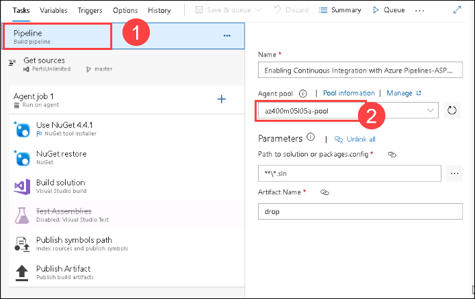

# Lab 04: Enabling Continuous Integration with Azure Pipelines
# Student lab manual

## Lab overview

In this lab, you will learn how to configure continuous integration (CI) and continuous deployment (CD) for your applications using Build and Release in Azure Pipelines. This scriptable CI/CD system is both web-based and cross-platform, while also providing a modern interface for visualizing sophisticated workflows. Although we won’t demonstrate all of the cross-platform possibilities in this lab, it is important to point out that you can also build for iOS, Android, Java (using Ant, Maven, or Gradle) and Linux.

## Objectives

After you complete this lab, you will be able to:

-   Create a basic build pipeline from a template
-   Track and review a build
-   Invoke a continuous integration build

## Instructions

### Exercise 0: Configure the lab prerequisites

In this exercise, you will set up the prerequisites for the lab, which consist of a new Azure DevOps project with a repository based on the **eShopOnWeb**.

#### Task 1: Create and configure the team project

In this task, you will create an **eShopOnWeb** Azure DevOps project to be used by several labs.

   1. On your lab computer, in a browser window open your Azure DevOps organization. Click on **New Project**. Give your project the name **eShopOnWeb** and leave the other fields with defaults. Click on **Create**

**Task 2: (skip if done) Import eShopOnWeb Git Repository**

  In this task you will import the eShopOnWeb Git repository that will be used by several labs.
  
   1. On your lab computer, in a browser window open your Azure DevOps organization and the previously created eShopOnWeb project. Click on **Repos>Files , Import a Repository**. Select **Import**. On the **Import a Git Repository** window, paste the following URL https://github.com/MicrosoftLearning/eShopOnWeb.git and click **Import:**

   2. The repository is organized the following way:

         o. **.ado** folder contains Azure DevOps YAML pipelines
         
         o **.devcontainer** folder container setup to develop using containers (either locally in VS Code or GitHub Codespaces)
         
         o **.azure** folder contains Bicep & ARM infrastructure as code templates used in some lab scenarios.
         
         o **.github** folder contains YAML GitHub workflow definitions.
         
         o. **src** folder contains the .NET 6 website used in the lab scenarios.
         
 **Exercise 1: Include build validation as part of a Pull Request**
 
 In this exercise, you will include build validation to validate a Pull Request.
 
 **Task 1: Import the YAML build definition**
 
 In this task, you will import the YAML build definition that will be used as a Branch Policy to validate the pull requests.
 
 Let's start by importing the build pipeline named **eshoponweb-ci-pr.yml**.
 
   1. Go to **Pipelines>Pipelines**

   2. Click on **Create Pipeline** or **New Pipeline** button

   3. Select **Azure Repos Git (YAML)**

   4. Select the **eShopOnWeb** repository

   5. Select **Existing Azure Pipelines YAML File**

   6. Select the **/.ado/eshoponweb-ci-pr.yml** file then click on **Continue**

      The build definition consists of the following tasks:
      
         o **DotNet Restore:** With NuGet Package Restore you can install all your project's dependency without having to store them in source                   control. 
        
         o **DotNet Build:** Builds a project and all of its dependencies.
        
         o **DotNet Test:** .Net test driver used to execute unit tests.
        
         o **DotNet Publish:** Publishes the application and its dependencies to a folder for deployment to a hosting system. In this case, it's                 **Build.ArtifactStagingDirectory**.
        
   7. Click the **Save** button to save the pipeline definition
     
   8. Your pipeline will take a name based on the project name. Let's **rename** it for identifying the pipeline better. Go to **Pipelines>Pipelines** and click on the recently created pipeline. Click on the ellipsis and **Rename/Remove** option. Name it **eshoponweb-ci-pr** and click on **Save**.

**Task 2: Branch Policies**

In this task, you will add policies to the main branch and only allow changes using Pull Requests that comply with the defined policies. You want to ensure that changes in a branch are reviewed before they are merged.

   1. Go to **Repos>Branches** section.
   
   2. On the **Mine** tab of the **Branches** pane, hover the mouse pointer over the **main** branch entry to reveal the ellipsis symbol on the         right side.

   3. Click the ellipsis and, in the pop-up menu, select **Branch Policies**.

   4. On the main tab of the repository settings, enable the option for **Require minimum number of reviewers**. Add 1 reviewer and check the box      **Allow requestors to approve their own changes**(as you are the only user in your project for the lab)

   5. On the **main** tab of the repository settings, in the **Build Validation** section, click + (Add a new build policy) and in the Build pipeline list, select **eshoponweb-ci-pr** then click **Save**

 **Task 3: Working with Pull Requests**
 
 In this task, you will use the Azure DevOps portal to create a Pull Request, using a new branch to merge a change into the protected main branch.
 
 1. Navigate to the **Repos** section in the eShopOnWeb navigation and click **Branches**.

 2. Create a new branch named **Feature01** based on the **main** branch.

 3. Click *Feature01 and navigate to the **/eShopOnWeb/src/Web/Program.cs** file as part of the **Feature01** branch and make the following change on the first line:

```
// Testing my PR
```
 
 

   
   


 .


     

  
        
        
 
 
 
 
 


    > **Note**: For more information on the site, see https://docs.microsoft.com/en-us/azure/devops/demo-gen.

2.  Click **Sign in** and if prompted sign with the credentials provided in environment details tab.

     
3.  If required, on the **Azure DevOps Demo Generator** page, click **Accept** to accept the permission requests for accessing your Azure DevOps subscription.
4.  On the **Create New Project** page, in the **New Project Name** textbox, type **Enabling Continuous Integration with Azure Pipelines**, in the **Select organization** dropdown list, select your Azure DevOps organization, and then click **Choose template**.

     
     
5.  In the list of templates, locate the **PartsUnlimited** template and click **Select Template**.

    
6.  Back on the **Create New Project** page, click **Create Project**

    > **Note**: Wait for the process to complete. This should take about 2 minutes. In case the process fails, navigate to your DevOps organization, delete the project, and try again.

7.  On the **Create New Project** page, click **Navigate to project**.

    

### Exercise 1: Introduction to Azure DevOps Build 

In this exercise, you will create a basic build pipeline from a template, track and review the new build job, and trigger a continuous integration build.

#### Task 1: Creating a basic build pipeline from a template

In this task, you will create and configure a build pipeline by using a predefined template.

1.  In the web browser displaying your Azure DevOps organization with the **Enabling Continuous Integration with Azure Pipelines** project you generated in the previous exercise, in the vertical navigational pane, select the **Pipelines** section and ensure that the **Pipelines** view is displayed.

      

    > **Note**: Alternatively, you can access the project page directly by navigating to the [https://dev.azure.com/`<your-Azure-DevOps-account-name>`/Enabling%20Continuous%20Integration%20with%20Azure%20Pipelines) URL, where the `<your-Azure-DevOps-account-name>` placeholder, represents your account name. 

2.  On the **Pipelines** pane, hover the mouse pointer over the entry representing the existing **PartsUnlimitedE2E** pipeline to reveal the ellipsis symbol on the right side.
3.  Click the ellipsis and, in the dropdown menu, click **Edit**.

    

   > **Note**: In order to avoid two pipelines being triggered later in the lab, start by disabling the CI trigger for the pipeline created by the template.

4.  On the **Tasks** tab of the **PartsUnlimitedE2E** pane, click the **Triggers** tab, clear the checkbox **Enable continuous integration**, click **Save & queue** and then click **Save**.
  
    

5.  To create a new pipeline, navigate back to the **Pipelines** view by selecting **Pipelines** in the vertical navigational pane in the Azure DevOps portal.
6.  Back on the **Pipelines** pane, click **New pipeline** to create a new build pipeline.

   

> **Note**: The default option for build pipelines involves the use of YAML. For this lab, you will use the classic editor. 

7.  On the **Where is your code ?** pane, click the **Use the classic editor** link at the bottom of the page.

   

 > **Note**: You need to start by configuring the source repository. Every major platform is available, but the default options are all we need here. This build will use the **master** branch of the **PartsUnlimited** repo. 

8.  Ensure that the **Azure Repos Git** option with the **PartsUnlimited** repository and **master** branch entries are selected, and click **Continue**.

  
9.  On the **Choose a template** pane, in the **Search** text box, type **ASP.NET**, in the list of results, select the **ASP.NET** template and click **Apply** to apply this template to the build definition. 

  

  > **Note**: Note that there are many options that should cover all of our mainstream scenarios. For our purposes here, we'll just build the project using the baseline ASP.NET template. The process for this build pipeline is easy to follow. After getting the source, Azure DevOps will use NuGet to restore any dependent packages. Then, the project will be built and tested. The results will then be published to the configured target.

10. On the **Tasks** tab, Click on **Pipelines** task , and select the Agent pool  **az400m05l05a-pool** from the drop down list.

   

10. On the **Tasks** tab, look for **test Assemblies** task , right-click and **disable selected task(s)**.

   
  
   

11.  Select the **Variables** tab and review its content.

   

   > **Note**: Here you can configure special parameters to be used during the build, such as the configuration or platform.

12.  Select the **Triggers** tab and check the **Enable continuous integration** checkbox. 

   

  > **Note**: This automatically invokes the build whenever source changes are committed. Triggers allow you to automatically invoke builds on a schedule, when another build completes, or when changes are made to the source.

13.  Select the **Options** tab and review its content.

  

 > **Note**: This section includes a wide variety of options related to the build workflow. Note that you'll generally configure options for specific build tasks on the configuration views of the tasks themselves.

14.  Select the **History** tab. 


   > **Note**: At this point, the tab does not contain any entries, but it will show a history of changes you make to the build definition.

15.  Select the **Save & Queue** tab header and, in the dropdown menu, select **Save & Queue** entry to save and queue a new build.

  > **Note**: You can define the retention time for pipeline artifacts from **Project Settings** > **Settings** > **Retention policy**. These settings enable you to configure which pipeline runs are retained and for how long. 

16.  In the **Run pipeline** pane, accept the default options and click **Save and run**. This will automatically display the **Summary** tab of the pipeline run job, with the **Queued** status.


#### Task 2: Tracking and reviewing a build

In this task, you will track and review the new build job.

> **Note**: Once the build begins, you'll be able to track the console output per task. 

1.  On the **Summary** tab of the pipeline run job, in the **Jobs** section, click **Agent job 1**. This will display the details pane of the job.

    > **Note**: If you want to review an earlier task, you can scroll the right pane to review its logs.

2.  Once the build completes successfully, on the job details pane, click the left-facing arrow to return to the summary view. 

    > **Note**: The summary view provides overview details about the build, including details about commits, tests, and artifacts.


#### Task 3: Invoking a continuous integration build

In this task, you will trigger a continuous integration build.

   > **Note**: In the first task of this exercise, you configured the build to support continuous integration. In this task, you will test its functionality.

1.  In the web browser window displaying your project settings in the Azure DevOps portal, in the vertical navigational pane, select the **Repos** section and ensure that the **Files** view is displayed.
2.  In the middle pane, navigate to the file **PartsUnlimited-aspnet45/src/PartsUnlimitedWebsite/Views/Home/Index.cshtml** and select it. 
3.  On the **Index.cshtml** pane, click **Edit**.
4.  On the **Index.cshtml** pane, make a minor update by changing the line `ViewBag.Title = "Home Page";` to `ViewBag.Title = "Lab Project Home Page";` and click **Commit**.
5.  On the **Commit** pane, accept the default commit details and click **Commit**.

    > **Note**: This will automatically trigger a build. 

6.  In the vertical navigational pane, select the **Pipelines** section and ensure that the **Pipelines** view is displayed.
7.  On the **Pipelines** pane, verify that it contains the entry representing a new build, which was triggered by your change. 
8.  Click the build entry to display its details and verify that it completed successfully. 

#### Review

In this lab, you used the Azure DevOps portal to create a basic build pipeline from a template, to track and review a build, and to invoke a continuous integration build.
