# Lab 04: Enabling Continuous Integration with Azure Pipelines

## Lab overview

In this lab, you will learn how to configure continuous integration (CI) and continuous deployment (CD) for your applications using Build and Release in Azure Pipelines. This scriptable CI/CD system is both web-based and cross-platform, while also providing a modern interface for visualizing sophisticated workflows. Although we won’t demonstrate all of the cross-platform possibilities in this lab, it is important to point out that you can also build for iOS, Android, Java (using Ant, Maven, or Gradle) and Linux.

## Objectives

After you complete this lab, you will be able to:

-   Create a basic build pipeline from a template
-   Track and review a build
-   Invoke a continuous integration build

## Architecture Diagram

  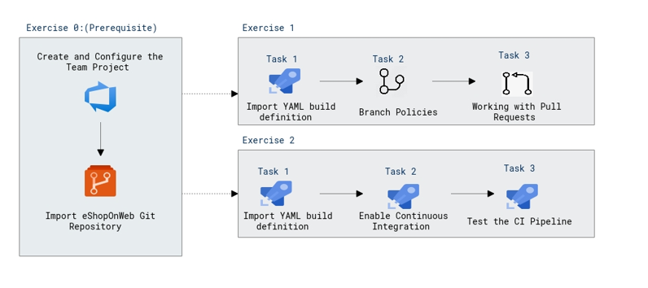

# Set up an Azure DevOps organization (Skip if already done).

1. On your lab VM open **Edge Browser** on desktop and navigate to [Azure DevOps](https://go.microsoft.com/fwlink/?LinkId=307137), and if prompted sign with the credentials.

    * Email/Username: <inject key="AzureAdUserEmail"></inject>

    * Password: <inject key="AzureAdUserPassword"></inject>

2. In the pop-up for *Help us protect your account*, select **Skip for now (14 days until this is required)**.

3. On the next page accept defaults and click on continue.
   
   
   
4. On the **Almost Done...** page fill the captcha and click on continue. 

   

# Exercise 0: Configure the lab prerequisites

In this exercise, you will set up the prerequisites for the lab, which consist of a new Azure DevOps project with a repository based on the **eShopOnWeb**.

## Task 1: Create and configure the team project

In this task, you will create an **eShopOnWeb** Azure DevOps project to be used by several labs.

   1. On your lab computer, in a browser window open your Azure DevOps organization. Click on **New Project**. Give your project the name  **eShopOnWeb (1)**, select visibility as **Private(2)**  and leave the other fields with defaults. Click on **Create project (3)**.

      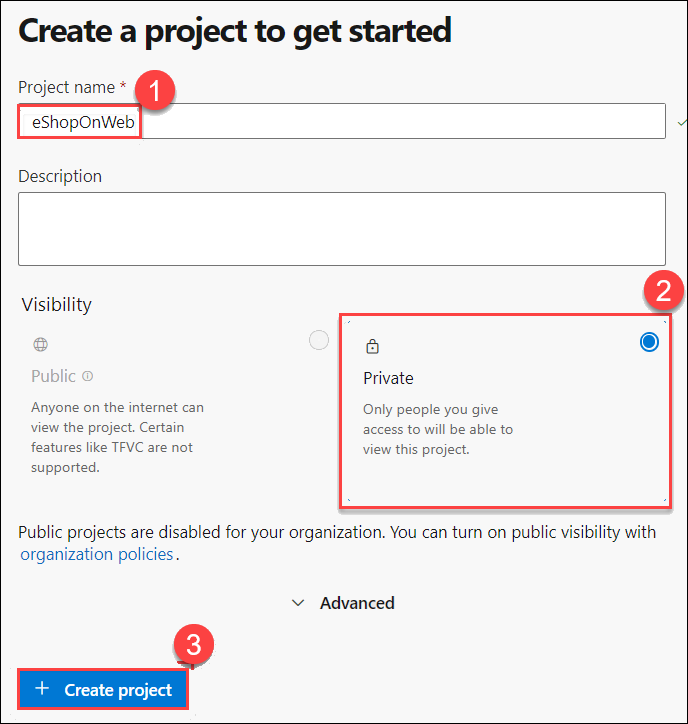

## Task 2: (skip if done) Import eShopOnWeb Git Repository

  In this task you will import the eShopOnWeb Git repository that will be used by several labs.
  
   1. On your lab computer, in a browser window open your Azure DevOps organization and the previously created eShopOnWeb project. Click on             **Repos (1)>Files (2) , Import a Repository**. Select **Import (3)**. On the **Import a Git Repository (4)** window, paste the following URL                     https://github.com/MicrosoftLearning/eShopOnWeb.git (5) and click **Import (6)**.

      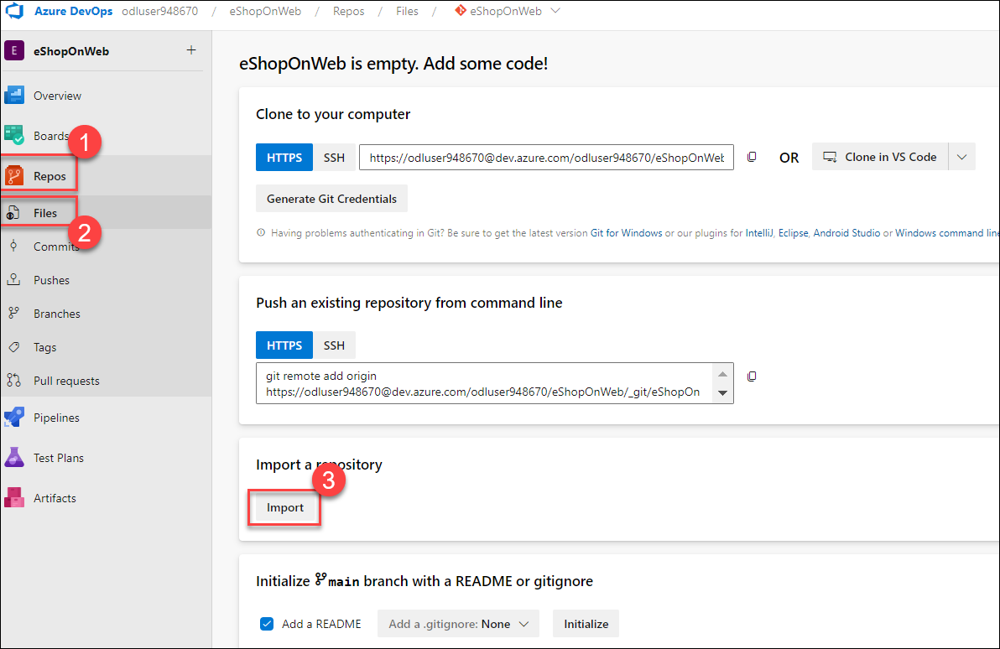
      
      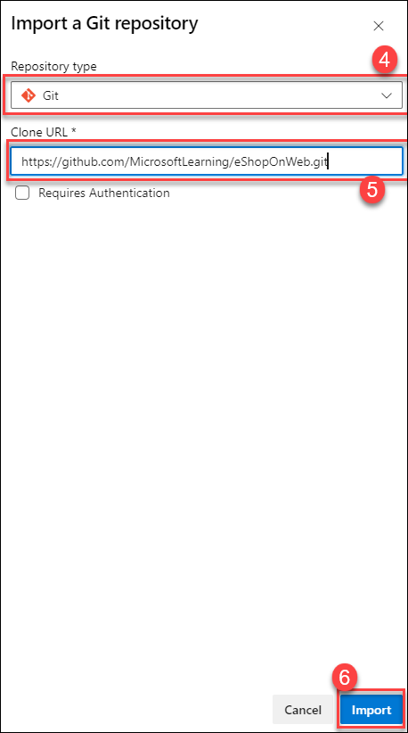

   2. The repository is organized the following way:

         o. **.ado** folder contains Azure DevOps YAML pipelines
         
         o **.devcontainer** folder container setup to develop using containers (either locally in VS Code or GitHub Codespaces)
         
         o **.azure** folder contains Bicep & ARM infrastructure as code templates used in some lab scenarios.
         
         o **.github** folder contains YAML GitHub workflow definitions.
         
         o. **src** folder contains the .NET 6 website used in the lab scenarios.
         
       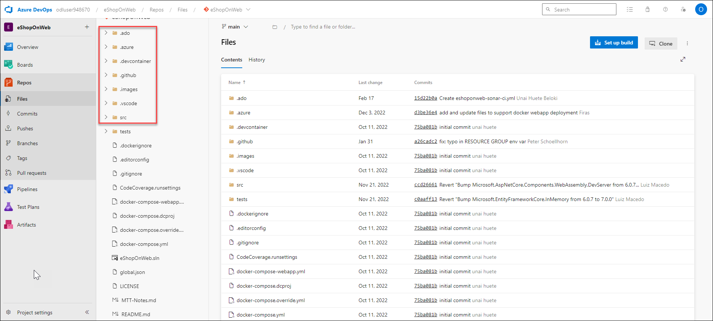
         
 # Exercise 1: Include build validation as part of a Pull Request
 
 In this exercise, you will include build validation to validate a Pull Request.
 
 ## Task 1: Import the YAML build definition
 
 In this task, you will import the YAML build definition that will be used as a Branch Policy to validate the pull requests.
 
 Let's start by importing the build pipeline named **eshoponweb-ci-pr.yml**.
 
   1. Go to **Pipelines (1)>Pipelines (2)**. Click on **Create Pipeline (3)** or **New Pipeline** button.

        

   2. Select **Azure Repos Git (YAML)**

      

   3. Select the **eShopOnWeb** repository.

      

   4. Select **Existing Azure Pipelines YAML File**

      

   5. Select the **/.ado/eshoponweb-ci-pr.yml(1)** file then click on **Continue(2)**

      

       The build definition consists of the following tasks:
      
         o **DotNet Restore:** With NuGet Package Restore you can install all your project's dependency without having to store them in source                   control. 
        
         o **DotNet Build:** Builds a project and all of its dependencies.
        
         o **DotNet Test:** .Net test driver used to execute unit tests.
        
         o **DotNet Publish:** Publishes the application and its dependencies to a folder for deployment to a hosting system. In this case, it's                 **Build.ArtifactStagingDirectory**.
        
        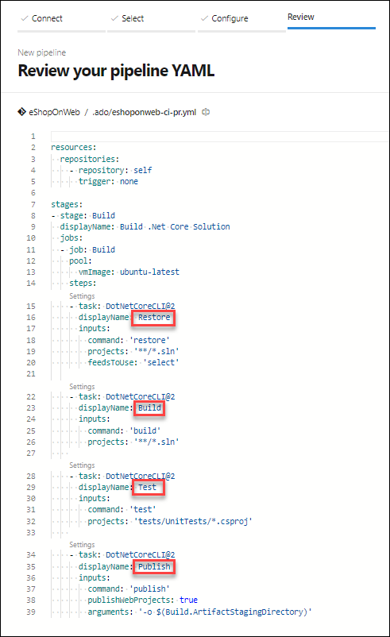

   6. Click the **Save** button to save the pipeline definition

      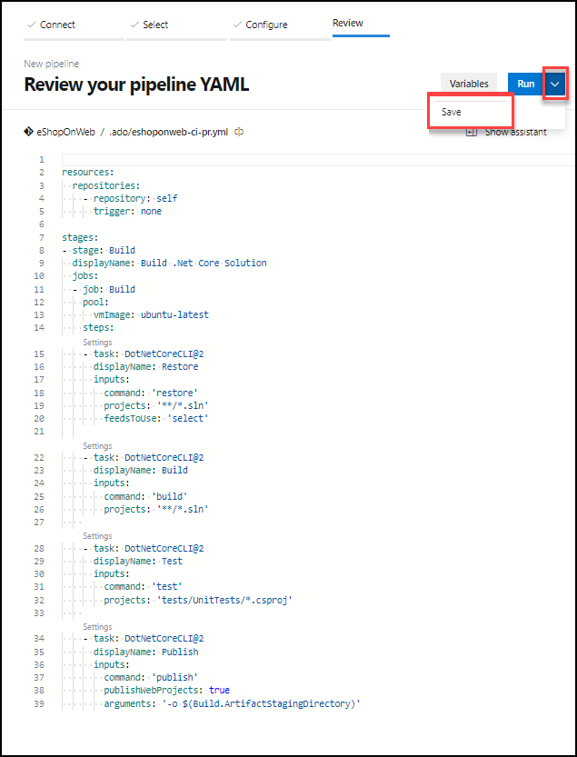
     
   7. Your pipeline will take a name based on the project name. Let's **rename** it for identifying the pipeline better. Go to **Pipelines>Pipelines** and click on the recently created pipeline. Click on the **ellipsis (1)** and **Rename/move (2)** option.
   
      

   8. Name it **eshoponweb-ci-pr (1)** and click on **Save (2)**.

      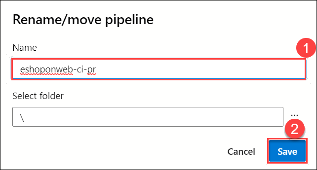    

## Task 2: Branch Policies

In this task, you will add policies to the main branch and only allow changes using Pull Requests that comply with the defined policies. You want to ensure that changes in a branch are reviewed before they are merged.

   1. Go to **Repos (1)>Branches (2)** section. On the **Mine** tab of the **Branches** pane, hover the mouse pointer over the **main (3)** branch entry to reveal the **ellipsis symbol (4)** on the right side.

      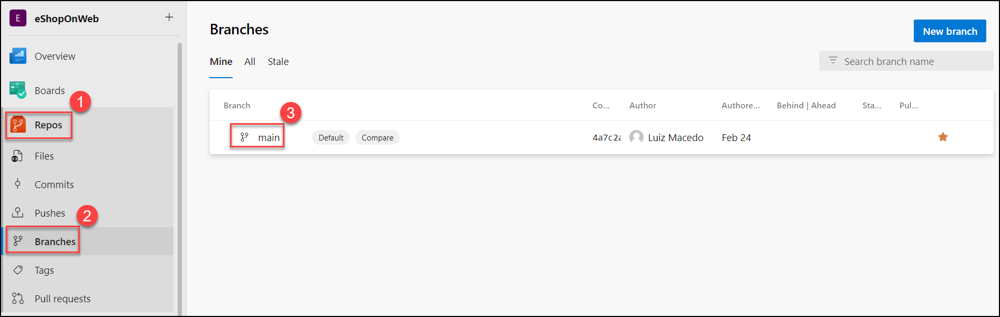

   2. Click the **ellipsis (4)** and, in the pop-up menu, select **Branch Policies (5)**.

      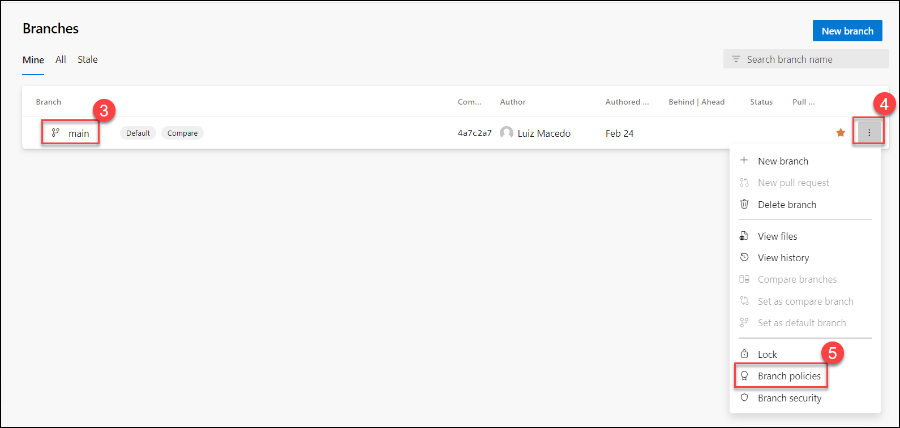

   3. On the main tab of the repository settings, enable the option for **Require minimum number of reviewers (1)**. Add **1 (2)** reviewer and check the box **Allow requestors to approve their own changes (3)**(as you are the only user in your project for the lab)

      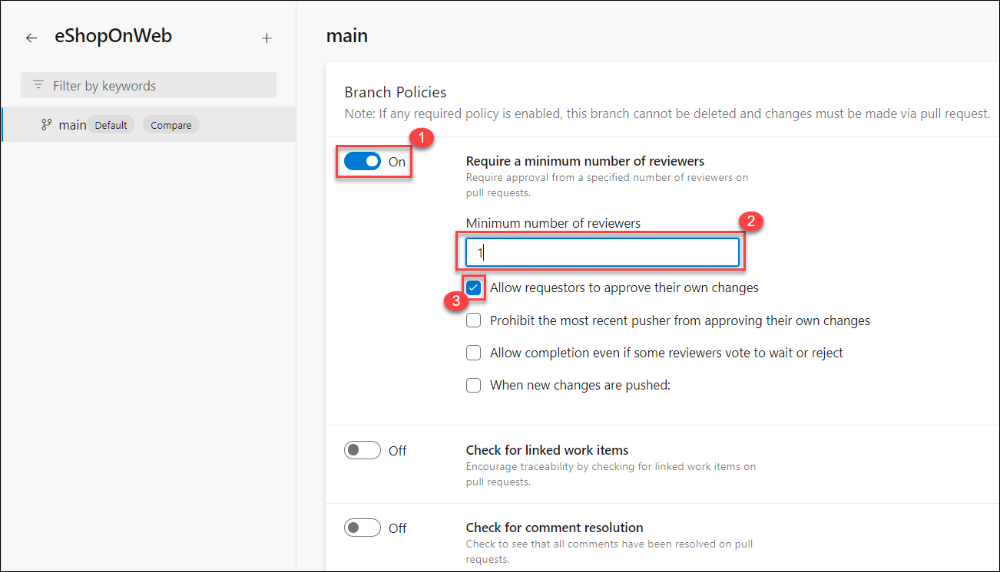

   4. On the **main (1)** tab of the repository settings, in the **Build Validation (2)** section, **click + (Add a new build policy) (3)** and in the Build pipeline list, select **eshoponweb-ci-pr (4)** then click **Save (5)**

      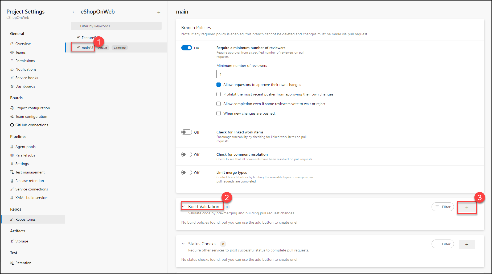

      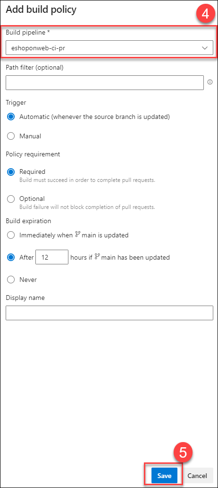
      
      >**Note**: If you get any error while saving the branch validation refresh the page and try again.

 ## Task 3: Working with Pull Requests
 
 In this task, you will use the Azure DevOps portal to create a Pull Request, using a new branch to merge a change into the protected main branch.
 
 1. Navigate to the **Repos (1)->Branches (2)** section in the eShopOnWeb navigation and click **New Branch (3)**.

    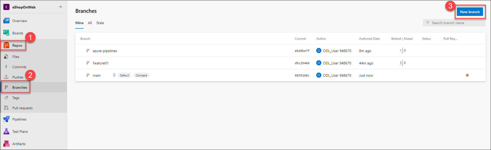

 2. Create a new branch named **Feature01 (1)** based on the **main** branch and click **Create (2)**.

    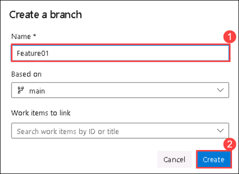

3. Click **Feature01 (1)** and navigate to the **/eShopOnWeb/src(2)/Web(3)/Program.cs (4)** file as part of the **Feature01** branch and click on **edit (5)** to make the following change on the first line:

   ```
   // Testing my PR
   ```

   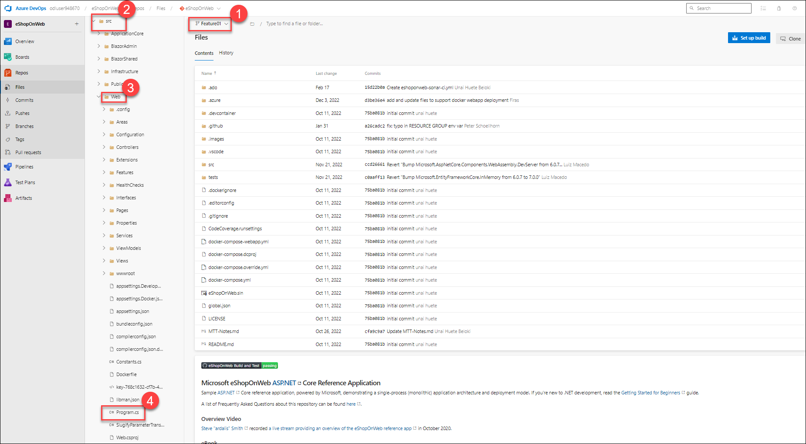

   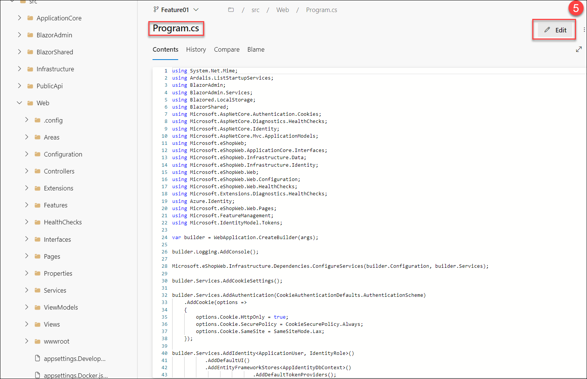
   
 4. Click on **Commit > Commit** (leave default commit message).

    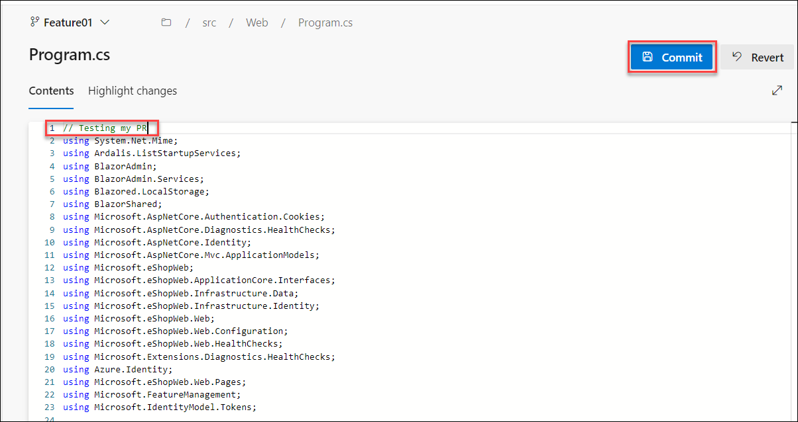
    
    

5. A message will pop-up, proposing to create a Pull Request (as your **Feature01** branch is now ahead in changes, compared to **main**). Click on **Create a Pull Request (1)**.

    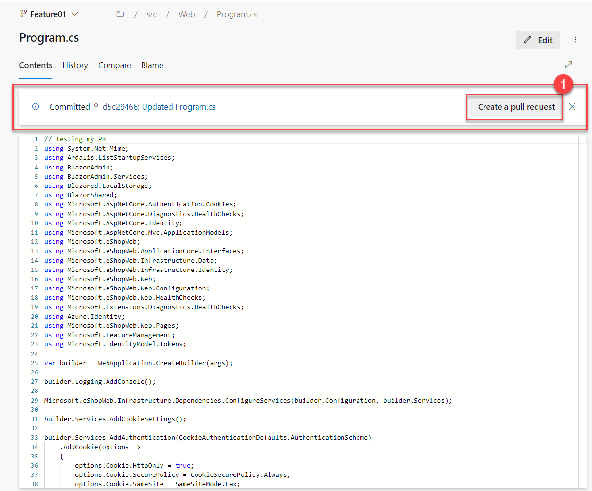

6. In the **New pull request (1)** tab, leave defaults and click on **Create (2)**.
   
   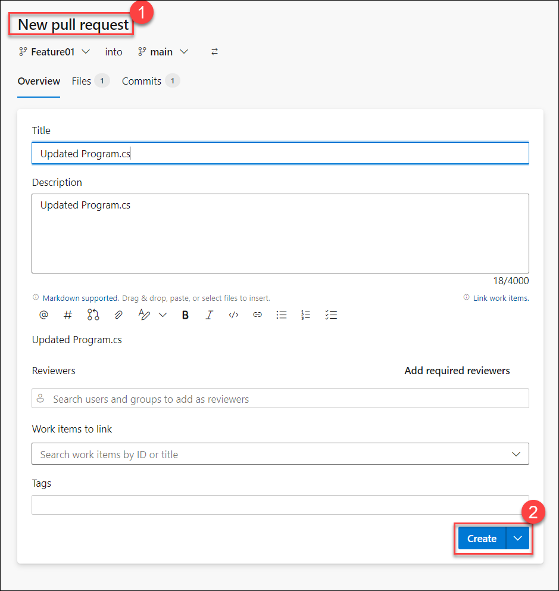
   
7. The Pull Request will show some pending requirements, based on the policies applied to the target **main** branch.

    - **At least 1 user should review and approve the changes (1)**, click **Add (2)** select Required Reviewer and **select the Reviewer to complete the PR(3)**.
    - Build validation, you will see that the build **eshoponweb-ci-pr** was triggered automatically
     
     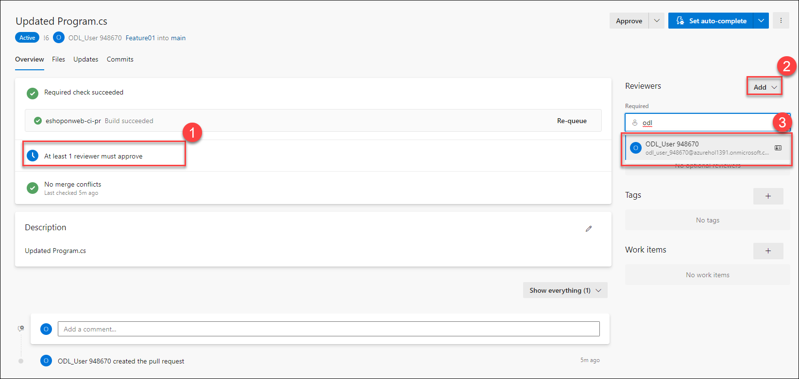
     
     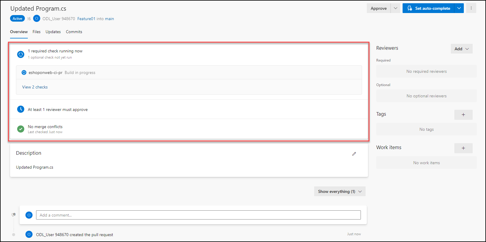    
      
8. After all validations are successful, on the top-right click on **Approve (1)**,  click on **Complete (3)**.  

9. On the **Complete Pull Request** tab, select only **Complete associated work items after merging** checkbox  and Click on **Complete Merge**

   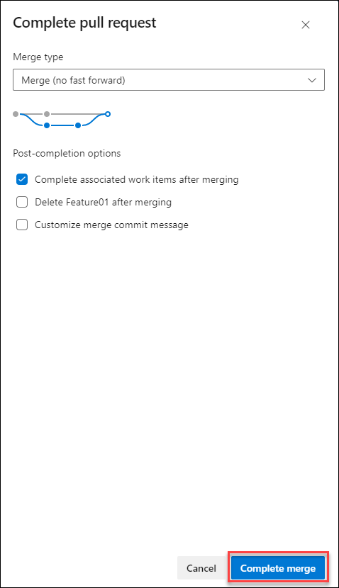

# Exercise 2: Configure CI Pipeline as Code with YAML

  In this exercise, you will configure CI Pipeline as code with YAML.

## Task 1: Import the YAML build definition

  In this task, you will add the YAML build definition that will be used to implement the Continuous Integration.

  Let's start by importing the CI pipeline named **eshoponweb-ci.yml**.

  1. Go to **Pipelines>Pipelines (1)** and click on **New Pipeline (2)** button

     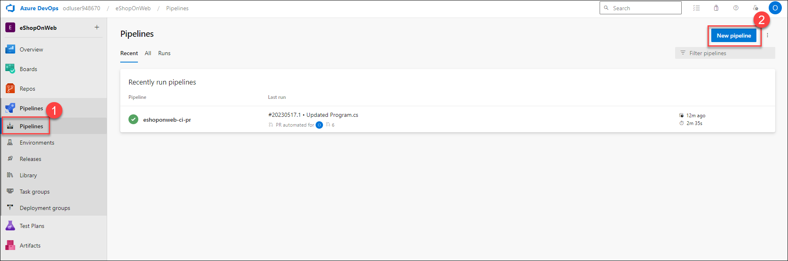

  2. Select **Azure Repos Git (YAML)**

      

  3. Select the **eShopOnWeb** repository

     

  4. Select **Existing Azure Pipelines YAML File**

     

  5. Select the **/.ado/eshoponweb-ci.yml (1)** file then click on **Continue (2)**

     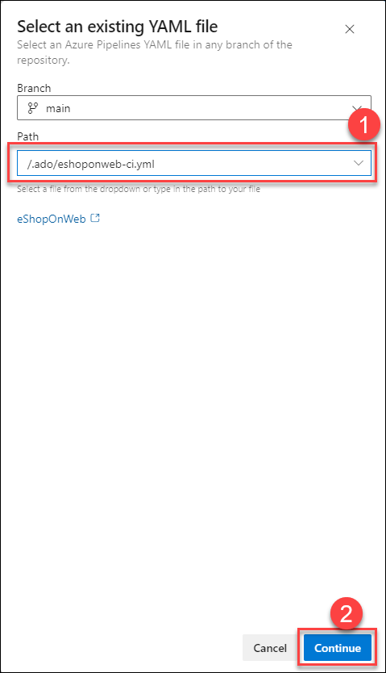

     The CI definition consists of the following tasks:
     
   o **DotNet Restore:** With NuGet Package Restore you can install all your project's dependency without having to store them in source control.
       
   o **DotNet Build:** Builds a project and all of its dependencies.
       
   o **DotNet Test:** .Net test driver used to execute unit tests.
       
   o **DotNet Publish:** Publishes the application and its dependencies to a folder for deployment to a hosting system. In this case, it's             **Build.ArtifactStagingDirectory**.
       
   o **Publish Artifact - Website:** Publish the app artifact (created in the previous step) and make it available as a pipeline artifact.
       
   o **Publish Artifact - Bicep:** Publish the infrastructure artifact (Bicep file) and make it available as a pipeline artifact.
       
              
   ## Task 2: Enable Continuous Integration
   
   The default build pipeline definition doesn't enable Continuous Integration
   
   1. Now, you need to replace the **trigger: none** code with the following code:
   
      ```
        trigger:
         branches:
          include:
          - main
        paths:
          include:
          - src/web/*
      ``` 

      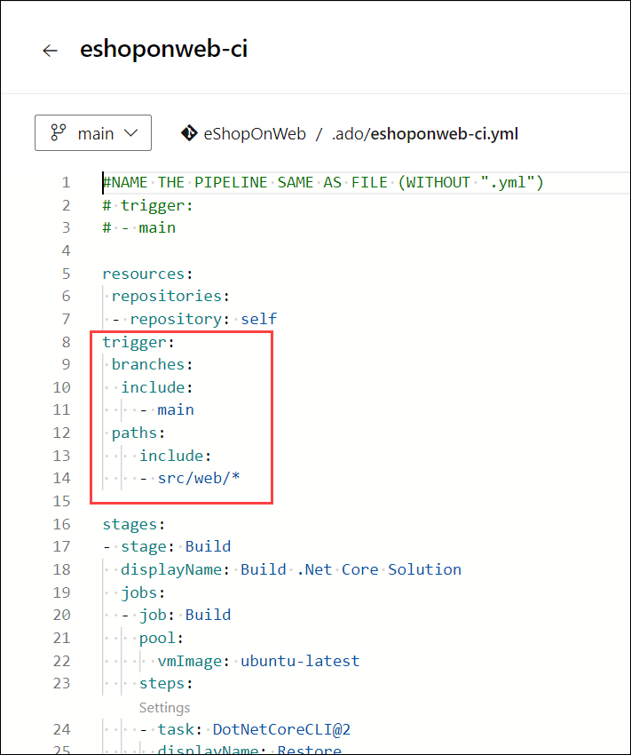

      This will automatically trigger the build pipeline if any change is made to the main branch and the web application code (the src/web folder).Since you enabled Branch Policies, you need to pass by a Pull Request in order to update your code. 
    
  2. Click the **Dropdown** and **Save** button (not **Save and run**) to save the pipeline definition.

     (1).png)
  
  3. Select **Create a new branch for this commit (1)** Keep the default branch name and **Start a pull request(2)** checked. and Click on **Save(3)**

     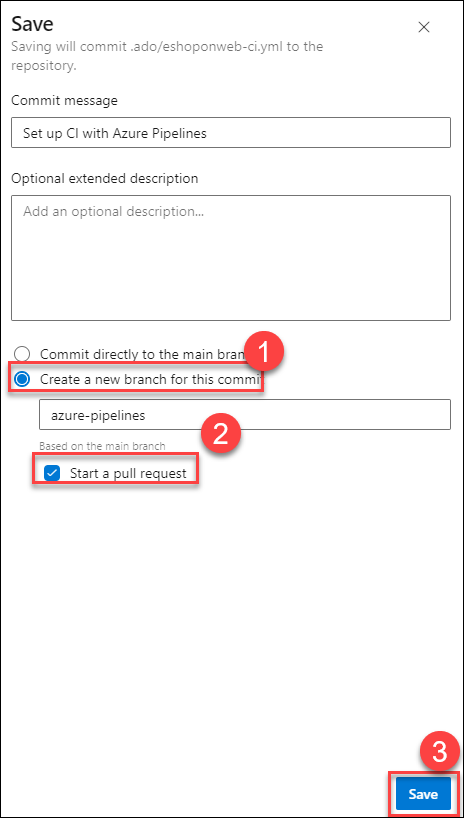

  4. Your pipeline will take a name based on the project name. Let's **rename** it for identifying the pipeline better. Go to                          **Pipelines>Pipelines** and click on the recently created pipeline. Click on the **ellipsis (1)** and **Rename/move** option. Name it **eshoponweb-ci (2)**  and click on **Save (3)**.

     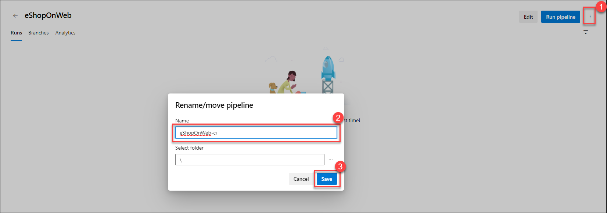

  5. Go to **Repos (1)>Pullrequests (2)** and click on the existing pull request. After all validations are successful, on the top-right click on **Approve (3)**. Now you can click on **Complete (4)**.

     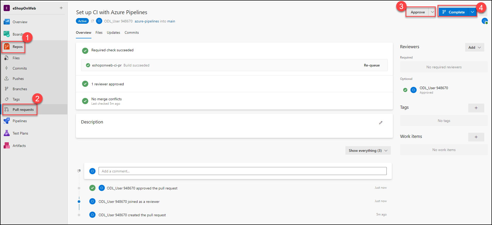

  6. On the **Complete Pull Request** tab, select only **Complete associated work items after merging** checkbox  and Click on **Complete Merge**

     

 ## Task 3: Test the CI pipeline
 
 In this task, you will create a Pull Request, using a new branch to merge a change into the protected main branch and automatically trigger the CI pipeline Navigate to the Repos section
 
 1. Navigate to the **Repos (1)->Branches (2)** section. Create a **new branch (3)** named **Feature02 (4)** based on the **main** branch and Click on **Create (5)**

    
    
    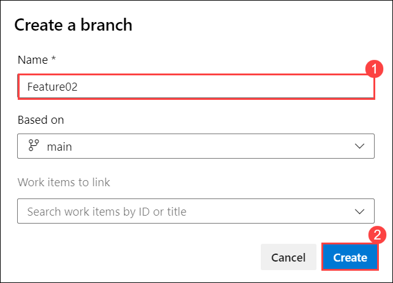

 2. Click the new **Feature02 (1)** branch and navigate to the **/eShopOnWeb/src (2)/Web (3)/Program.cs (4)** file and click on **Edit (5)** to remove the first line // **Testing my PR (6)** and click on commit.
   
    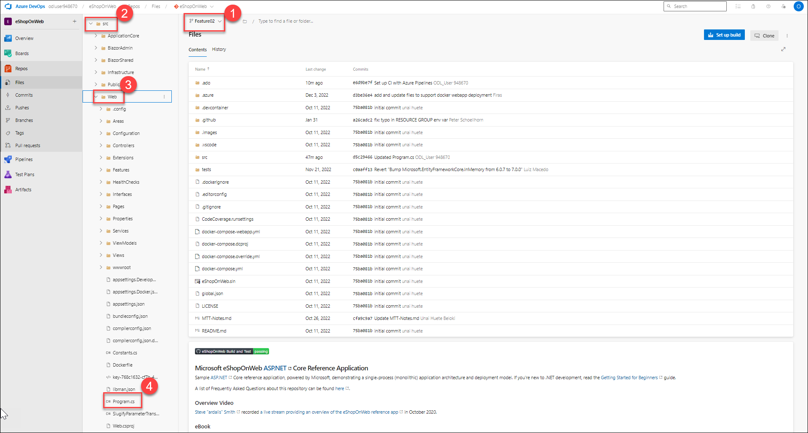
   
    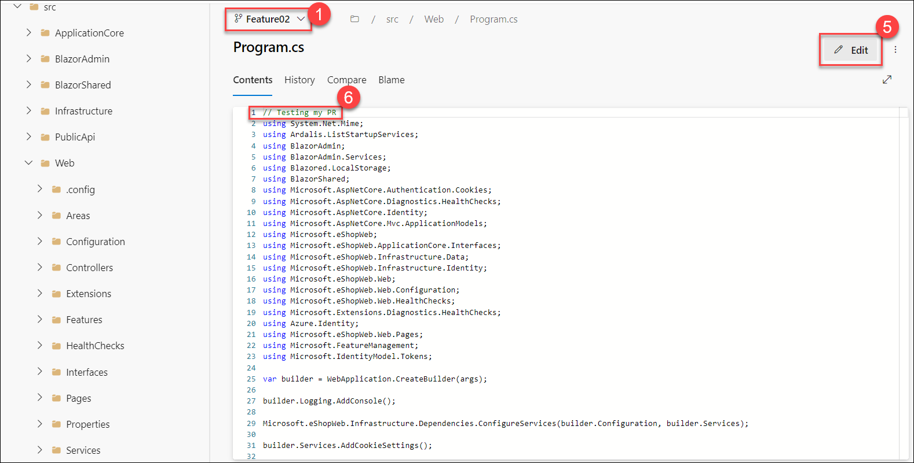

 3. Click on **Commit > Commit** (leave default commit message).
   
    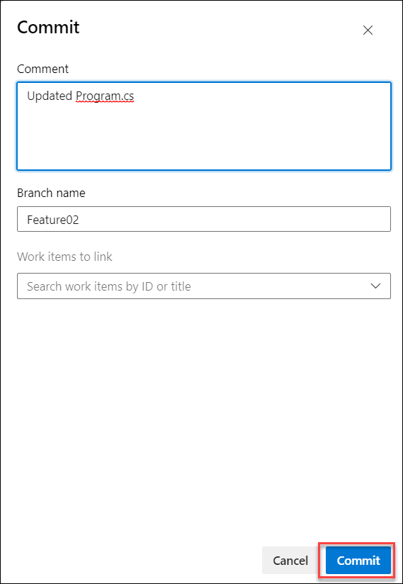

 4. A message will pop-up, proposing to create a Pull Request (as your **Feature02** branch is now ahead in changes, compared to main).

 5. Click on **Create a Pull Request**

     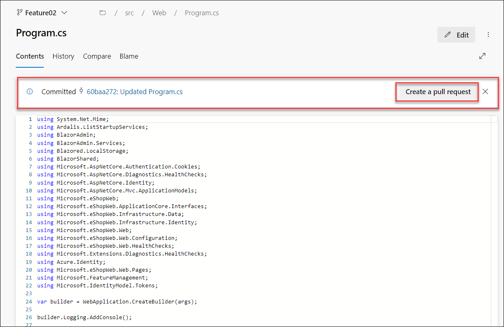

 6. In the **New pull request (1)** tab, leave defaults and click on **Create (3)** The Pull Request will show some pending requirements, based on the policies applied to the target **main (2)** branch and wait until build completes.

     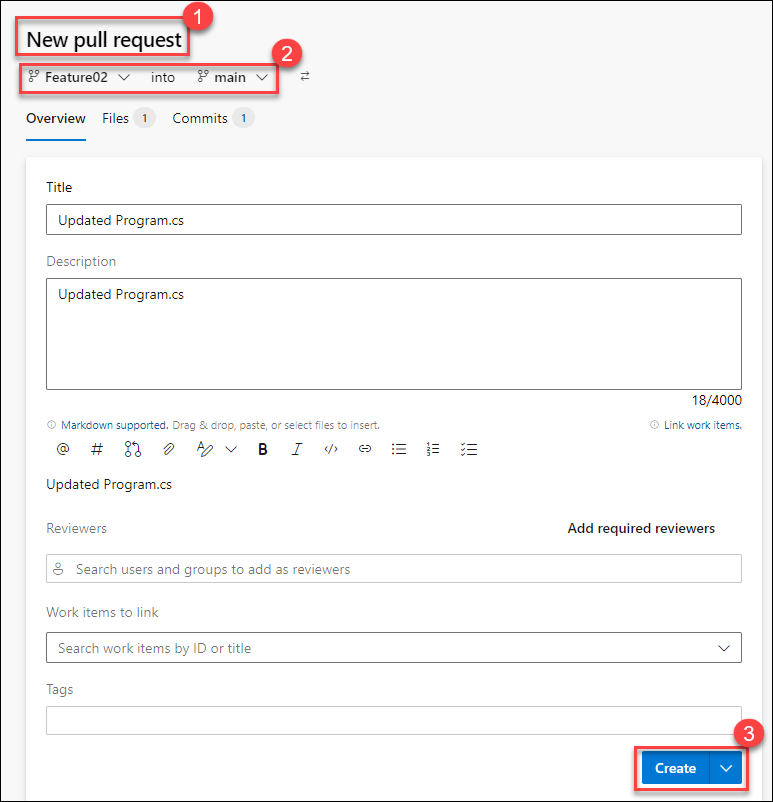

 7. After all validations are successful, on the top-right click on **Approve (1)**, click on **Complete (2)**

     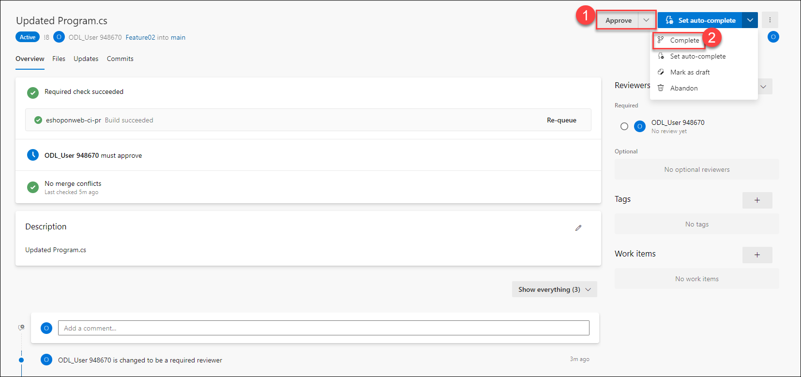

 8. On the **Complete Pull Request** tab, select only **Complete associated work items after merging** checkbox  and Click on **Complete Merge**

     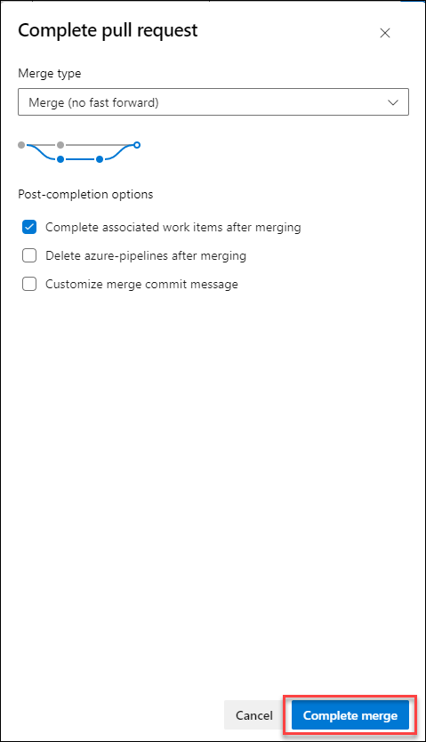

 9. Go back to **Pipelines>Pipelines,** you will notice that the build **eshoponweb-ci** was triggered automatically after the code was merged.

    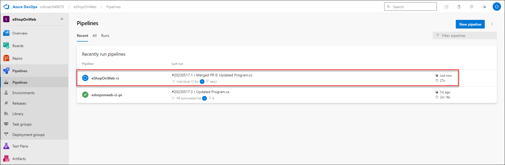
 
 10. Click on the **eshoponweb-ci** build then select the last run.

       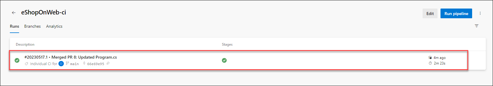

 11. After its successful execution, click on **Related (1) > Published (2)** to check the published artifacts:
           
     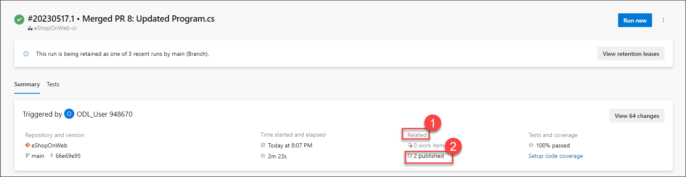  
     
     o Bicep: the infrastructure artifact  
     o Website: the app artifact
     
     
     
     > **Congratulations** on completing the task! Now, it's time to validate it. Here are the steps:
     > - Select the **Lab Validation** tab located at the upper right corner of the lab guide section.
     > - Hit the Validate button for the corresponding task. If you receive a success message, you can proceed to the next task. 
     > - If not, carefully read the error message and retry the step, following the instructions in the lab guide.
     > - If you need any assistance, please contact us at labs-support@spektrasystems.com. We are available 24/7 to help you out.
          
 #### Review
  
  In this lab, you enabled pull request validation using a build definition and configured CI pipeline as code with YAML in Azure DevOps. 
