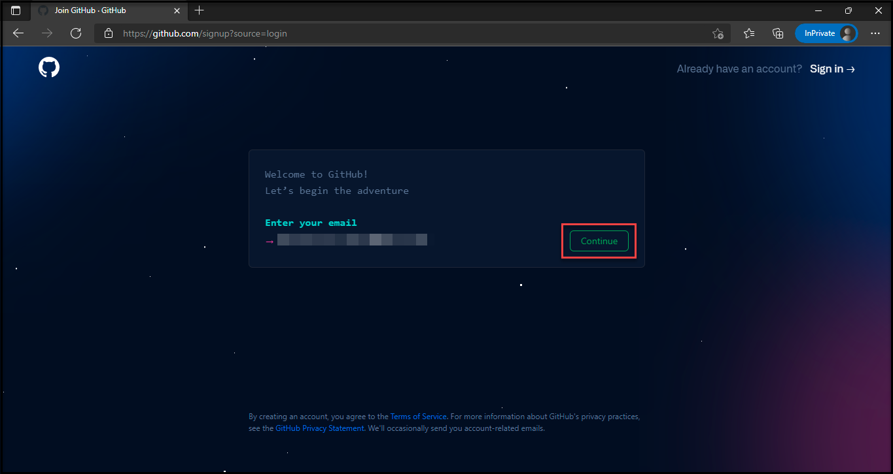
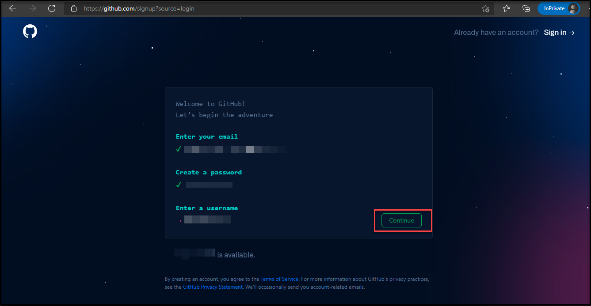
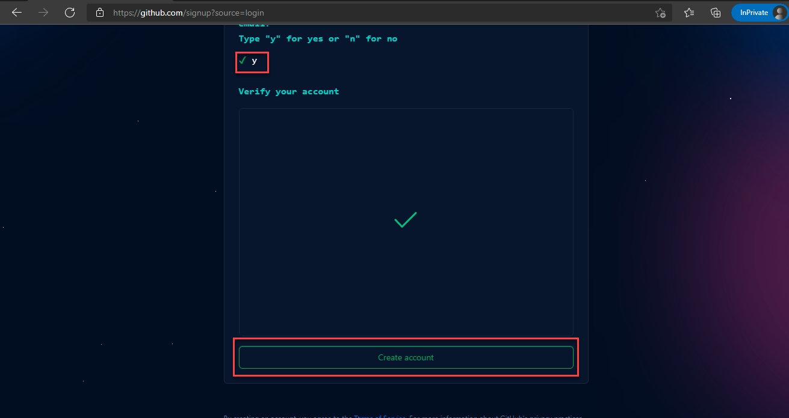
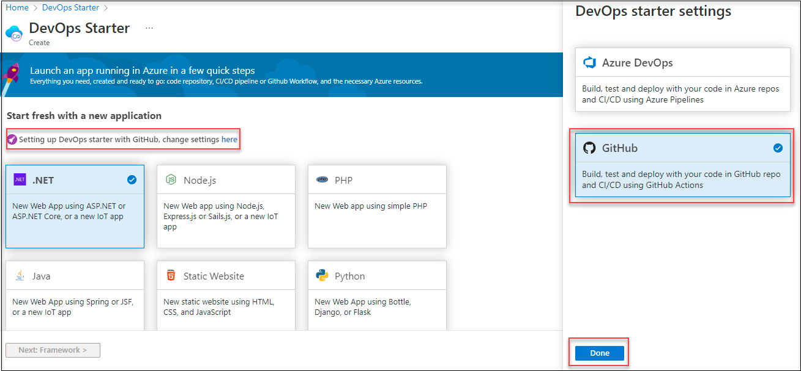
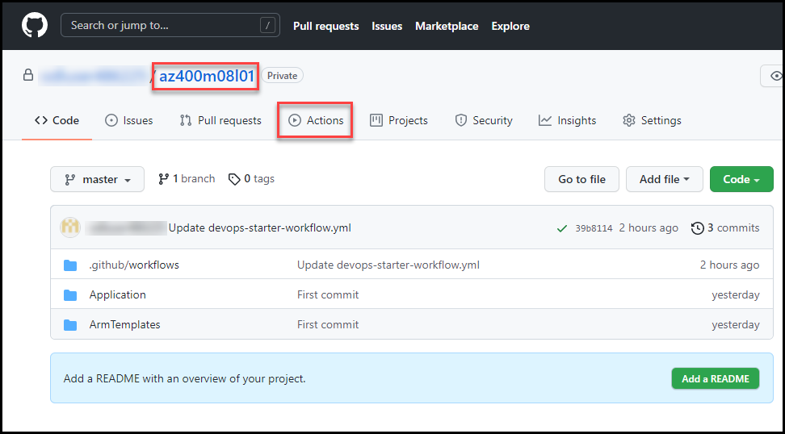
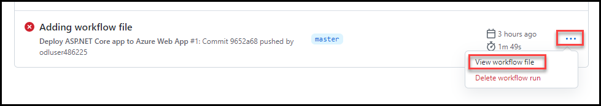
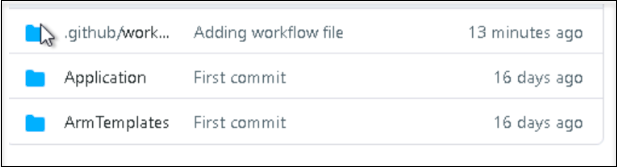

# Lab 07: Implementing GitHub Actions by using DevOps Starter
# Student lab manual

## Lab overview

In this lab, you will learn how to implement a GitHub Action workflow that deploys an Azure web app by using DevOps Starter.

## Objectives

After you complete this lab, you will be able to:

- Implement a GitHub Action workflow by using DevOps Starter
- Explain the basic characteristics of GitHub Action workflows

## Instructions

#### Prepare a GitHub account

1. If you already have a GitHub account that you can use for this lab proceed with Exercise 1, else follow the instructions to create an account.

1. Navigate to the https://github.com/ Click on Signup.
   
1. Provide the email address and click on continue.

 
 
1. Provide the password and enter the valid username and click on continue.

  

1. Provide the confirmation and verify your account and click on create account. This would take 2 minutes to create.

 

### Exercise 1 : Create a DevOps Starter project

In this exercise, you will use DevOps Starter to facilitate provisioning of a number of resources, including: 

-  A GitHub repository hosting:

    -  Code of a sample .NET Core web site.
    -  Azure Resource Manager templates that deploy an Azure web app hosting the web site code.
    -  A workflow that builds, deploys, and tests the web site.

-  An Azure web app, automatically deployed by using the GitHub workflow.

#### Task 1: Create DevOps Starter project

In this task, you will create an Azure DevOps Starter project that automatically sets up a GitHub repository, as well as creates and triggers a GitHub workflow that deploys an Azure web app, based on the content of the GitHub repository.

1.  From the lab VM, open Edge browser, navigate to the https://portal.azure.com, and sign in with the credentials provided in environmental details page.
1.  In the Azure portal, search for and select the **DevOps Starter** resource type and, on the **DevOps Starter** blade, click either **+ Add**, **+ New**, or **+ Create**.
1.  On the **Start fresh with a new application** page of the **DevOps Starter** blade, click the **here** link in the **Setting up DevOps starter with GitHub, click here** text. 

    

    > **Note**: This will display the **DevOps starter settings** blade. 

1.  On the **DevOps starter settings** blade, ensure that the **GitHub** tile is selected and click **Done**.
1.  Back on the **DevOps Starter** blade, click **Next: Framework >**.
1.  On the **Choose an application framework** page of the **DevOps Starter** blade, select the **ASP.NET Core** tile and click **Next: Service >**.
1.  On the **Select an Azure service to deploy the application** page of the **DevOps Starter** blade, ensure that the **Windows Web App** tile is selected and click **Next: Create >**.
1.  On the **Select Repository and Subscription** page of the **DevOps Starter** blade, click **Authorize**. 

    > **Note**: This will display the **Authorize Azure GitHub Actions** pop-up web browser window.

1.  In the **Authorize Azure GitHub Actions** pop-up window, review the required permissions and click **Authorize AzureGithubActions**. 

    > **Note**: This will redirect the web pop-up browser window to the Azure DevOps site, prompting you for your Azure DevOps information.

1.  When prompted, in the pop-up web browser window, click **Continue**.
1.  Back on the **Select Repository and Subscription** page of the **DevOps Starter** blade, specify the following settings and click **Review + Create**:

    | Setting | Value |
    | ------- | ----- |
    | Organization | the name of GitHub account |
    | Repository | **az400m08l01** |
    | Subscription | the name of the Azure subscription you are using for this lab |
    | Web app name | az400m08l01{DeploymentID} |
    | Location | the name of any Azure region in which you can provision an Azure web app |

    > **Note**: Replace Deployment ID with its value from environment details page. Wait for the provisioning to complete. This should take about 1 minute.

1.  On the **Deploy_DevOps_Project_az400m08l01 \| Overview** blade, click **Go to Resource**.
1.  On the **az400m08l01** blade, on the **GitHub Workflow** tile, click **Authorize**. 
1.  On the **GitHub Authorization** blade, click **Authorize** again.
1.  Back on the **az400m08l01** blade, monitor the progress of actions on the **GitHub Workflow** tile. 

> **Note**: Wait for the build, deploy, and functional tests jobs of the GitHub workflow to complete. This should take about 5 minutes.

#### Task 2: Review the results of creating the DevOps Starter project

In this task, you will review the results of creating the DevOps Starter project.

1.  In the web browser window displaying the Azure portal, on the **az400m08l01** blade, review the **GitHub Workflow** section and verify that the **build**, **deploy**, and **Functional tests** jobs completed successfully.

    > **Note**: If you get below error while running deploy section follow below steps

    `
    Error:
    ERROR: Could not retrieve credential from local cache for service principal 63e0c73b-c825-42f3-a6f5-6009fade2956. Run az login for this service principal.
    Error: Error: az cli script failed.
    `

    Solution:
    - Switch to browser tab where you created or logged into git hub https://github.com/, Go to repositories search and select the repo **az400m08l01**. Click on **Actions** from the menu.
     
    - In the **All Workflows** section on the available workflow with error go to options by clicking on 3 dots at the right side and select **View workflow file**.   
    
    - Click on edit icon to start editing the file, On the Edit file page go to section **- name: Deploy ARM Template** and add **azcliversion: 2.29.2** as shown in below image
    
    - Click on **start commits** and select **commit changes**. This will automatically start rebuild process switch to azure portal and wait for the the task to get completed.

1.  On the **az400m08l01** blade, review the **Azure resources** section and verify that they include an App Service web app instance and the corresponding Application Insights resource.
1.  At the top of the **az400m08l01** blade, note the link to the **Workflow file** and the GitHub repository you created in the previous task.
1.  At the top of the **az400m08l01** blade, click the link to the GitHub repository. 
1.  On the GitHub repository page, note the three folders labeled:

    - **.github\workflows** - containing the YAML-formatted workflow file
    - **Application** - containing the code of the sample web site
    - **ArmTemplates** - containing the Azure Resource Manager templates that the workflow uses to provision Azure resources

    

1.  On the GitHub repository page, click **.github/workflows** and then, click the **devops-starter-workflow.yml** entry.
1.  On the GitHub repository page displaying the content of the **devops-starter-workflow.yml**, review its content and note that it contains the **build**, **deploy**, and **Functional tests** job definitions.
1.  On the GitHub repository page, in the toolbar, click **Actions**.
1.  On the GitHub repository page, on the **Actions** tab, in the **All workflows** section, click the entry representing the most recent workflow run.
1.  On the workflow run page, review the workflow status, as well as the listing of **Annotations** and **Artifacts**.
1.  On the GitHub repository page, in the toolbar, click **Settings** and, on the **Settings** tab, click **Secrets**.
1.  On the **Action secrets** pane, note the **AZURE_CREDENTIALS** entry, representing the credentials necessary to access the target Azure subscription. 
1.  Navigate to the **az400m08l01/Application/aspnet-core-dotnet-core/Pages/Index.cshtml** GitHub repository page and, in the upper right corner, click the pencil icon to switch to the edit mode.
1.  Change the line 19 to `
 GitHub Workflow has been successfully updated
`.
1.  Scroll down to the bottom of the page and click **Commit changes**.
1.  On the GitHub repository page, in the toolbar, click **Actions**.
1.  In the **All workflows** section, click the **Update Index.cshtml** entry.
1.  In the **devops-starter-workflow.yml** section, monitor the progress of deployment and verify that it completed successfully.
1.  Switch to the browser window displaying the DevOps Starter blade in the Azure portal and click the **Browse** link next to the **Application endpoint** entry.
1.  In the newly opened web browser window, verify that the updated text representing the change you committed in the GitHub repo is displayed on the web app home page.

## Review

In this lab, you implemented a GitHub Action workflow that deploys an Azure web app by using DevOps Starter.
