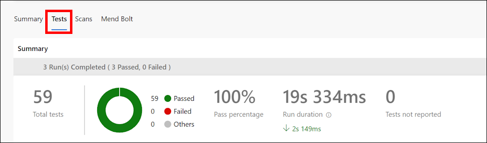
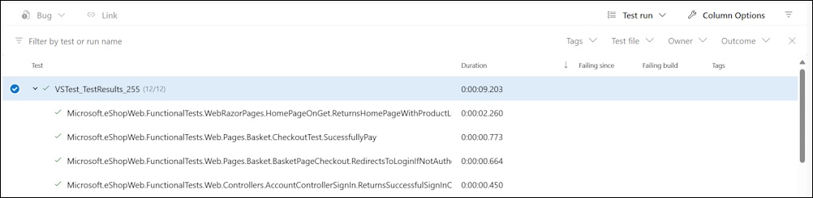

# Lab 03: Setting Up and Running Functional Tests

## Lab overview

Software of any complexity can fail in unexpected ways in response to changes. Thus, testing after making changes is required for all but the most trivial (or least critical) applications. Manual testing is the slowest, least reliable, most expensive way to test software.

There are many kinds of automated tests for software applications. The simplest, lowest level test is the unit test. At a slightly higher level, there are integration tests and functional tests. Other kinds of tests, such as UI tests, load tests, stress tests, and smoke tests, are beyond the scope of this lab.

*If you want to know more about the different types of testing, we recommend you reading this article: [Test ASP.NET Core MVC apps](https://learn.microsoft.com/dotnet/architecture/modern-web-apps-azure/test-asp-net-core-mvc-apps).*

## Objectives

After you complete this lab, you will be able to configure a CI pipeline for a .Net application that includes:

- Unit Tests
- Integration Tests
- Functional Tests

## Estimated timing: 60 minutes

### Exercise 1: Setup Tests in CI pipeline

In this exercise, you will setup tests in CI pipeline.

#### Task 1: (Skip if done) Import the YAML build definition for CI

In this task, you will add the YAML build definition that will be used to implement the Continuous Integration.

Let's start by importing the CI pipeline named [eshoponweb-ci.yml](https://github.com/MicrosoftLearning/eShopOnWeb/blob/main/.ado/eshoponweb-ci.yml).

1. Go to **Pipelines>Pipelines**.

1. Click on **New Pipeline** button.

1. Select **Azure Repos Git (YAML)**.

1. Select the **eShopOnWeb** repository.

1. Select **Existing Azure Pipelines YAML File**.

1. Select the **main** branch and the **/.ado/eshoponweb-ci.yml** file, then click on **Continue**.

    The CI definition consists of the following tasks:
    - **DotNet Restore**: With NuGet Package Restore you can install all your project's dependency without having to store them in source control.
    - **DotNet Build**: Builds a project and all of its dependencies.
    - **DotNet Test**: .Net test driver used to execute unit tests.
    - **DotNet Publish**: Publishes the application and its dependencies to a folder for deployment to a hosting system. In this case, it's **Build.ArtifactStagingDirectory**.
    - **Publish Artifact - Website**: Publish the app artifact (created in the previous step) and make it available as a pipeline artifact.
    - **Publish Artifact - Bicep**: Publish the infrastructure artifact (Bicep file) and make it available as a pipeline artifact.

1. Click the **Save** button (not **Save and run**) to save the pipeline definition.

#### Task 2: Add tests to the CI pipeline

In this task, you will add the integration and functional tests to the CI Pipeline.

You can notice that the Unit Tests task is already part of the pipeline.

- **Unit Tests** test a single part of your application's logic. One can further describe it by listing some of the things that it isn't. A unit test doesn't test how your code works with dependencies or infrastructure – that's what integration tests are for.

1. Now you need to add the Integration Tests task after the Unit Tests task:

    ```YAML
    - task: DotNetCoreCLI@2
      displayName: Integration Tests
      inputs:
        command: 'test'
        projects: 'tests/IntegrationTests/*.csproj'
    ```

    > **Integration Tests** test how your code works with dependencies or infrastructure. Although it's a good idea to encapsulate your code that interacts with infrastructure like databases and file systems, you will still have some of that code, and you will probably want to test it. Additionally, you should verify that your code's layers interact as you expect when your application's dependencies are fully resolved. This functionality is the responsibility of integration tests.

1. Then you need to add the Functional tests task after the Integration Tests task:

    ```YAML
    - task: DotNetCoreCLI@2
      displayName: Functional Tests
      inputs:
        command: 'test'
        projects: 'tests/FunctionalTests/*.csproj'
    ```

    > **Functional Tests** are written from the perspective of the user, and verify the correctness of the system based on its requirements. Unlike integration tests that are written from the perspective of the developer, to verify that some components of the system work correctly together.

1. Click **Save**, on the **Save** pane, click **Save** again to commit the changes directly into the main branch.

#### Task 4: Check the tests summary

1. Click on the **Run**, then from the **Run pipeline** tab, click on **Run** again.

1. Wait for the pipeline to start and until it completes the Build Stage successfully.

1. Once completed, the **Test** tab will show as part of the pipeline run. Click on it to check the summary. It looks like shown below:

    

1. For more details, at the bottom of the page, the table shows a list of the different run tests.

    >**Note**: If the table is empty, you need to reset the filters to have all the details about the tests run.

    


## Review

In this lab, you learned how to setup and run different tests types using Azure Pipelines and .Net.
