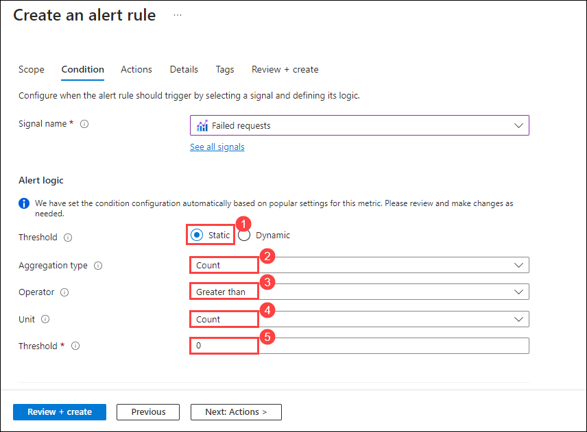

# Lab 07: Controlling Deployments using Release Gates

## Lab overview

This lab covers the configuration of the deployment gates and details how to use them to control the execution of Azure Pipelines. To illustrate their implementation, you'll configure a release definition with two environments for an Azure Web App. You'll deploy to the Canary environment only when there are no blocking bugs for the app and mark the Canary environment complete only when there are no active alerts in Application Insights of Azure Monitor.

A release pipeline specifies the end-to-end release process for an application to be deployed across various environments. Deployments to each environment are fully automated by using jobs and tasks. Ideally, you don't want new updates to the applications to be simultaneously exposed to all the users. It's a best practice to expose updates in a phased manner, that is, expose them to a subset of users, monitor their usage, and expose them to other users based on the experience of the initial set of users.

Approvals and gates enable you to take control over the start and completion of the deployments in a release. You can wait for users to approve or reject deployments with approvals manually. Using release gates, you can specify application health criteria to be met before the release is promoted to the following environment. Before or after any environment deployment, all the specified gates are automatically evaluated until they pass or reach your defined timeout period and fail.

Gates can be added to an environment in the release definition from the pre-deployment conditions or the post-deployment conditions panel. Multiple gates can be added to the environment conditions to ensure all the inputs are successful for the release.

As an example:

- Pre-deployment gates ensure no active issues in the work item or problem management system before deploying a build to an environment.
- Post-deployment gates ensure no incidents from the app's monitoring or incident management system after being deployed before promoting the release to the following environment.

There are 4 types of gates included by default in every account.

- Invoke Azure Function: Trigger the execution of an Azure Function and ensures a successful completion.
- Query Azure Monitor alerts: Observe the configured Azure Monitor alert rules for active alerts.
- Invoke REST API: Make a call to a REST API and continues if it returns a successful response.
- Query work items: Ensure the number of matching work items returned from a query is within a threshold.

## Objectives

After you complete this lab, you will be able to:

- Configure release pipelines.
- Configure release gates.
- Test release gates.

### Estimated time: 90 minutes

## Architecture Diagram

   

## Estimated timing: 75 minutes


## Set up an Azure DevOps organization. 

1. In the JumpVM, click on the Azure portal shortcut of the Microsoft Edge browser which is created on the desktop.

   
   
1. If not Sign-in, then on the **Sign into Microsoft Azure** tab you will see the login screen, in that enter following **Email/Username** and then click on **Next**. 
   * Email/Username: <inject key="AzureAdUserEmail"></inject>
   
1. Now enter the following **Password** and click on **Sign in**.
   * Password: <inject key="AzureAdUserPassword"></inject>
   
1. If you see the pop-up **Stay Signed in?**, click No.

1. If you see the pop-up **You have free Azure Advisor recommendations!**, close the window to continue the lab.

1. If **Welcome to Microsoft Azure** popup window appears, click **Maybe Later** to skip the tour.

1. Now open a **New Tab** navigate to https://go.microsoft.com/fwlink/?LinkId=307137.

    >**Note:** If not **login**, use previously used **Username: <inject key="AzureAdUserEmail"></inject> and Password: <inject key="AzureAdUserPassword"></inject>** to login.
    
1. If you see the pop-up for *Help us protect your account*, select **Skip for now (14 days until this is required)**.

1. On the next page accept defaults and click on **continue**.

    
    
1. On the **Almost Done...** page fill the captcha and click on **continue**. 

    

1. On the Azure Devops page click on **Azure DevOps(1)** located at top left corner and then click on **Organization Setting(2)** at the left down corner.

    
    
1. In the **Organization Setting** window on the left menu click on **Billing(1)** and select **Setup Billing(2)**, It will automatically select your **azure subscription(3)** then click on **Save(4)**.

        

1. On the **MS Hosted CI/CD** section under **Paid parallel jobs** enter value **1** and at the end of the page click on **Save**.

    

# Exercise 1: Configure the lab prerequisites

> **Note**: If you already created this project during previous labs, this exercise can be skipped.

In this exercise, you will set up the prerequisites for the lab, which consist of a new Azure DevOps project with a repository based on the [eShopOnWeb](https://github.com/MicrosoftLearning/eShopOnWeb). 

## Task 1: Create and configure the team project

In this task, you will create an **eShopOnWeb** Azure DevOps project to be used by several labs.

1.  On your lab computer, in a browser window open your Azure DevOps organization. Click on **New Project**. Give your project the name **eShopOnWeb(1)** and leave the other fields with defaults. Click on **+ Create Project(3)**.

    

## Task 2: Import eShopOnWeb Git Repository

In this task you will import the eShopOnWeb Git repository that will be used by several labs.

1.  On your lab computer, in a browser window open your Azure DevOps organization and the previously created **eShopOnWeb** project. Click on **Repos(1)>Files(2)** , **Import a Repository**. Select **Import(3)**. On the **Import a Git Repository** window, paste the following URL https://github.com/MicrosoftLearning/eShopOnWeb.git **(4)** and click **Import(5)**:

     

1.  The repository is organized the following way:
    - **.ado** folder contains Azure DevOps YAML pipelines
    - **.devcontainer** folder container setup to develop using containers (either locally in VS Code or GitHub Codespaces)
    - **.azure** folder contains Bicep&ARM infrastructure as code templates used in some lab scenarios.
    - **.github** folder container YAML GitHub workflow definitions.
    - **src** folder contains the .NET 6 website used on the lab scenarios.

## Task 3: Configure CI Pipeline as Code with YAML in Azure DevOps

In this task, you will add a YAML build definition to the existing project.

1. Navigate back to the **Pipelines** pane in of the **Pipelines** hub.
1. In the **Create your first Pipeline** window, click **Create pipeline**.

    > **Note**: We will use the wizard to create a new YAML Pipeline definition based on our project.

1. On the **Where is your code?** pane, click **Azure Repos Git (YAML)** option.

    
      
1. On the **Select a repository** pane, click **eShopOnWeb**.

    

1. On the **Configure your pipeline** pane, scroll down and select **Existing Azure Pipelines YAML File**.

    

1. In the **Selecting an existing YAML File** blade, specify the following parameters:
   
- Branch: **main**
- Path: Select **/.ado/eshoponweb-ci.yml** from the drop-down.

    
  
1. Click **Continue** to save these settings.
1. From the **Review your Pipeline YAML** screen, click **Run** to start the Build Pipeline process.

     
   
1. Wait for the Build Pipeline to complete successfully. Ignore any warnings regarding the source code itself, as they are not relevant for this lab exercise.

    

    > **Note**: Each task from the YAML file is available for review, including any warnings and errors.

  **Congratulations** on completing the task! Now, it's time to validate it. Here are the steps:

  > - Navigate to the Lab Validation tab, from the upper right corner in the lab guide section.
  > - Hit the Validate button for the corresponding task. If you receive a success message, you can proceed to the next task. 
  > - If not, carefully read the error message and retry the step, following the instructions in the lab guide.
  > - If you need any assistance, please contact us at labs-support@spektrasystems.com.

# Exercise 2: Creating the necessary Azure Resources for the Release Pipeline

## Task 1: Create two Azure web apps

In this task, you will create two Azure web apps representing the **Canary** and **Production** environments, into which you'll deploy the application via Azure Pipelines.

1. Switch back to the Azure portal.

1. In the Azure portal, click the **Cloud Shell** icon, located directly to the right of the search textbox at the top of the page.

   
  
1. If prompted to select either **Bash** or **PowerShell**, select **Bash**.

     

    >**Note**: If this is the first time you are starting **Cloud Shell** and you are presented with the **You have no storage mounted** message, select the subscription you are using in this lab, and select **Create storage**.
   
   
    
1. From the **Bash** prompt, in the **Cloud Shell** pane, run the following command to create a resource group. 

   >**Important:** Replace the `<region>` variable placeholder with the name of the Azure region that will host the two Azure web apps, for example **westeurope** or **centralus** or **any other available region** of your choice):

    >**Note**: possible locations can be found by running the following command, use the **Name** on `<region>` : `az account list-locations -o table`

    ```bash
    REGION='westeurope'
    RESOURCEGROUPNAME='az400m04l09-RG'
    az group create -n $RESOURCEGROUPNAME -l $REGION
    ```

1. To create an App service plan

    ```bash
    SERVICEPLANNAME='az400m04l09-sp1'
    az appservice plan create -g $RESOURCEGROUPNAME -n $SERVICEPLANNAME --sku S1
    ```

1.  Create two web apps with unique app names.
 
     ```bash
     SUFFIX=$RANDOM$RANDOM
     az webapp create -g $RESOURCEGROUPNAME -p $SERVICEPLANNAME -n RGATES$SUFFIX-Canary
     az webapp create -g $RESOURCEGROUPNAME -p $SERVICEPLANNAME -n RGATES$SUFFIX-Prod
     ```

    > **Note:** Record the name of the Canary web app. You will need it later in this lab.    Canary web app should look like : **RGATES495017526-Canary**

1. Wait for the Web App Services Resources provisioning process to complete and close the **Cloud Shell** pane.

## Task 2: Configure an Application Insights resource

1. In the Azure portal, use the **Search resources, services, and docs** text box at the top of the page to search for **Application Insights(1)** and, in the list of results, select **Application Insights(2)**.

      
   
1. On the **Application Insights** blade, select **+ Create**.

      
      
1. On the **Application Insights** blade, on the **Basics** tab, specify the following settings (leave others with their default values):

    | Setting | Value |
    | --- | --- |
    | Resource group | **az400m04l09-RG(2)** |
    | Name | the name of the Canary web app you recorded in the previous task(3) |
    | Region | the same Azure region to which you deployed the web apps earlier in the previous task(4) |
    | Resource Mode | **Classic(5)** |
    
 
    > **Note**: Disregard the deprecation message. This is required in order to prevent failures of the Enable Continuous Integration DevOps task you will be using later in this lab.

1. Click **Review + create(6)** and then click **Create**.

     
    
1. Wait for the provisioning process to complete.

1. In the Azure portal, use the **Search resources, services, and docs** text box at the top of the page to search for **resource group(1)** and, in the list of results, select **Resouce groups(2)**.

    

1. In the Azure portal, navigate to the resource group **az400m04l09-RG(1)** you created in the previous task, In the list of resources, click the **Canary(2)** web app.

    
  
1. On the **Canary** web app page, in the vertical menu on the left, in the **Settings** section, click **Application Insights**.
  
1. On the **Application Insights(1)** blade, click **Turn on Application Insights(2)**.

     
   
1. In the **Change your resource** section, scroll down and click on **Select existing resource(1)** option, in the list of existing resources, select the newly created **Application Insight resource(2)**, click **Apply(3)**.

    

1. When prompted for confirmation, click on **Yes**.
  
    

1. Wait until the change takes effect.

    > **Note**: You will create monitor alerts here, which you will use in later part of this lab.
1. From the same **Settings** / **Application Insights** menu option within the Web App, select **View Application Insights Data**. This redirects you to the Application Insights blade in the Azure Portal.

      

1.  On the Application Insights resource blade, in the **Monitoring** section, click **Alerts** and then click **Create > Alert rule**.

      
       
1. O n the **Create an alert rule** blade, in the **Select a name** textbox, Select  **Failed Requests(1)** from the drop-down. 

      
     
1.  On the **Create an Alert Rule** blade, in the **Condition** section, leave the **Threshold** set to **Static(1)**, validate the other default settings as follows:
- Aggregation Type: Count(2)
- Operator: Greater Than(3)
- Unit: Count(4)
- Threshold value: type 0(5)

     
    
1. Click on **Next:Actions**. Don't make any changes in the **Actions** settings blade, and define the following parameters under the **Details** section:

    | Setting | Value |
    | --- | --- |
    | Severity | **2- Warning(1)** |
    | Alert rule name | **RGATESCanary_FailedRequests(2)** |
    | Advanced Options: Automatically resolve alerts | **Unchecked (3)(4)** |
    
      

    > **Note**: Metric alert rules might take up to 10 minutes to activate.

    > **Note**: You can create multiple alert rules on different metrics such as availability < 99 percent, server response time > 5 Seconds, or server exceptions > 0

1. Confirm the creation of the Alert rule by clicking **Review+Create(5)**, and confirm once more by clicking **Create**. Wait for the alert rule to get created successfully.

# Exercise 3: Configure the release pipeline

In this exercise, you will configure a release pipeline.

## Task 1: Set Up Release Tasks

In this task, you will set up the release tasks as part of the Release Pipeline.

1. From the **eShopOnWeb** project in the Azure DevOps portal, in the vertical navigational pane, select **Pipelines** and then, within the **Pipelines** section, click **Releases(1)**.
1. Click **New Pipeline(2)**.
    
     
  
1. From the **Select a template** window, **choose** **Azure App Service Deployment** (Deploy your application to Azure App Service. Choose from Web App on Windows, Linux, containers, Function Apps, or WebJobs) under the **Featured** list of templates.    
1. Click **Apply**.

    
   
1. From the **Stage** window appearing, update the default "Stage 1" Stage Name to **Canary**. Close the popup window by using the **X** button. You are now in the graphical editor of the Release Pipeline, showing the Canary Stage.

    
   
1. Hover the mouse over the Canary Stage, and click the **Clone** button, to copy the Canary Stage to an additional Stage. Name this Stage **Production**.

    

    > **Note**: The pipeline now contains two stages named **Canary** and **Production**.

     

1. On the **Pipeline** tab, select the **Add an Artifact** rectangle.

     
     
1. Select the **eShopOnWeb** in the **Source (build pipeline)** field. Click **Add** to confirm the selection of the artifact.
    
     

1. From the **Artifact** rectangle, notice the **Continuous Integration Trigger** (lightning bolt) appearing. 

     
    
1. Click it to open the **Continuous deployment trigger** settings. Click the continuous deployment trigger to toggle the switch to enable it. Leave all other settings at default and close the **Continuous deployment trigger** pane, by clicking the **x** mark in its upper right corner.

       
   
1. Within the **Canary Environments** stage, click the **1 job, 2 tasks** label and review the tasks within this stage.
     
      

    > **Note**: The canary environment has 1 task which, respectively, publishes the artifact package to Azure Web App.

1. On the **All pipelines > New Release Pipeline** pane, ensure that the **Canary(1)** stage is selected. In the **Azure subscription(2)** dropdown list, Confirm the App Type is set to "Web App on Windows(3)". Next, in the **App Service name** dropdown list, select the name of the **Canary(4)** web app.

      
      
     >**Note:** After Selecting your Azure subscription and click **Authorize**. If prompted, authenticate by using the user account with the Owner role in the Azure subscription
    
      
     
1. Select the Task **Deploy Azure App Service**. In the **Package or Folder** field, update the default value of "$(System.DefaultWorkingDirectory)/\*\*/\*.zip" to **"$(System.DefaultWorkingDirectory)/\*\*/Web.zip"**

    > notice an exclamation mark next to the Tasks tab. This is expected, as we need to configure the settings for the Production Stage.
    
      

1. Under **All pipelines > New Release Pipeline** pane, Click on **Tasks**,From the drop-down selct Select **Production**.

      
      
3. In **Production(1)** stage Similar to the Canary stage earlier, complete the pipeline settings. Under the Tasks tab / Production Deployment process, in the **Azure subscription(2)** dropdown list, select the Azure subscription you used for the **Canary Environment** stage, shown under **Available Azure Service connections**, as we already created the service connection before when authorizing the subscription use. In the **App type** from the dropdown list select **Web App on Windows(3)**, In the **App Service name(4)** from the dropdown list, select the name of the **Prod** web app.

      
     
1. Select the Task **Deploy Azure App Service**. In the **Package or Folder** field, update the default value of "$(System.DefaultWorkingDirectory)/\*\*/\*.zip" to **"$(System.DefaultWorkingDirectory)/\*\*/Web.zip"**

     

1. On the **All pipelines > New Release Pipeline** pane, click **Save** and, in the **Save** dialog box, click **OK**.

      

   You have now successfully configured the Release Pipeline.

1. In the browser window displaying the **eShopOnWeb** project, in the vertical navigational pane, in the **Pipelines** section, click **Pipelines**.
1. On the **Pipelines** pane, click the entry representing **eShopOnWeb** build pipeline and then, on the **eShopOnWeb** pane, click on **Run Pipeline**.

    

1. On the **Run pipeline** pane, accept the default settings and click **Run** to trigger the pipeline. **Wait for the build pipeline to finish**.

    > **Note**: After the build succeeds, the release will be triggered automatically and the application will be deployed to both the environments. Validate the release actions, once the build pipeline completed successfully.

1. In the vertical navigational pane, in the **Pipelines** section, click **Releases** and, on the **eShopOnWeb** pane, click the entry representing the most recent release.
1. On the **eShopOnWeb > Release-1** blade, track the progress of the release and verify that the deployment to both web apps completed successfully.

   

1. Switch back to the Azure portal interface, navigate to the resource group **az400m04l09-RG**, in the list of resources, click the **Canary** web app.

    

1. On the web app blade, click **Browse**, and verify that the web page (E-commerce website) loads successfully in a new web browser tab.
    
    
   
1. Switch back to the Azure portal interface, this time navigating  to the resource group **az400m04l09-RG**, in the list of resources, click the **Production** web app. 

   

1. On the web app blade, click **Browse**, and verify that the web page loads successfully in a new web browser tab.

   
   
1. Close the web browser tab displaying the **EShopOnWeb** web site.

    > **Note**: Now you have the application with CI/CD configured. In the next exercise we will set up Quality Gates as part of a more advanced  Release pipeline.

  **Congratulations** on completing the task! Now, it's time to validate it. Here are the steps:

  > - Navigate to the Lab Validation tab, from the upper right corner in the lab guide section.
  > - Hit the Validate button for the corresponding task. If you receive a success message, you can proceed to the next task. 
  > - If not, carefully read the error message and retry the step, following the instructions in the lab guide.
  > - If you need any assistance, please contact us at labs-support@spektrasystems.com.

# Exercise 4: Configure release gates

In this exercise, you will set up Quality Gates in the release pipeline.

## Task 1: Configure pre-deployment gates for approvals

In this task, you will configure pre-deployment gates.

1. Switch to the web browser window displaying the Azure DevOps portal, and open the **eShopOnWeb** project. In the vertical navigational pane, in the **Pipelines** section, click **Releases** and, on the **New Release Pipeline** pane, click **Edit**.

      

1. On the **All pipelines > New Release Pipeline** pane, on the left edge of the rectangle representing the **Canary Environment** stage, click the oval shape representing the **Pre-deployment conditions**.

    
    
1. On **Pre-deployment conditions** pane, set the **Pre-deployment approvals** slider to **Enabled** and, in the **Approvers** text box, type and select your Azure DevOps account name.

    

    > **Note**: In a real-life scenario, this should be a DevOps Team name alias instead of your own name.  
1. Click on **x** mark in its upper right corner to **Save** the pre-approval settings and close the popup window.

1. Back on the **New Release Pipeline** pane, click **Save**, and in the **Save** dialog box, click **OK**.

    

1. Return back to the Azure DevOps Portal, open the **eShopOnWeb*** Project. Navigate to **Pipelines**, select **Releases** and select the **New Release Pipeline**. Click the **Create Release** button.

     
 
1. On **create a new realease** page, click on **Create**.

     
1. Notice the green confirmation message, saying "Release-2" has been created. Click the link of "Release-2" to navigate to its details.

1. Notice the **Canary** Stage is in a **Pending Approval** state. Click the **Approve** button. This sets off the Canary Stage again.

      

## Task 2: Configure post-deployment gates for Azure Monitor

In this task, you will enable the post-deployment gate for the Canary Environment.

1. Again switch to the **New Release Pipeline** pane, click **Edit**.

      
      
1. On the right edge of the rectangle representing the **Canary Environment** stage, click the oval shape representing the **Post-deployment conditions**.

   
   
1. On **Post-deployment conditions** pane, set the **Gates** slider to **Enabled**.
    
      
     
1. click **+ Add**, and, in the pop-up menu, click **Query Azure Monitor Alerts**.

       
      
1. On **Post-deployment conditions** pane, in the **Query Azure Monitor Alerts** section, in the **Azure subscription(1)** dropdown list, select the **service connection** entry representing the connection to your Azure subscription, and, in the **Resource group** dropdown list, select the **az400m04l09-RG(2)** entry.

       

1. On the **Post-deployment conditions** pane, expand the **Advanced** section and configure the following options:

- Filter type: **None(1)**
- Severity: **Sev0, Sev1, Sev2, Sev3, Sev4(2)**
- Time Range: **Past Hour(3)**
- Alert State: **Acknowledged, New(4)**
- Monitor Condition: **Fired(5)**
 
      
     
1. On **Post-deployment conditions** pane, expand the **Evaluation options** and configure the following options:

- Set the value of **Time between re-evaluation of gates** to **5 Minutes(1)**.
- Set the value of **Timeout after which gates fail** to **8 Minutes(2)**.
- Select the **On successful gates, ask for approvals(3)** option.

      

    > **Note**: The sampling interval and timeout work together so that the gates will call their functions at suitable intervals and reject the deployment if they don't succeed during the same sampling interval within the timeout period.

1. Close the **Post-deployment conditions** pane, by clicking the **x** mark in its upper right corner.

1. Back on the **New Release Pipeline** pane, click **Save**, and in the **Save** dialog box, click **OK**.

   [Azure devops](images/saverea.png)

# Exercise 5: Test release gates

In this exercise, you will test the release gates by updating the application, which will trigger a deployment.

## Task 1: Update and deploy application after adding release gates

In this task, you will first generate some alerts for the Canary Web App, followed by tracking the release process with the release gates enabled.

1. From the Azure Portal, browse to the **Canary Web App** Resource deployed earlier.
1. From the Overview pane, notice the **URL** field showing the Hyperlink of the web application. Click this link, which redirects you to the EShopOnWeb web application in the browser.

     
   
1. To simulate a **Failed Request**, add **/discount** to the URL, which will result in an error message, since that page does not exist. Refresh this page several times to generate multiple events.
1. From the Azure Portal, in the "Search resources, services and docs" field, enter **resource group(1)** and select the **Resource group(2)** Resource created in the previous exercise.

    
    
1. There should be at least **1** new alert in the list of results, having a **Severity 2** enter **Alerts** to open the Alerts Service of Azure Monitor.
1. Notice there should be at least **1** Failed_Alert** with **Severity 2 - Warning** showing up in the list. This got trigger when you validated the non-existing website URL address in the previous exercise.

    > **Note:** If no Alert shows up yet, wait another few minutes. 
    
     

1. Return back to the Azure DevOps Portal, open the **eShopOnWeb*** Project. Navigate to **Pipelines**, select **Releases** and select the **New Release Pipeline**. Click the **Create Release** button.

     
 
1. On **create a new realease** page, click on **Create**.

      
   
1. Wait for the Release pipeline to kick off, and **approve** the Canary Stage release action.
1. Wait for the Canary release Stage to complete successfully. Notice how the **Post-deployment Gates** is switching to an **Evaluation Gates** status.  Click the **Evaluation Gates** icon.

    
   
1. For the **Query Azure Monitor Alerts**, notice an initial failed state.
1. Let the Release pipeline in a pending state for the next 5 minutes. After the 5 minutes did pass, notice the 2nd evaluation failing again.
1. This is expected behavior, since there is an Application Insights Alerts triggered for the Canary Web App.

    > **Note**: Since there is an alert triggered by the exception, **Query Azure Monitor** gate will fail. This, in turn, will prevent deployment to the **Production** environment.

1. Wait another 3 minutes and validate the status of the Release Gates again. As it is now +8 minutes after the initial Release Gates got checked, and it's been more than 8 minutes since the initial Application Insight Alert got triggered with action "Fired", it should result in a successful Release Gate, having allowed the deployment of the Production Release Stage as well.

     
    
## Review

In this lab, you configured release pipelines and then configured and tested release gates.

### You have successfully completed the lab.
