# Lab 11: Enable Dynamic Configuration and Feature Flags

## Lab requirements

- This lab requires **Microsoft Edge** or an [Azure DevOps supported browser.](https://learn.microsoft.com/azure/devops/server/compatibility?view=azure-devops#web-portal-supported-browsers)

- **Set up an Azure DevOps organization:** If you don't already have an Azure DevOps organization that you can use for this lab, create one by following the instructions available at [Create an organization or project collection](https://learn.microsoft.com/azure/devops/organizations/accounts/create-organization?view=azure-devops).

- Identify an existing Azure subscription or create a new one.

- Verify that you have a Microsoft account or an Azure AD account with the Contributor or the Owner role in the Azure subscription. For details, refer to [List Azure role assignments using the Azure portal](https://learn.microsoft.com/azure/role-based-access-control/role-assignments-list-portal) and [View and assign administrator roles in Azure Active Directory](https://learn.microsoft.com/azure/active-directory/roles/manage-roles-portal).

## Lab overview

[Azure App Configuration](https://learn.microsoft.com/azure/azure-app-configuration/overview) provides a service to manage application settings and feature flags centrally. Modern programs, especially those running in a cloud, generally have many distributed components. Spreading configuration settings across these components can lead to hard-to-troubleshoot errors during application deployment. Use App Configuration to store all the settings for your application and secure their accesses in one place.

## Lab objectives

After you complete this lab, you will be able to:

- Enable dynamic configuration
- Manage feature flags

## Estimated time: 60 minutes

## Architecture Diagram

  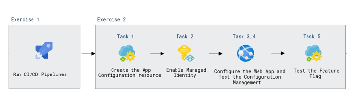


### Set up an Azure DevOps organization(Skip if already done)

1. On your lab VM open **Edge Browser** on desktop and navigate to [Azure DevOps](https://go.microsoft.com/fwlink/?LinkId=307137), and if prompted sign with the credentials.

    * Email/Username: <inject key="AzureAdUserEmail"></inject>

    * Password: <inject key="AzureAdUserPassword"></inject>

2. In the pop-up for *Help us protect your account*, select **Skip for now (14 days until this is required)**.

3. On the next page accept defaults and click on continue.
   
   
   
4. On the **Almost Done...** page fill the captcha and click on continue. 

### Exercise 0: Configure the lab prerequisites 

In this exercise, you will set up the prerequisites for the lab, which consist of a new Azure DevOps project with a repository based on the **eShopOnWeb**

#### Task 1: (skip if done) Create and configure the team project

In this task, you will create an **eShopOnWeb** Azure DevOps project to be used by several labs.

   1. On your lab computer, in a browser window open your Azure DevOps organization. Click on **New Project(1)**. Give your project the name **eShopOnWeb(1)** and choose visibility as **Private(2)**. Click on **Create(3)**
      
      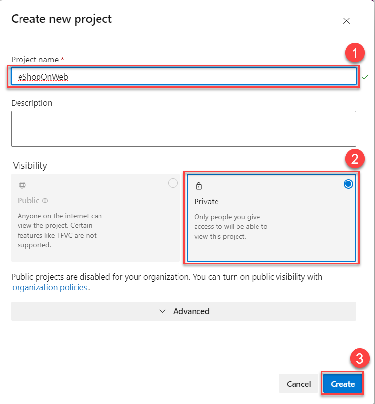
      
#### Task 2: (skip if done) Import eShopOnWeb Git Repository
 
 In this task you will import the eShopOnWeb Git repository that will be used by several labs.

   1. On your lab computer, in a browser window open your Azure DevOps organization and the previously created eShopOnWeb project. Navigate to **Repos(1)>Files(2)**       and under the Import a repository click on **Import(3)**. 
      
      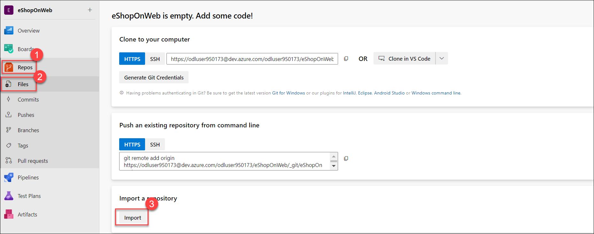
  
   2. On the **Import a Git Repository** window, Select repository type as **Git(1)** paste the following URL in Clone URL tab                                             **https://github.com/MicrosoftLearning/eShopOnWeb.git(2)** and click on **Import(3)**.
      
      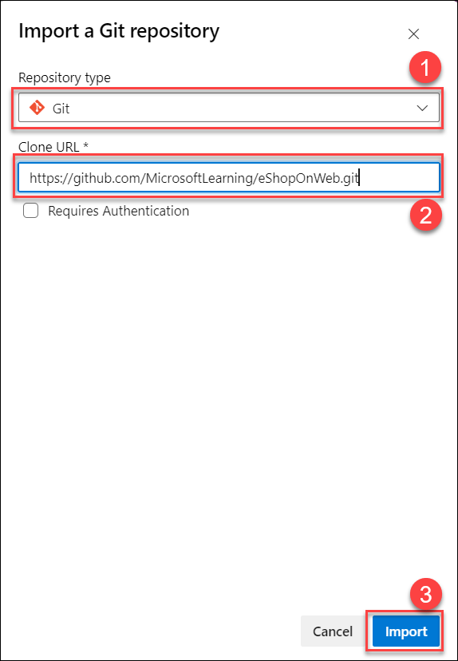
      
   3. The repository is organized the following way:

        O **.ado** folder contains Azure DevOps YAML pipelines
        
        O **.devcontainer** folder container setup to develop using containers (either locally in VS Code or GitHub Codespaces)
        
        O **.github** folder container YAML GitHub workflow definitions.
        
        O **.src** folder contains the .NET 6 website used on the lab scenarios.
        
        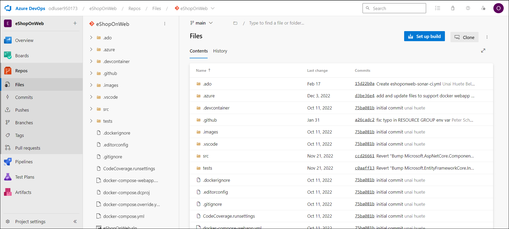
        
#### Task 3: (skip if done) Set main branch as default branch
   
   1. Go to **Repos(1)>Branches(2)**. Hover on the **main(3)** branch then click the **ellipsis(4)** on the right of the column and Click on **Set as default branch(5)**
      
      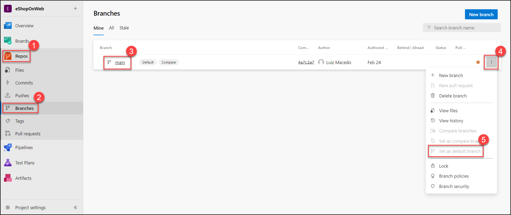
      
### Exercise 1: Import and run CI/CD Pipelines

In this exercise, you will import and run the CI pipeline, configure the service connection with your Azure Subscription and then import and run the CD pipeline.

In this task, you will create an eShopOnWeb Azure DevOps project to be used by several labs.

#### Task 1: Import and run the CI pipeline

Let's start by importing the CI pipeline named **eshoponweb-ci.yml**.

1. From the left navigation pane go to **Pipelines > Pipelines**.Click on **New pipeline** button
   
2. Select **Azure Repos Git (Yaml)**.

   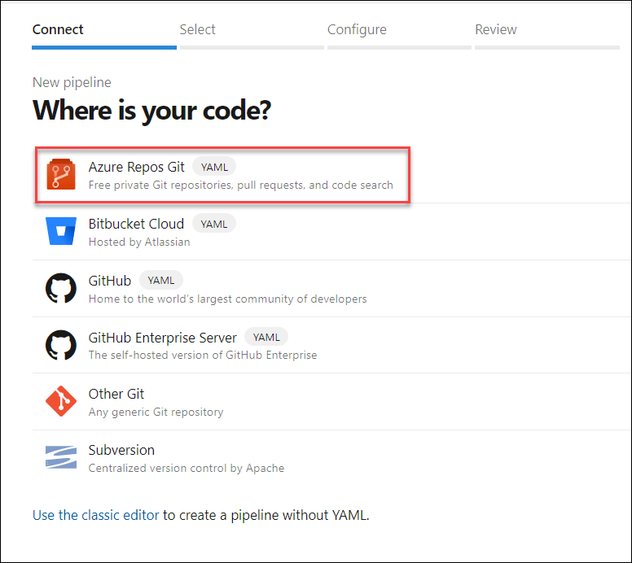

3. Select the **eShopOnWeb** repository.

   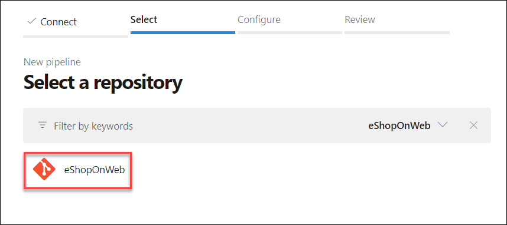

4. Select **Existing Azure Pipelines YAML File**.

   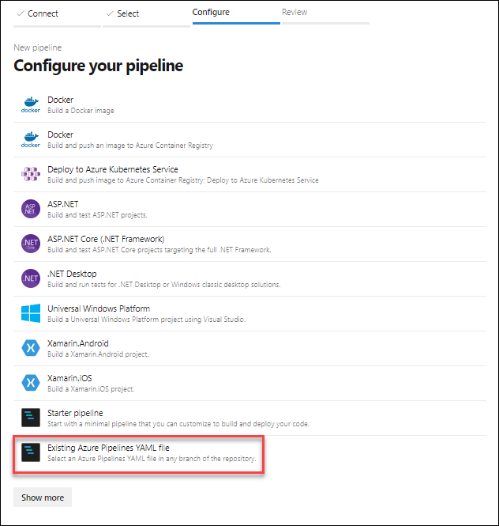

5. Select the **/.ado/eshoponweb-ci.yml** file then click on **Continue**.

   

6. Click the **Run** button to run the pipeline.

   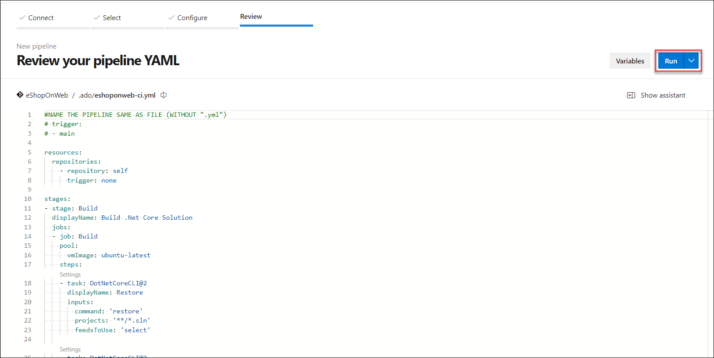

7. Your pipeline will take a name based on the project name. Let's **rename** it for identifying the pipeline better. Go to **Pipelines>Pipelines** and click on the recently created pipeline. Click on the **ellipsis** and **Rename/move** option. Name it **eshoponweb-ci** and click on **Save**.

   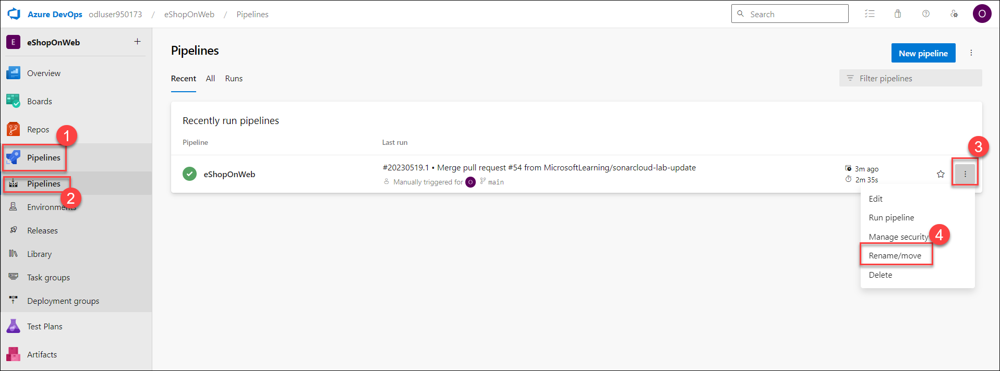
   
   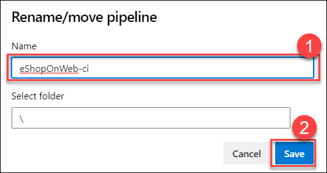

#### Task 2: Manage the service connection

You can create a connection from Azure Pipelines to external and remote services for executing tasks in a job.

In this task, you will create a service principal by using the Azure CLI, which will allow Azure DevOps to:

o Deploy resources on your azure subscription
   
o Deploy the eShopOnWeb application
   
   > **Note**: If you do already have a service principal, you can proceed directly to the next task.
      
   > **Note**: You will need a **service principal** to deploy Azure resources from Azure Pipelines.
 
   > **Note**: A **service principal** is automatically created by Azure Pipeline when you connect to an Azure subscription from inside a pipeline definition or when you create a new service connection from the project settings page (automatic option). You can also manually create the service principal from the portal or using Azure CLI and re-use it across projects.
 
1. From the lab computer, start a web browser, navigate to the **portal.azure.com**, and sign in with the user account **email(1)** and **password(2)** that has the Owner role in the Azure subscription you will be using in this lab and has the role of the Global Administrator in the Azure AD tenant associated with this subscription.

   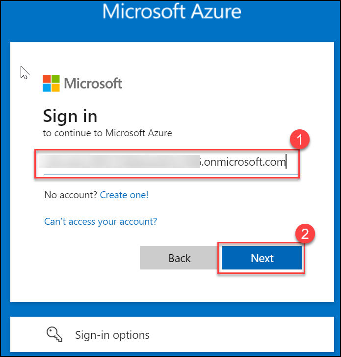
      
   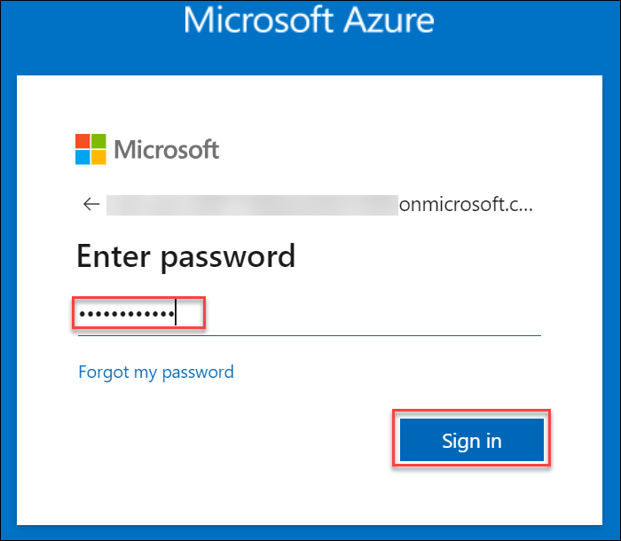
     
2. In the Azure portal, click on the **Cloud Shell** icon, located directly to the right of the search textbox at the top of the page.

   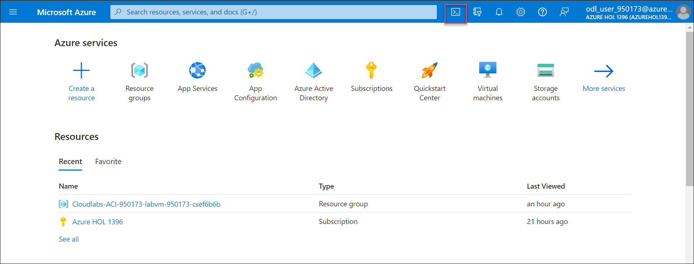
     
3. If prompted to select either **Bash** or **PowerShell**, select **Bash**.
   
   > **Note**: If this is the first time you are starting **Cloud Shell** and you are presented with the **You have no storage mounted** message, select the subscription you are using in this lab, and select **Create storage** then it will create storage account to store the logs.
         
      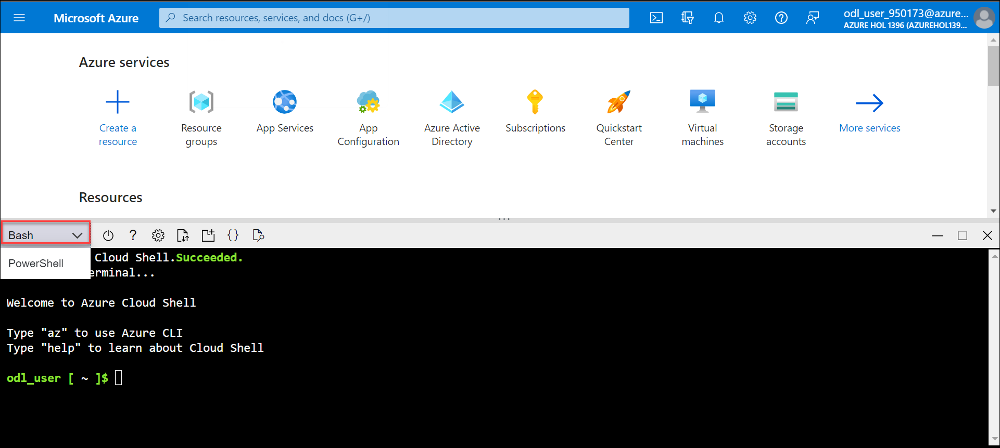
      
      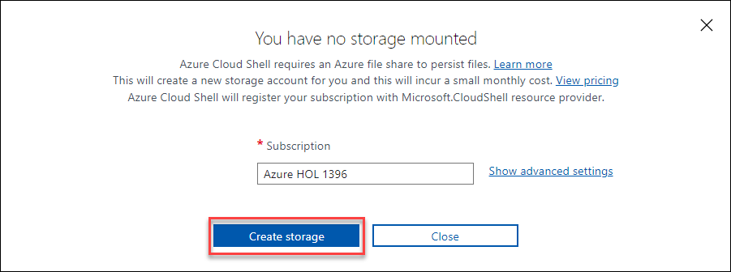
        
4. From the **Bash** prompt, in the **Cloud Shell** pane, run the following commands to retrieve the values of the Azure subscription ID attribute:
   
      ```
      subscriptionName=$(az account show --query name --output tsv)
      subscriptionId=$(az account show --query id --output tsv)
      echo $subscriptionName
      echo $subscriptionId
      ```
      
      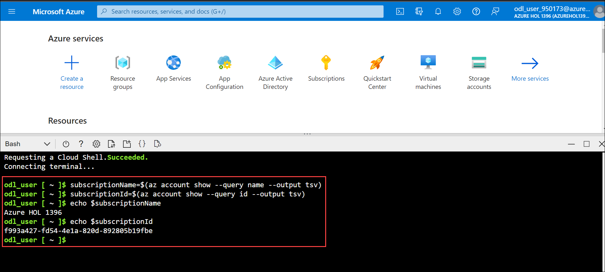
      
      >  **Note**: Copy both values to a text file. You will need them later in this lab.
     
5. From the **Bash** prompt, in the **Cloud Shell** pane, run the following command to create a service principal:

   ```
   az ad sp create-for-rbac --name sp-az400-azdo --role contributor --scopes /subscriptions/$subscriptionId
   ```

   > **Note**: The command will generate a JSON output. Copy the output to text file. You will need it later in this lab.

   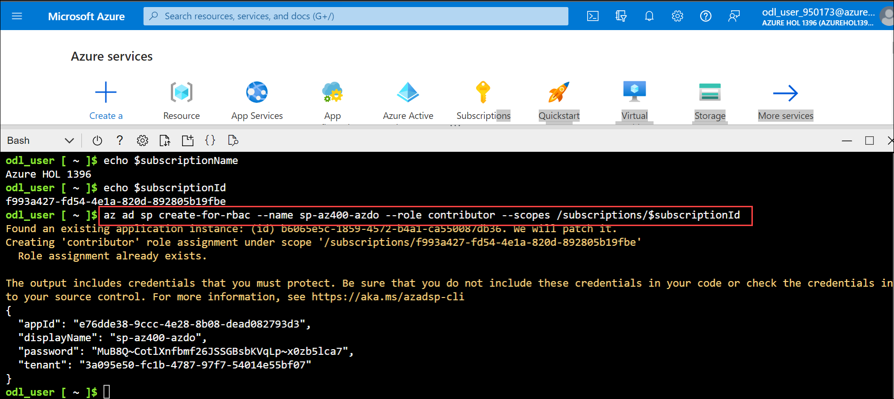

6. Next, from the lab computer, start a web browser, navigate to the Azure DevOps **eShopOnWeb** project. Click on **Project Settings>Service Connections(1) (under Pipelines)** and **Create Service Connection(2)**.

   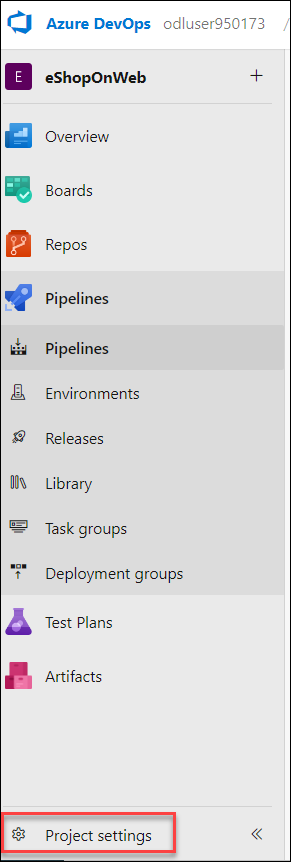
     
7. On the **New service connection** blade, select **Azure Resource Manager** and **Next** (may need to scroll down).

      
8. The choose **Service principal (manual)(1)** and click on **Next(2)**.

   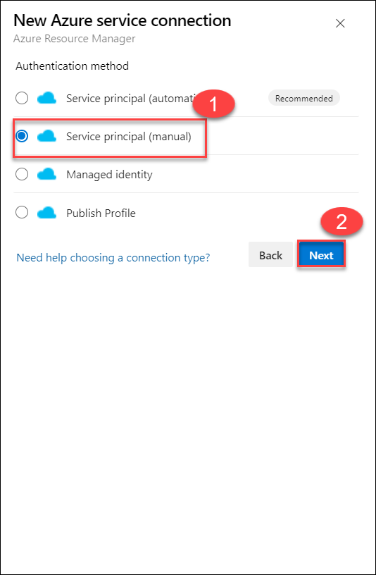

9. Fill in the empty fields using the information gathered during previous steps:

      o **Subscription Id(1)** and **Subscription Name(2)**.
        
      o **Service Principal Id (or clientId)(3)**, **Service Principal Key (or Password)(4)** and **TenantId(5)** and click **Verify(6)** to check the connection.
        
      o In **Service connection name type azure subs(7)**. This name will be referenced in YAML pipelines when needing an Azure DevOps Service Connection to communicate with your Azure subscription.
        
      o **Enable(8)** Grant access permissions to all pipelines.
        
      o Click on **Verify and Save(9)**
        
      
        
      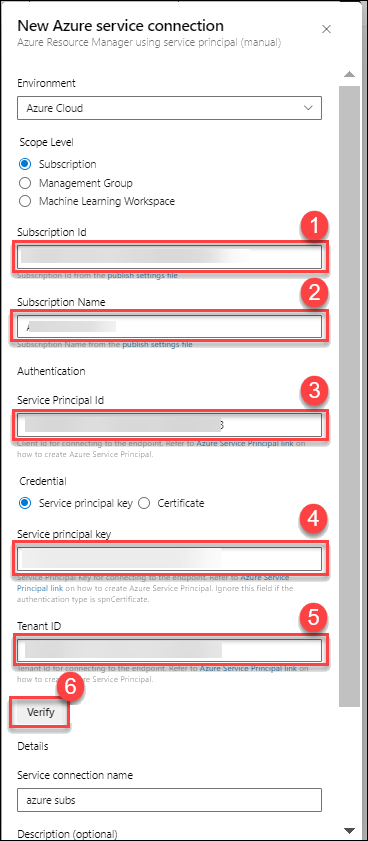
        
      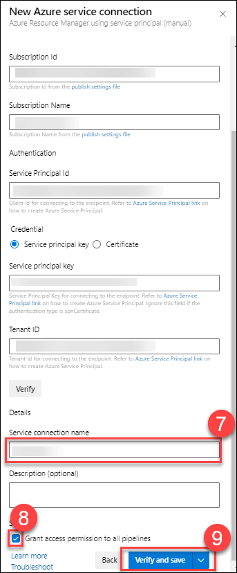
          
#### Task 3: Import and run the CD pipeline
 
Let's import the CD pipeline named **eshoponweb-cd-webapp-code.yml*.
 
1. Go to **Pipelines(1)>Pipelines(2)** and Click on **New pipeline(3)** button

   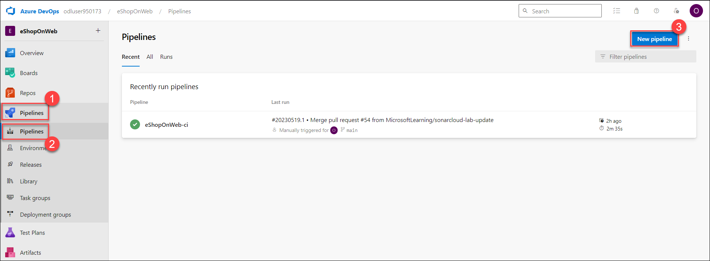

2. Select **Azure Repos Git (Yaml)**

   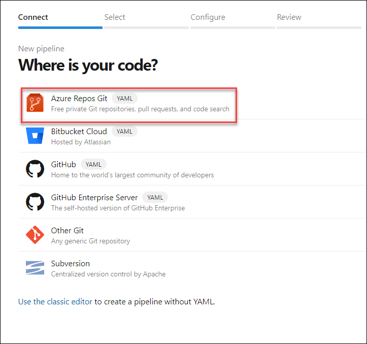

3. Select the **eShopOnWeb** repository

   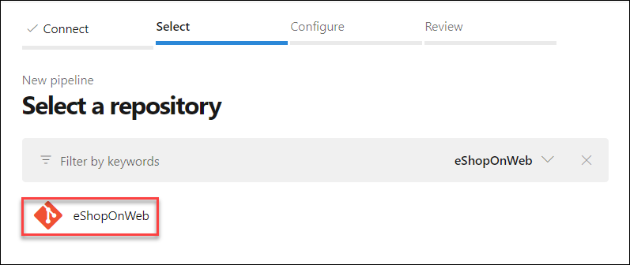

4. Select **Existing Azure Pipelines YAML File**

   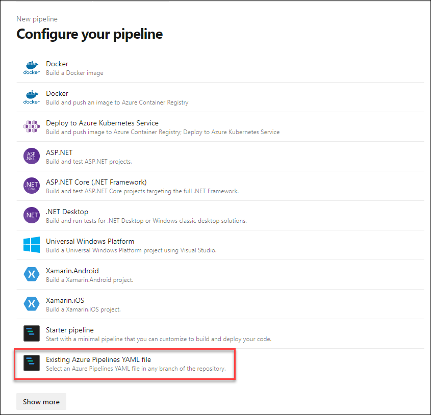

5. Select the **.ado/eshoponweb-cd-webapp-code.yml(1)** file then click on **Continue(2)**

   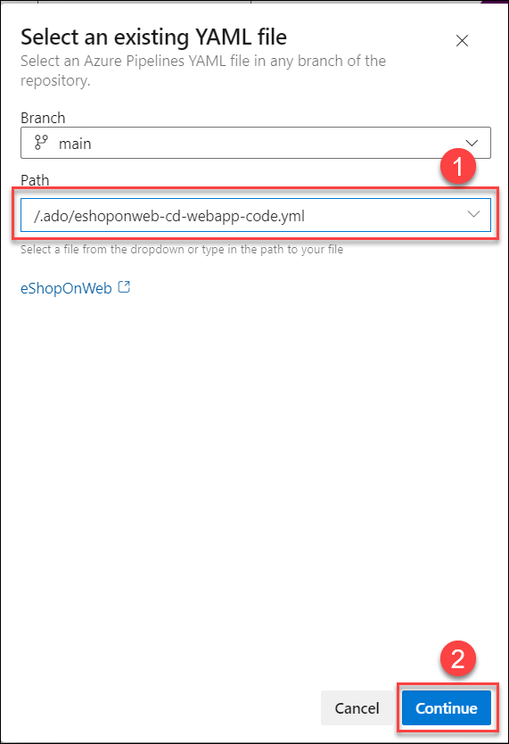
   
   In the YAML pipeline definition, customize:
      
   - **AZ400-EWebshop-NAME(1)** replace NAME with **<inject key="DeploymentID" enableCopy="false"/>**.
   - **YOUR-SUBSCRIPTION-ID(2)** with your Azure subscription id.
   - **az400-webapp-NAME(3)** replace NAME with **<inject key="DeploymentID" enableCopy="false"/>**.

   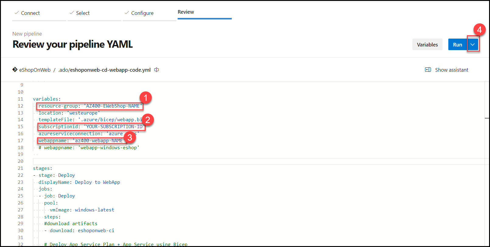
         
6. Click on **Save and Run** and wait for the pipeline to execute successfully.

   > **Note**: The deployment may take a few minutes to complete.When the pipeline is running if you get a prompt  as **Permissions Needed** click on **view** and click on permit 

      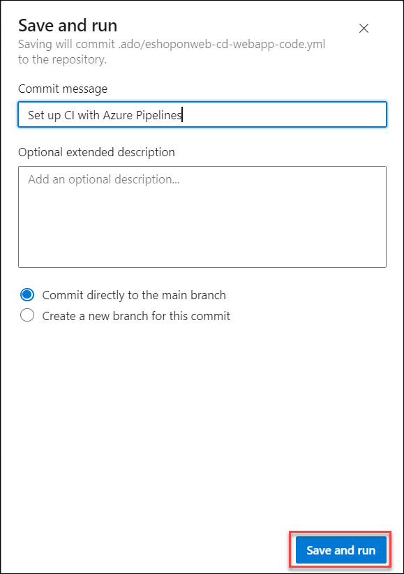
       
      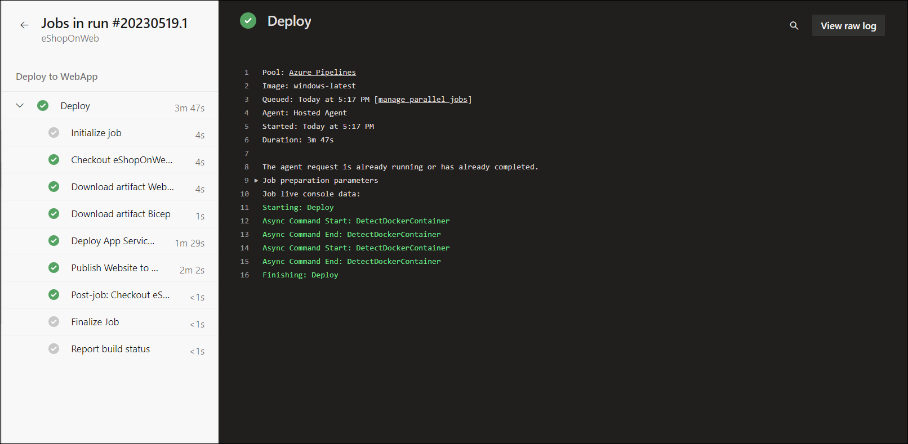

   The CD definition consists of the following tasks:
      - **Resources**: it is prepared to automatically trigger based on CI pipeline completion. It also downloads the repository for the bicep file.
      - **AzureResourceManagerTemplateDeployment**: Deploys the Azure Web App using bicep template.

7. Your pipeline will take a name based on the project name. Let's **rename** it for identifying the pipeline better. Go to **Pipelines(1)>Pipelines(2)** and          click on the recently created pipeline. Click on the **ellipsis(3)** and **Rename/move(4)** option. Name it **eshoponweb-cd-webapp-code(5)** and click on          **Save(6)**.

   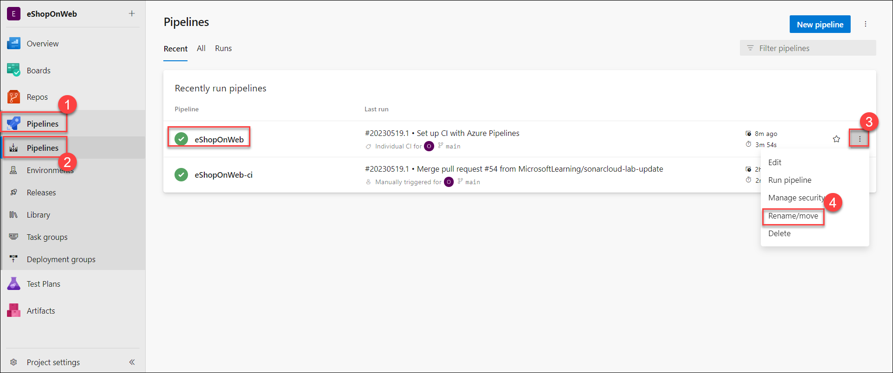   
     
   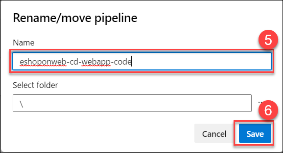 

### Exercise 2: Manage Azure App Configuration

In this exercise, you will create the App Configuration resource in Azure, enable the managed identity and then test the full solution.

   > **Note**: This exercise doesn't require any coding skills. The website's code implements already Azure App Configuration functionalities.

If you want to know how to implement this in your application, please take a look at these tutorials: [Use dynamic configuration in an ASP.NET Core app](https://learn.microsoft.com/azure/azure-app-configuration/enable-dynamic-configuration-aspnet-core) and [Manage feature flags in Azure App Configuration](https://learn.microsoft.com/azure/azure-app-configuration/manage-feature-flags).

#### Task 1: Create the App Configuration resource

1. In the Azure Portal, search for the **App Configuration** service

   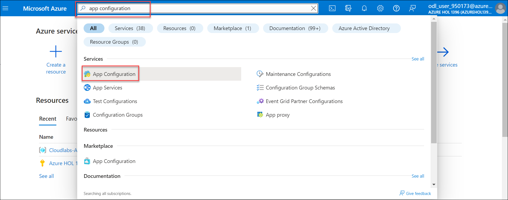
   
   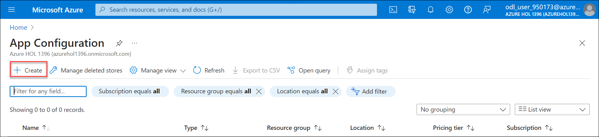
   
2. Click **Create app configuration** then select:
    - Your Azure Subscription(1)
    - The Resource Group **(2)** created previously (it should be named **AZ400-EWebShop1-<inject key="DeploymentID" enableCopy="false"/>**)
    - Retain the same region which is in the CD Pipeline previously **(3)**
    - Give a unique name **appcs-<inject key="DeploymentID" enableCopy="false"/>** **(4)**.
    - Select the **Free(5)** pricing tier

    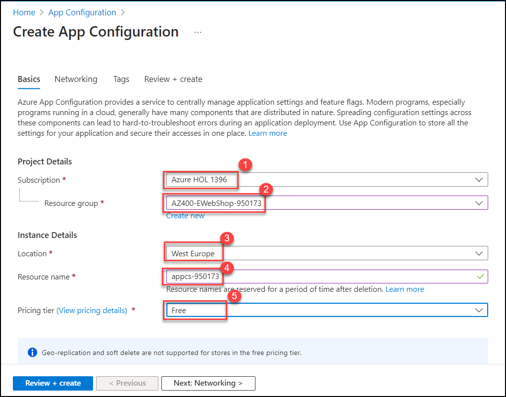
     
3. Click on **Review + create(6)** then **Create**

   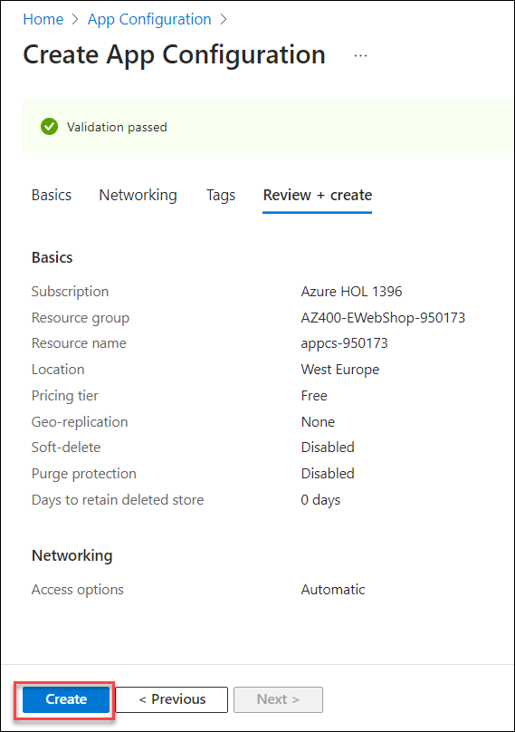
   
4. After creating the App Configuration service, go to **Overview(1)** and copy/save the value of the **Endpoint(2)**.

   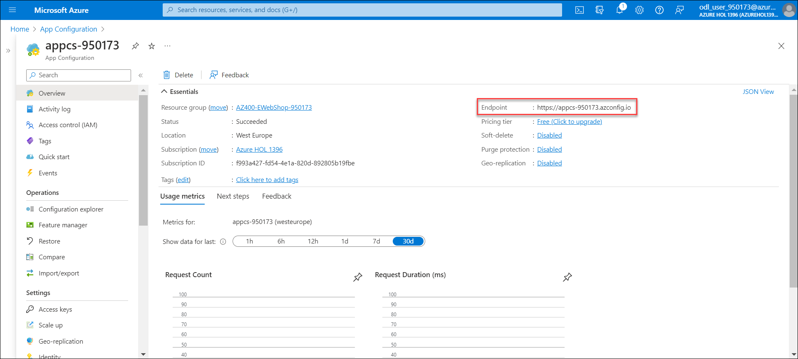

#### Task 2: Enable Managed Identity

1. Go to the **Web App(1)** deployed using the pipeline (it should be named **az400-webapp-NAME**).

   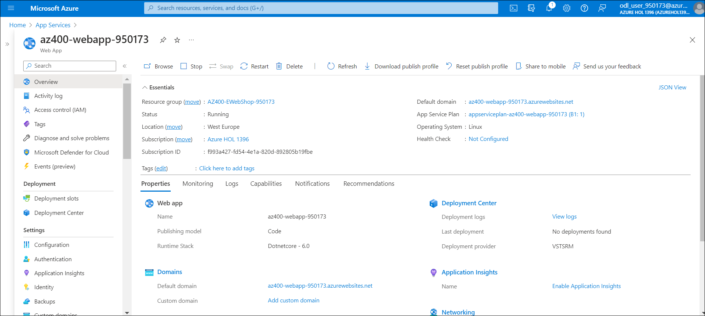
   
2. In the **Settings(2)** section, click on **Identity(3)** then switch status to **On(4)** in the **System Assigned** section, click **save(5)>yes(6)** and wait a few seconds for the operation to finish.

   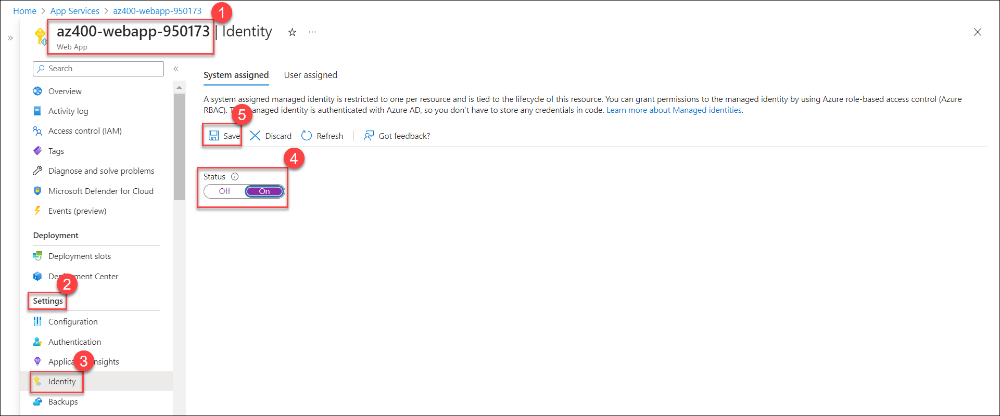
   
   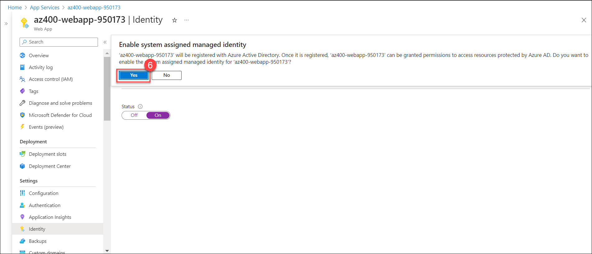
   
3. Go back to the **App Configuration(1)** service and click on **Access control(IAM)(2)** then **+Add(3)->Add role assignment(4)**.

   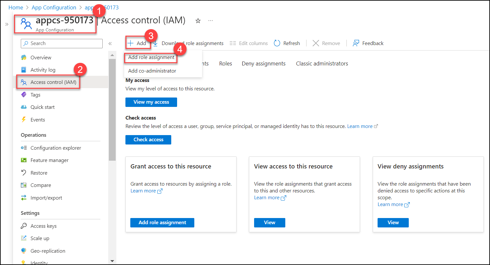
   
4. In the **Role(1)** section, select **App Configuration Data Reader(2)** and click on **Next(3)**.

   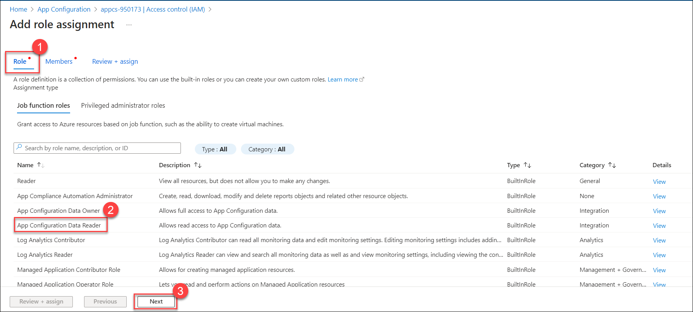
   
5. In the **Members(1)** section, check **Manage Identity(2)** then click on **+ Select members(3)**. In the select manage identities tab select **Managed Identity(4)** as **App Service** of your **Web App(5)** (they should have the same name) and then click on **Select(6)**.

   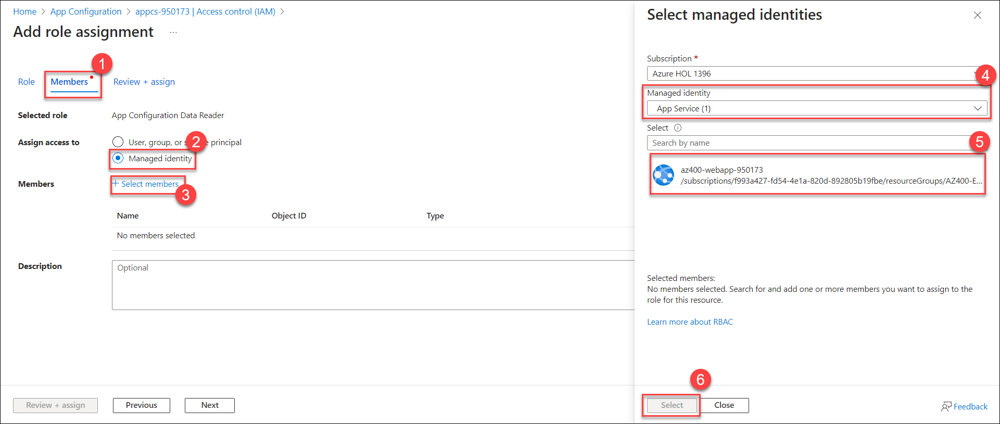
   
6. Click on **Review and assign**

   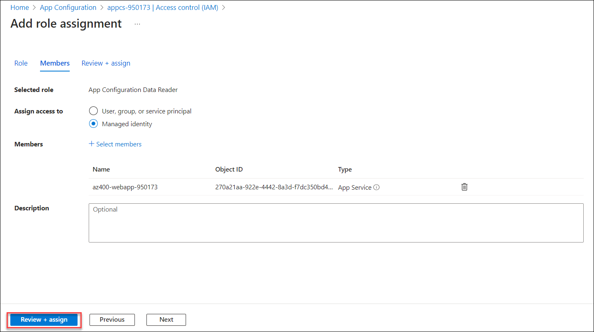

#### Task 3: Configure the Web App

In order to make sure that your website is accessing App Configuration, you need to update its configuration.
1. Go back to your Web App.
2. In the **Settings(1)** section, click on **Configuration(2)** and select **+ New application setting(3)**.

   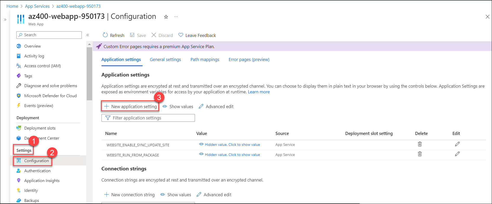

3. Add two new application settings:
    - First app setting
        - **Name (1):** UseAppConfig
        - **Value (2):** true

         
      
    - Second app setting
        - **Name (1):** AppConfigEndpoint
        - **Value (2):** *the value you saved/copied previously from App Configuration Endpoint. It should look like https://appcs-NAME-REGION.azconfig.io*
      
         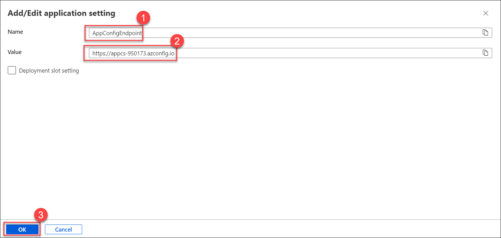
      
4. Click **Save** then **Continue** and wait for the settings to be updated.

   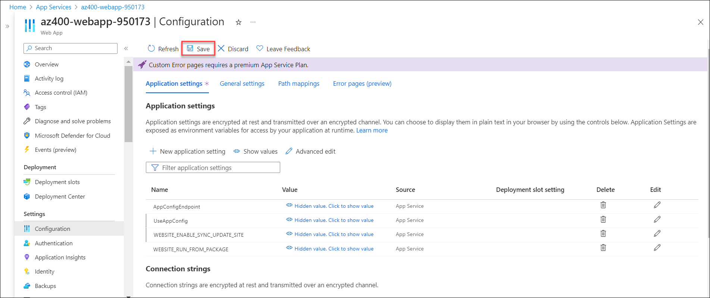
   
   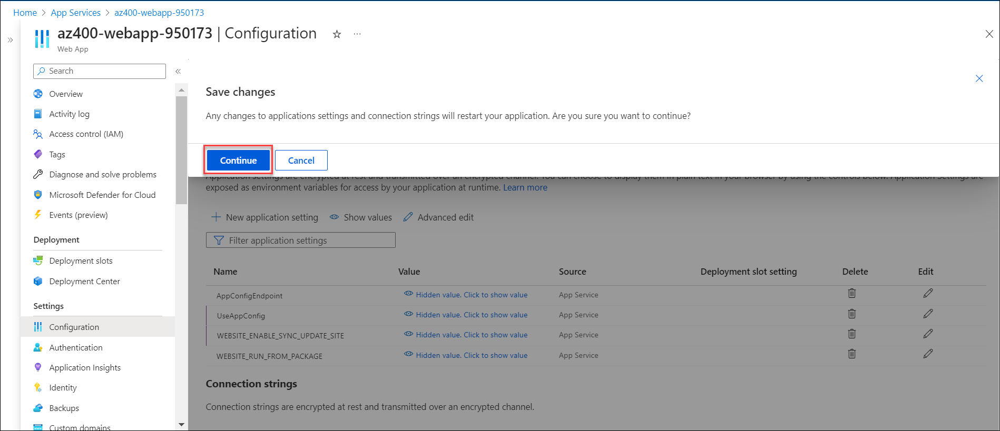
   
5. Go to **Overview(1)** and click on **Browse(2)**

   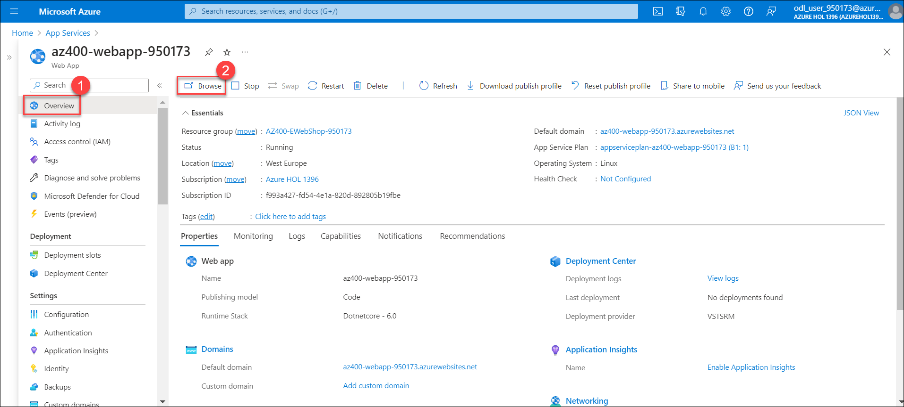
   
6. At this step, you will see no changes in the website since the App Configuration doesn't contain any data. This is what you will do in the next tasks.

#### Task 4: Test the Configuration Management

1. In your website, select **Visual Studio(2)** in the **Brand(1)** drop-down list and click on the arrow button (**>(3)**).

   
2. You will see a message saying **"THERE ARE NO RESULTS THAT MATCH YOUR SEARCH"(4)**.

   
   
The goal of this Lab is to be able to update that value without updating the website's code or redeploying it.

3. In order to try this, go back to **App Configuration(1)**. In the **Operations(2)** section, select **Configuration Explorer(3)** and Click on **+ Create(4) > Key-value(5)** then add:
    - **Key(6):** eShopWeb:Settings:NoResultsMessage
    - **Value(7):** *type your custom message*
   Click **Apply(8)** then go back to your website and refresh the webapp browser page.
   
   
   
   
   
4. You should see your new message instead of the old default value.

   
   
Congratulations! In this task, you tested the **Configuration explorer** in Azure App Configuration.

#### Task 5: Test the Feature Flag

Let's continue to test the Feature manager.
1. In order to try this, go back to **App Configuration(1)**. In the **Operations(2)** section, select **Feature manager(3)**.

   
   
2. Click on **+ Create(4)** then add:
    - **Enable feature flag(1):** Checked
    - **Feature flag name(2):** SalesWeekend
   and click **Apply(3)** then go back to your website and refresh the page.
   
   
    
3. You should see an image with text "ALL T-SHIRTS ON SALE THIS WEEKEND".

   
   
4. You can disable this feature in App Configuration and then you would see that the image disappears.

   
   
   

   **Congratulations!!** In this task, you tested the **Feature manager** in Azure App Configuration.

> **Congratulations** on completing the task! Now, it's time to validate it. Here are the steps:
- Click the Lab Validation tab located at the upper right corner of the lab guide section and navigate to the Lab Validation Page.
- Hit the Validate button for the corresponding task. If you receive a success message, you can proceed to the next task. 
- If not, carefully read the error message and retry the step, following the instructions in the lab guide.
- If you need any assistance, please contact us at labs-support@spektrasystems.com. We are available 24/7 to help you out.

## Review

In this lab, you learned how to dynamically enable configuration and manage feature flags.

## You have successfully completed the lab.
