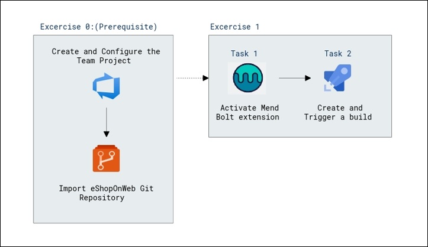
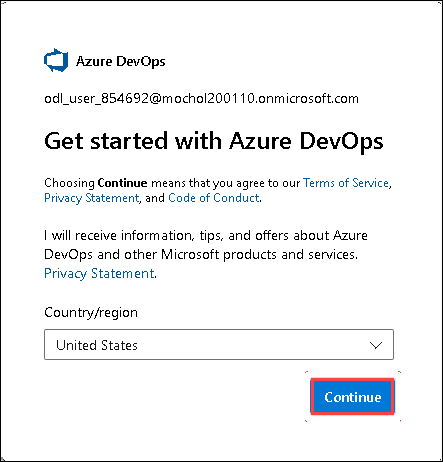
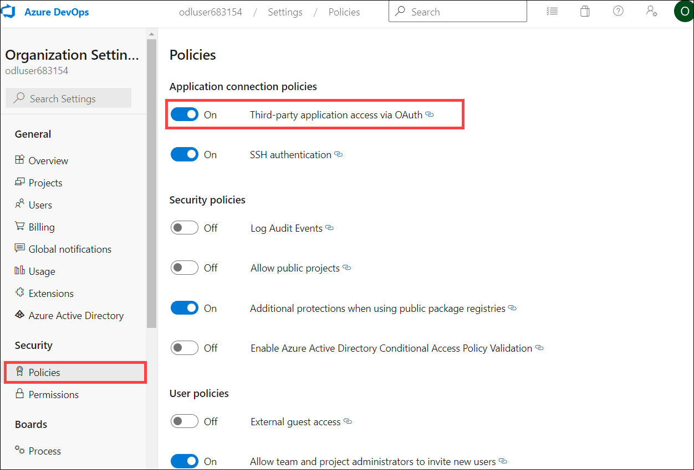
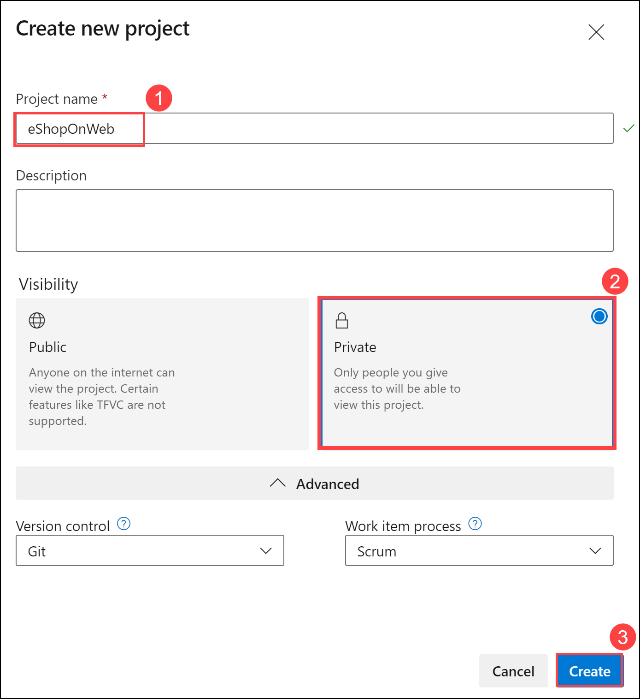
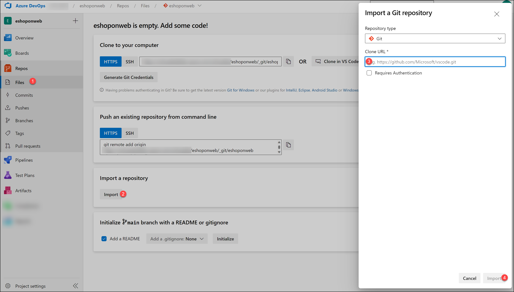

# Lab 13: Implement Security and Compliance in an Azure Pipeline

## Lab overview

In this lab, you will use **WhiteSource Bolt with Azure DevOps** to automatically detect vulnerable open source components, outdated libraries, and license compliance issues in your code. You will leverage WebGoat, an intentionally insecure web application, maintained by OWASP designed to illustrate common web application security issues.

[WhiteSource](https://www.whitesourcesoftware.com/) is the leader in continuous open source software security and compliance management. WhiteSource integrates into your build process, irrespective of your programming languages, build tools, or development environments. It works automatically, continuously, and silently in the background, checking the security, licensing, and quality of your open source components against WhiteSource constantly-updated definitive database of open source repositories.

WhiteSource provides WhiteSource Bolt, a lightweight open source security and management solution developed specifically for integration with Azure DevOps and Azure DevOps Server. Note that WhiteSource Bolt works per project and does not offer real-time alert capabilities, which requires **Full platform**, generally recommended for larger development teams that want to automate their open source management throughout the entire software development lifecycle (from the repositories to post-deployment stages) and across all projects and products.

Azure DevOps integration with WhiteSource Bolt will enable you to:

- Detect and remedy vulnerable open source components.
- Generate comprehensive open source inventory reports per project or build.
- Enforce open source license compliance, including dependencies’ licenses.
- Identify outdated open source libraries with recommendations to update.

## Lab objectives

After you complete this lab, you will be able to:

- Activate WhiteSource Bolt
- Run a build pipeline and review WhiteSource security and compliance report

## Estimated time: 45 minutes

## Architecture Diagram

   

### Set up an Azure DevOps organization. 

1. On your lab VM open **Edge Browser** on desktop and navigate to https://go.microsoft.com/fwlink/?LinkId=307137. 

2. In the pop-up for *Help us protect your account*, select **Skip for now (14 days until this is required)**.

3. On the next page accept defaults and click on continue.

    

4. On the **Almost Done...** page fill the captcha and click on continue. 

    

5. On the Azure Devops page click on **Azure DevOps** located at top left corner and then click on **Organization Setting** at the left down corner

    

6. In the **Organization Setting** window on the left menu click on **Billing** and select **Setup Billing** then click on save.

    
    
        

7. On the **MS Hosted CI/CD** section under **Paid parallel jobs** enter value **1** and at the end of the page click on **Save**.

        

8. In the **Organization Setting** window on the left menu click on **Policies** and enable **Third-party application access via OAuth**.

        

### Exercise 0: Configure the lab prerequisites

In this exercise, you will set up the prerequisites for the lab, which consist of a new Azure DevOps project with a repository based on the [eShopOnWeb](https://dev.azure.com/unhueteb/_git/eshopweb-az400).

#### Task 1:  (skip if done) Create and configure the team project

In this task, you will create an **eShopOnWeb** Azure DevOps project to be used by several labs.

1.  On your lab computer, in a browser window open your Azure DevOps organization. Click on **New Project**. Give your project the name **eShopOnWeb** and leave the other fields with defaults. Click on **Create**.

    

#### Task 2:  (skip if done) Import eShopOnWeb Git Repository

In this task you will import the eShopOnWeb Git repository that will be used by several labs.

1.  On your lab computer, in a browser window open your Azure DevOps organization and the previously created **eShopOnWeb** project. Click on **Repos>Files** , **Import**. On the **Import a Git Repository** window, paste the following URL https://github.com/MicrosoftLearning/eShopOnWeb.git  and click **Import**:

    

1.  The repository is organized the following way:
    - **.ado** folder contains Azure DevOps YAML pipelines
    - **.devcontainer** folder container setup to develop using containers (either locally in VS Code or GitHub Codespaces)
    - **.azure** folder contains Bicep&ARM infrastructure as code templates used in some lab scenarios.
    - **.github** folder container YAML GitHub workflow definitions.
    - **src** folder contains the .NET 6 website used on the lab scenarios.

### Exercise 1: Implement Security and Compliance in an Azure DevOps pipeline by using Mend Bolt

In this exercise, leverage Mend Bolt to scan the project code for security vulnerabilities and licensing compliance issues, and view the resulting report.

#### Task 1: Activate Mend Bolt extension

In this task, you will activate WhiteSource Bolt in the newly generated Azure Devops project.

1.  On your lab computer, in the web browser window displaying the Azure DevOps portal with the **eShopOnWeb** project open, click on the marketplace icon > **Browse Marketplace**.

    

1.  On the MarketPlace, search for **Mend Bolt (formerly WhiteSource)** and open it. Mend Bolt is the free version of the previously known WhiteSource tool, which scans all your projects and detects open source components, their license and known vulnerabilities.

    > Warning: make sure you select the Mend **Bolt** option (the **free** one)!

1.  On the **Mend Bolt (formerly WhiteSource)** page, click on **Get it for free**.

    

1.  On the next page, select the desired Azure DevOps organization and **Install**. **Proceed to organization** once installed.

1.  In your Azure DevOps navigate to **Organization Settings** and select **Mend** under **Extensions**. Provide your Work Email (**your lab personal account**, e.g. using AZ400learner@outlook.com instead of student@microsoft.com ), Company Name and other details and click **Create Account** button to start using the Free version.

    

#### Task 2: Create and Trigger a build

In this task, you will create and trigger a CI build pipeline within  Azure DevOps project. You will use **Mend Bolt** extension to identify vulnerable OSS components present in this code.

1.  On your lab computer, from the **eShopOnWeb** Azure DevOps project, in the vertical menu bar on the left side, navigate to the **Pipelines>Pipelines** section, click **Create Pipeline** (or **New Pipeline**).

1.  On the **Where is your code?** window, select **Azure Repos Git (YAML)** and select the **eShopOnWeb** repository.

1.  On the **Configure** section, choose **Existing Azure Pipelines YAML file**. Provide the following path **/.ado/eshoponweb-ci-mend.yml** and click **Continue**.

    

1.  Review the pipeline and click on **Run**. It will take a few minutes to run successfully.
    > **Note**: The build may take a few minutes to complete. The build definition consists of the following tasks:
    - **DotnetCLI** task for restoring, building, testing and publishing the dotnet project.
    - **Whitesource** task (still keeps the old name), to run the Mend tool analysis of OSS libraries.
    - **Publish Artifacts** the agents running this pipeline will upload the published web project.

1.  While the pipeline is executing, lets **rename** it to identify it easier (as the project may be used for multiple labs). Go to **Pipelines/Pipelines** section in Azure DevOps project, click on the executing Pipeline name (it will get a default name), and look for **Rename/move** option on the ellipsis icon. Rename it to **eshoponweb-ci-mend** and click **Save**.

    

1.  Once the pipeline execution has finished, you can review the results. Open the latest execution for  **eshoponweb-ci-mend** pipeline. The summary tab will show the logs of the execution, together with related details such as the repository version(commit) used, trigger type, published artifacts, test coverage, etc.

1. On the **Mend Bolt** tab, you can review the OSS security analysis. It will show you details around the inventory used, vulnerabilities found (and how to solve them), and an interesting report around library related Licenses. Take some time to review the report.

    

### Exercise 2: Remove the Azure DevOps billing

In this exercise, you will remove the Azure DevOps billing enabled in this lab to eliminate unexpected charges.

#### Task 1: Remove the Azure DevOps billing

In this task, you will remove pipeline billing to eliminate unnecessary charges.

1. On the lab computer, switch to the browser window displaying Azure DevOps organization homepage and select **Organization Settings** at bottom left corner.

1. Under **Organization Settings** select **Billing** and click on **Change billing** button to open Change billing pane.

1. In the **Change billing** pane, select **Remove billing** setting and click on Save.

> **Congratulations** on completing the task! Now, it's time to validate it. Here are the steps:
- Click the Lab Validation tab located at the upper right corner of the lab guide section and navigate to the Lab Validation Page.
- Hit the Validate button for the corresponding task. If you receive a success message, you can proceed to the next task. 
- If not, carefully read the error message and retry the step, following the instructions in the lab guide.
- If you need any assistance, please contact us at labs-support@spektrasystems.com. We are available 24/7 to help you out.

## Review

In this lab, you integrated a GitHub project with Azure DevOps by using the new Azure Pipelines integration from the Marketplace.

## You have successfully completed the lab.
