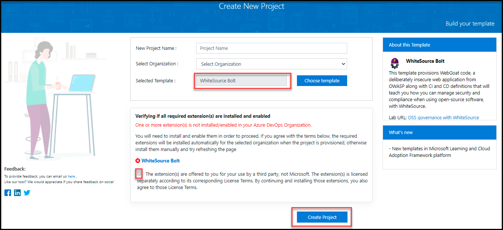
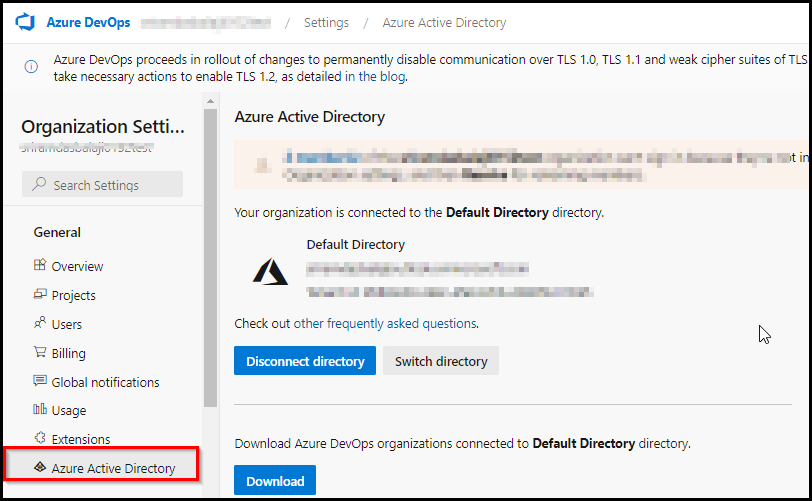
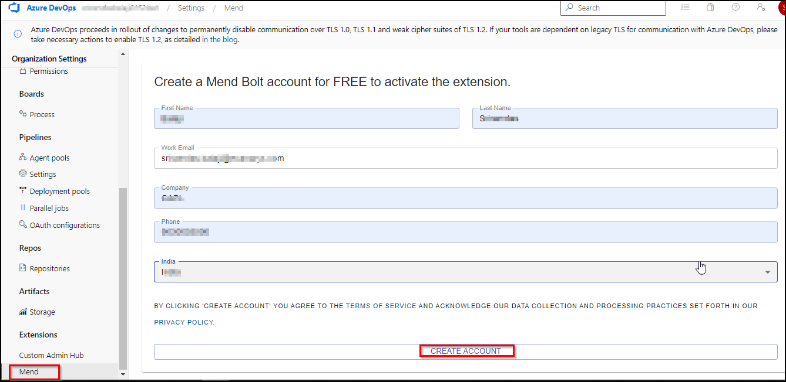
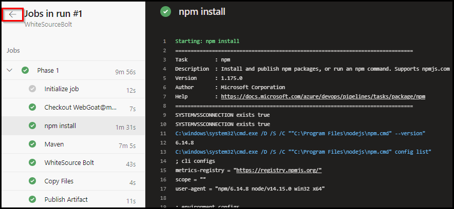
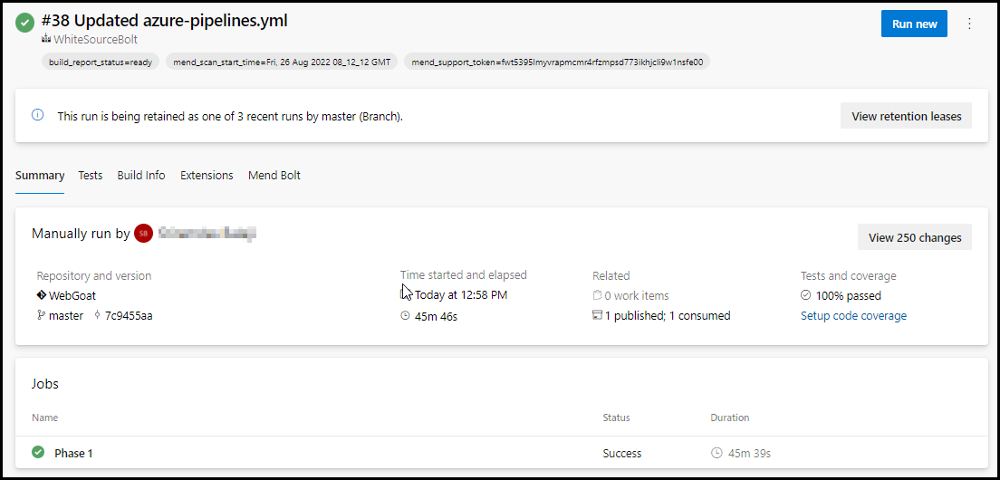
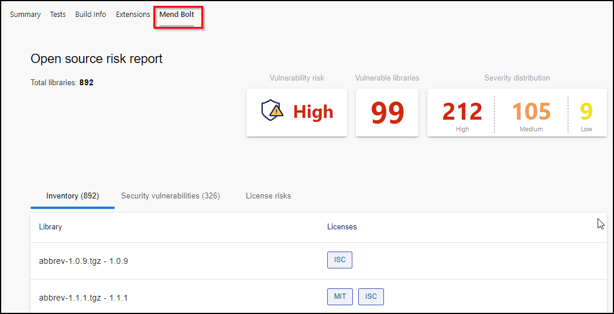
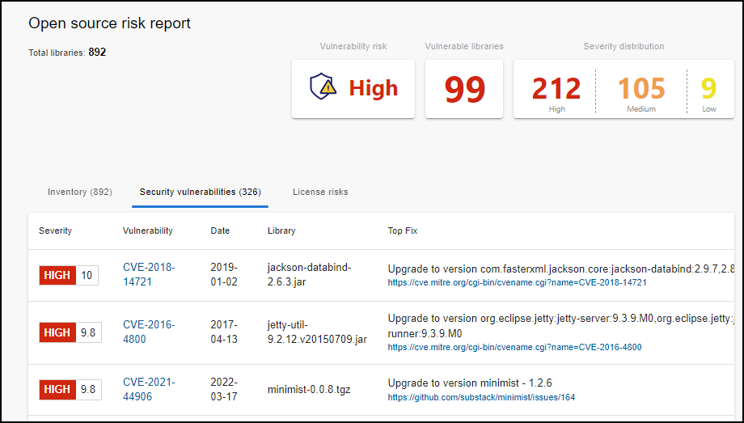
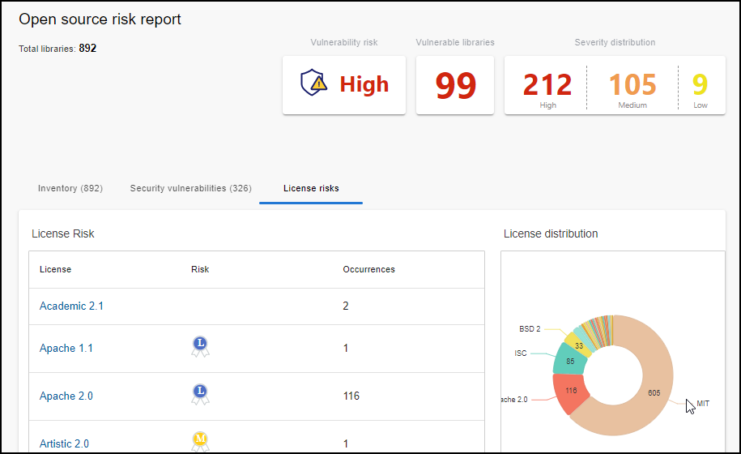

# Lab 15: Implement Security and Compliance in an Azure Pipeline
# Student lab manual

## Lab overview

In this lab, you will use **WhiteSource Bolt with Azure DevOps** to automatically detect vulnerable open source components, outdated libraries, and license compliance issues in your code. You will leverage WebGoat, an intentionally insecure web application, maintained by OWASP designed to illustrate common web application security issues.

[WhiteSource](https://www.whitesourcesoftware.com/) is the leader in continuous open source software security and compliance management. WhiteSource integrates into your build process, irrespective of your programming languages, build tools, or development environments. It works automatically, continuously, and silently in the background, checking the security, licensing, and quality of your open source components against WhiteSource constantly-updated definitive database of open source repositories.

WhiteSource provides WhiteSource Bolt, a lightweight open source security and management solution developed specifically for integration with Azure DevOps and Azure DevOps Server. Note that WhiteSource Bolt works per project and does not offer real-time alert capabilities, which requires **Full platform**, generally recommended for larger development teams that want to automate their open source management throughout the entire software development lifecycle (from the repositories to post-deployment stages) and across all projects and products.

Azure DevOps integration with WhiteSource Bolt will enable you to:

- Detect and remedy vulnerable open source components.
- Generate comprehensive open source inventory reports per project or build.
- Enforce open source license compliance, including dependencies’ licenses.
- Identify outdated open source libraries with recommendations to update.

## Objectives

After you complete this lab, you will be able to:

- Activate WhiteSource Bolt
- Run a build pipeline and review WhiteSource security and compliance report

## Instructions

#### Set up an Azure DevOps organization. 

1. On your lab VM open **Edge Browser** on desktop and navigate to https://dev.azure.com. Then click on **Sign into Azure DevOps** and login with the credentials provided in environment details tab.

    

2. On the next page accept defaults and click on continue.

    

3. On the **Get started with Azure DevOps** page click on **Continue**.

4. On the **Almost Done...** page fill the captcha and click on continue. 

    

5. On the Azure Devops page click on **Azure DevOps** located at top left corner and then click on **Organization Setting** at the left down corner

    

6. In the **Organization Setting** window on the left menu click on **Billing** and select **Setup Billing** then click on save.

    
    
        

7. On the **MS Hosted CI/CD** section under **Paid parallel jobs** enter value **1** and at the end of the page click on **Save**.

        

8. In the **Organization Setting** window on the left menu click on **Policies** and enable **Third-party application access via OAuth**.

        

### Exercise 0: Configure the lab prerequisites

In this exercise, you will set up the prerequisites for the lab, which consist of a new Azure DevOps project with a repository based on the [Parts Unlimited MRP GitHub repository](https://www.github.com/microsoft/partsunlimitedmrp).

#### Task 1: Create and configure the team project

In this task, you will use Azure DevOps Demo Generator to generate a new project based on the [WhiteSource-Bolt template](https://azuredevopsdemogenerator.azurewebsites.net/?name=WhiteSource-Bolt&templateid=77362)

1.  In a new tab of Edge browser navigate to https://azuredevopsdemogenerator.azurewebsites.net. This utility site will automate the process of creating a new Azure DevOps project within your account that is prepopulated with content (work items, repos, etc.) required for the lab. 

    > **Note**: For more information on the site, see https://docs.microsoft.com/en-us/azure/devops/demo-gen.

2.  Click **Sign in** and sign in using the logins provided in environment details tab

    

3.  If required, on the **Azure DevOps Demo Generator** page, click **Accept** to accept the permission requests for accessing your Azure DevOps subscription.

4.  On the **Create New Project** page, in the **New Project Name** textbox, type **WhiteSource Bolt**, in the **Select organization** dropdown list, select your Azure DevOps organization, and then click **Choose template**.

5.  In the list of templates, in the toolbar, click **DevOps Labs**, select the **WhiteSource Bolt** template and click **Select Template**.
 
     
     
6.  Back on the **Create New Project** page, if prompted to install a missing extension, select the checkbox below the **WhiteSource Bolt** and click **Create Project**.

    
    
    > **Note**: Wait for the process to complete. This should take about 2 minutes. In case the process fails, navigate to your DevOps organization, delete the project, and try again.

7.  On the **Create New Project** page, click **Navigate to project**.

### Exercise 1: Implement Security and Compliance in an Azure DevOps pipeline by using WhiteSource Bolt

In this exercise, leverage WhiteSource Bolt to scan the project code for security vulnerabilities and licensing compliance issues, and view the resulting report.

#### Task 1: Activate WhiteSource Bolt\Mend Bolt

In this task, you will activate WhiteSource Bolt in the newly generated Azure Devops project.

### Prerequisites to integrate Azure DevOps with Mend

Ensure the following:
1. On the Azure Devops page click on **Azure DevOps** located at top left corner and then click on **Organization Setting** at the left down corner

    
 
1. Your Azure DevOps organization is connected to an Azure AD via **Organization Settings > Azure Active Directory**.
    
      
      
1. In your Azure DevOps navigate to **Organization Settings** and select **Mend** under Extensions. Provide your Work Email, Company Name and other details and click **Create Account** button to start using the Free version.

   

#### Task 2: Trigger a build

In this task, you will trigger a build within your Java code-based Azure DevOps project. You will use **WhiteSource Bolt** extension to identify vulnerable components present in this code.

1.  On your lab computer, in the web browser window displaying the Azure DevOps portal open **WhiteSource Bolt** project. 

1. Go to **Pipelines** section under **Pipelines** tab, select the build definition **WhiteSourceBolt** and click on **Run pipeline** to trigger a build. Click **Run** (leave defaults).

   .png)

   .png)
   
   > **Note** : We also have a YAML build pipeline if that's something you're interested in. To proceed through the YAML pipeline, choose **WhiteSourceBolt-YAML** and click **Edit** to view the YAML pipeline.

1. To view the build in progress status, click on job named **Phase 1**.

   

   

1. While the build is in progress, let's explore the build definition. The tasks that are used in the build definition are listed in the table below.

    |Tasks|Usage|
    |----|------|
    | **npm**| Installs and publishes npm packages required for the build|
    | **Maven**| builds Java code with the provided pom xml file|
    |**Mend Bolt**| scans the code in the provided working directory/root directory to detect security vulnerabilities, problematic open source licenses|
    | **Copy Files**| copies the resulting JAR files from the source to the destination folder using match patterns|
    | **Publish Build Artifacts**| publishes the artifacts produced by the build
    
1. Once the build is completed, click back navigation to  see the summary which shows **Test results, Build artifacts** etc. as shown below. 

   
   
   

1. Navigate to **Mend Bolt** tab  and wait for the report generation of the completed build to see the vulnerability report.
   
   

#### Task 3: Analyze Reports

In this task, you will review the WhiteSource Bolt build report. 

##### Security Dashboard

The security dashboard shows the vulnerability of the build.
This report shows the list of all vulnerable open source components with **Vulnerability Score, Vulnerable Libraries, Severity Distribution**.

##### License risks
You can see the opensource license distribution and a detailed view of all components and links to their metadata and licensed references.

 

### Exercise 2: Remove the Azure DevOps billing

In this exercise, you will remove the Azure DevOps billing enabled in this lab to eliminate unexpected charges.

#### Task 1: Remove the Azure DevOps billing

In this task, you will remove pipeline billing to eliminate unnecessary charges.

1. On the lab computer, switch to the browser window displaying Azure DevOps organization homepage and select **Organization Settings** at bottom left corner.

1. Under **Organization Settings** select **Billing** and click on **Change billing** button to open Change billing pane.

1. In the **Change billing** pane, select **Remove billing** setting and click on Save.

#### Review

In this lab, you integrated a GitHub project with Azure DevOps by using the new Azure Pipelines integration from the Marketplace.
## Review

In this lab, you will use **WhiteSource Bolt with Azure DevOps** to automatically detect vulnerable open source components, outdated libraries, and license compliance issues in your code.
