# Lab 15: Package Management with Azure Artifacts


## Lab overview

Azure Artifacts facilitate discovery, installation, and publishing NuGet, npm, and Maven packages in Azure DevOps. It's deeply integrated with other Azure DevOps features such as Build, making package management a seamless part of your existing workflows.

## Objectives

After you complete this lab, you will be able to:

-  Create and connect to a feed.
-  Create and publish a NuGet package.
-  Import a NuGet package.
-  Update a NuGet package.

## Estimated timing: 60 minutes

## Architecture Diagram

  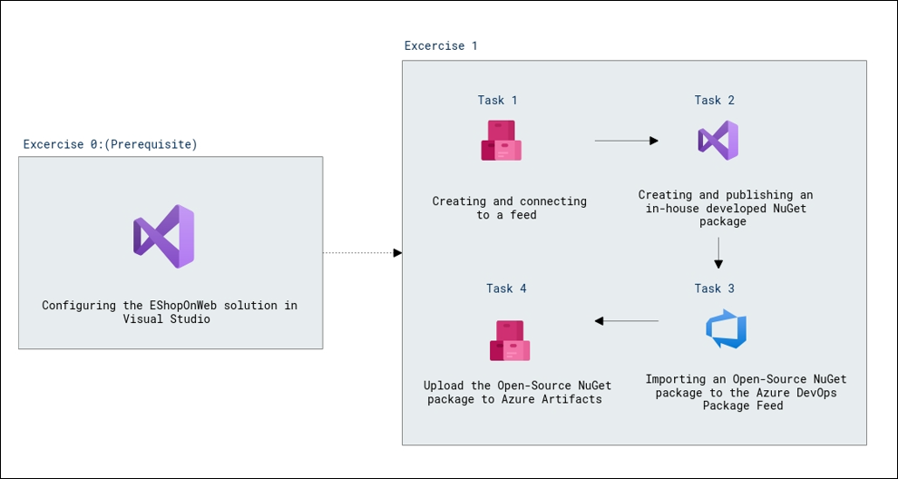

## Set up an Azure DevOps organization
1. On your lab VM open **Edge Browser** on desktop and navigate to [Azure DevOps](https://go.microsoft.com/fwlink/?LinkId=307137), and if prompted sign in with the credentials.

    * Email/Username: <inject key="AzureAdUserEmail"></inject>

    * Password: <inject key="AzureAdUserPassword"></inject>

2. In the pop-up for *Help us protect your account*, select **Skip for now (14 days until this is required)**.

3. On the next page accept defaults and click on continue.

   
    
4. On the **Almost Done...** page fill the captcha and click on continue. 

    

# Exercise 1: Configure the lab prerequisites

In this exercise, you will set up the prerequisites for the lab, which include the pre-configured EShopOnWeb team project based on an Azure DevOps Organization and a Visual Studio configuration.

## Task 1: Configure the EShopOnWeb project

In this task, you will create a new project named **EShopOnWeb** in Azure DevOps Organization.

1.  Click **Sign in** and sign in with the following credentials.
    
    > **Email/Username**: <inject key="AzureAdUserEmail"></inject>
    
    > **Password**: <inject key="AzureAdUserPassword"></inject>

1.  On the **Create New Project** page, in the **Project Name** textbox, type **EShopOnWeb (1)**, select visibility as **Private (2)**, and then click **+ Create Project(3)**

    

## Task 2: Configuring the EShopOnWeb solution in Visual Studio

In this task, you will configure Visual Studio to prepare for the lab.

1.  Ensure that you are viewing the **EShopOnWeb** team project on the Azure DevOps portal. 

    > **Note**: You can access the project page directly by navigating to the [https://dev.azure.com/<inject key="DeploymentID" enableCopy="false"/>/EShopOnWeb]URL.

    .png)

2.  In the vertical menu on the left side of the **EShopOnWeb** pane, click **Repos**.

    

3. When we click on the **Files (2)** pane, we can see that **EShopOnWeb is empty. Add some code!**. So click **Initialize (3)** to initialize the repository for the first time.

    

4. In the **EShopOnWeb** repo Click on **Clone**.

    .png)

5. Select the drop-down arrow next to **Clone in VS Code (1)**, and, in the dropdown menu, select **Visual Studio (2)**.

    .png)

6.  If **This site is trying to open Microsoft visua---ndler Selector** prompted , click on **Open**.

    .png)

7.  On **Sign in to Visual Studio** page click **Sign in**.

    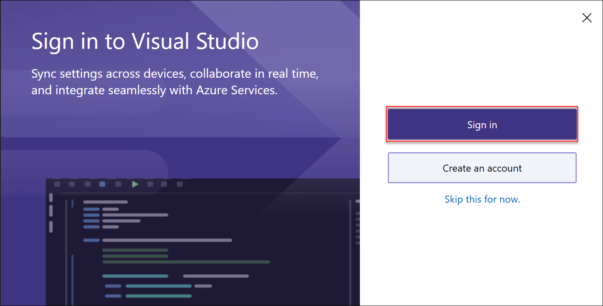
    
8.  If prompted, sign in with following Username and password.
  
    > **Email/Username**: <inject key="AzureAdUserEmail"></inject>
    
    > **Password**: <inject key="AzureAdUserPassword"></inject>
    
9.  On **Personalize your Visual Studio experience** page click **Start Visual Studio**.

     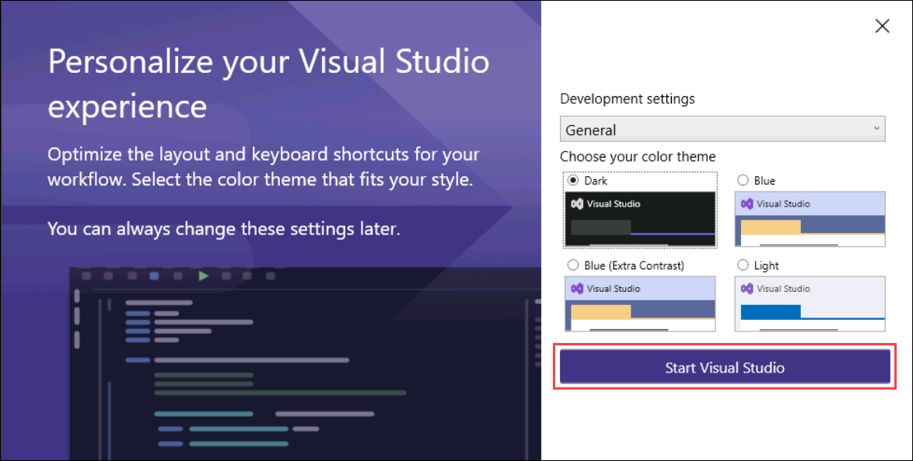            
     
10.  Within the Visual Studio interface, in the **Azure DevOps** pop-up window, accept the default local path and click **Clone**. This will automatically import the project into Visual Studio. Make a note of local path you will need it in further tasks.

      .png)
    
     >**Note**: If **Visual Studio** takes more than 5 minutes to get launched follow the below steps:
   
     - Close the **Visual Studio** by navigating to **Task Manager** and on task manager select **Microsoft Visual studio 2022**, click **End Task** and reopen **Visual Studio**  from start menu.

       .png)
       
     - If prompted click **Continue without code** on **Visual studio 2022** page
    
     - Within the Visual Studio interface click **Git** tool and select **Clone Repository**
          
       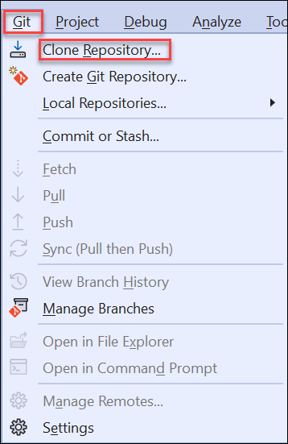
             
     - On **Clone Repository** page under Browse a Repository select **Azure DevOps** and Connect to a Project select **EShopOnWeb** repo and **Clone**.
           
        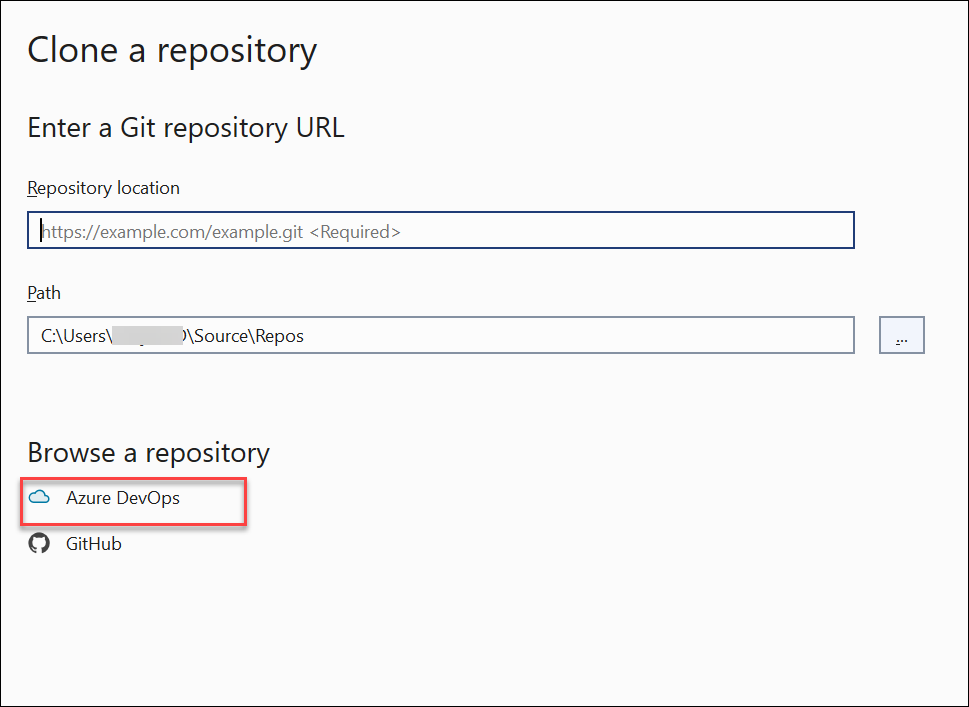
        
        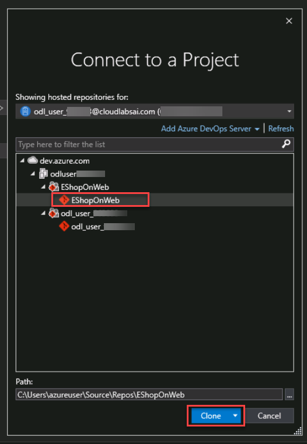
         
     - If prompted, sign in with the following Username and password.

          > **Email/Username**: <inject key="AzureAdUserEmail"></inject>
    
          > **Password**: <inject key="AzureAdUserPassword"></inject>

# Exercise 2: Working with Azure Artifacts

In this exercise, you will learn how to work with Azure Artifacts by using the following steps:

- create and connect to a feed.
- create and publish a NuGet package.
- import a NuGet package.
- update a NuGet package.

## Task 1: Create and connect to a feed

In this task, you will create and connect to a feed.

1.  In the web browser window displaying your project settings in the Azure DevOps portal, in the vertical navigational pane, select **Artifacts**.
    
    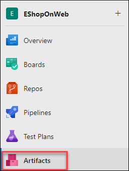

2.  With the **Artifacts** hub displayed, select organization **odluser-<inject key="DeploymentID" enableCopy="false"/>** **(1)** and click **+ Create feed (2)** at the top of the pane. 

    > **Note**: This feed will be a collection of NuGet packages available to users within the organization and will sit alongside the public NuGet feed as a peer. The scenario in this lab will focus on the workflow for using Azure Artifacts, so the actual architectural and development decisions are purely illustrative.  This feed will include common functionality that can be shared across projects in this organization. 
    
    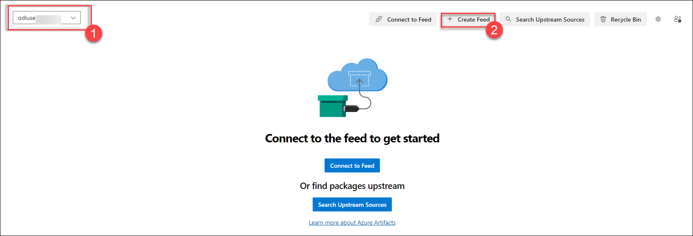

3.  On the **Create new feed** pane, in the **Name** textbox, type **EShopOnWebShared (1)**, in the **Scope** section, select the **Organization (2)** option, leave other settings with their default values, and click **Create (3)**. 

    > **Note**: Any user who wants to connect to this NuGet feed must configure their environment. 
    
    .png)
    
4.  Back on the **Artifacts** hub, select **odluser-<inject key="DeploymentID" enableCopy="false"/>** **(1)** Organization, click **Connect to feed (2)**.
    
    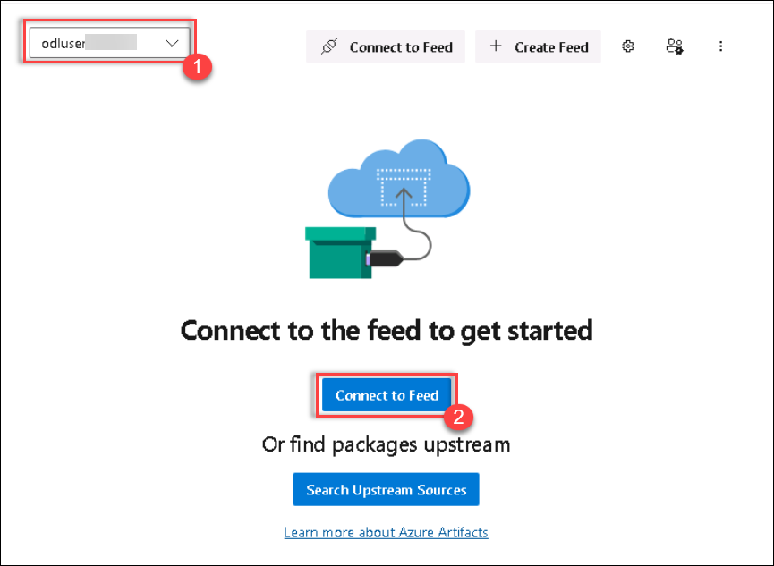

5.  On the **Connect to feed** pane, in the **NuGet** section, select **Visual Studio (1)** and, on the **Visual Studio** pane, copy the **Source (2)** url.
    
    .png)

6.  Switch back to the **Visual Studio** window and wait for the installation to be get completed. 
7.  In the Visual Studio window, click **Tools (1)** menu header, in the dropdown menu, select **NuGet Package Manager (2)** and, in the cascading menu, select **Package Manager Settings (3)**.
    
    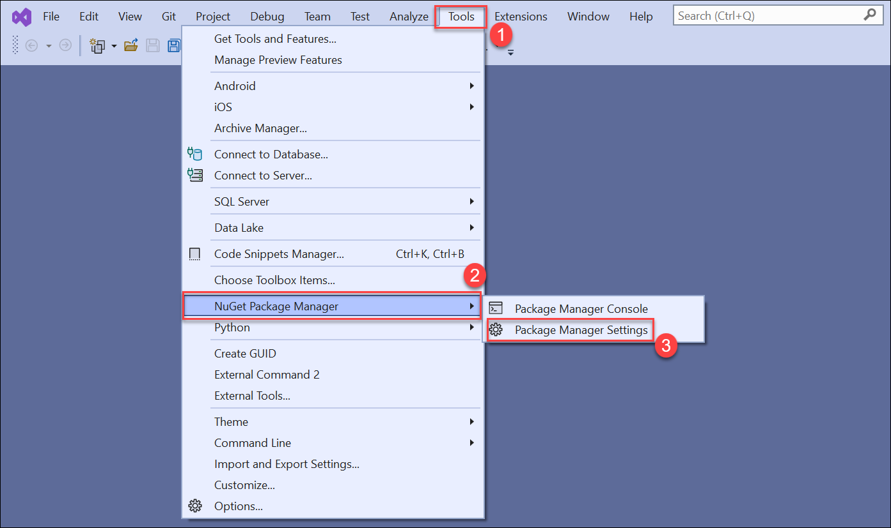
    
8.  In the **Options** dialog box, click **Package Sources** and click the plus sign to add a new package source.
9.  At the bottom of the dialog box, in the **Name** textbox, replace **Package Sources (1)** with **EShopOnWebShared (2)** and, in the **Source** textbox, paste the **Source URL (3)** you copied in the Azure DevOps portal and click **Update (4)** and then click **OK (5)** to finalize the addition. 
    
     (1).png)
     
     > **Note**: Visual Studio is now connected to the new feed.

11.  Close and reopen the other Visual Studio instance you used for cloning the EShopOnWeb repository, to account for the artifact source update and open the **EShopOnWebShared** solution. You will need it in the third task of this exercise.

      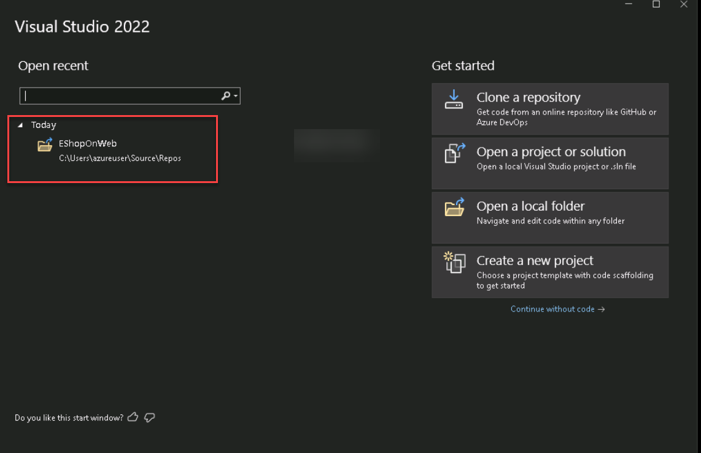

## Task 2: Create and publish a NuGet package

In this task, you will create and publish a NuGet package.

1.  In the Visual Studio window you used to configure the new package source, in the main menu, click **File (1)**, in the dropdown menu, click **New (2)** and then, in the cascading menu, click **Project (3)**. 

    > **Note**: We will now create a shared assembly that will be published as a NuGet package so that other teams can integrate it and stay up to date without having to work directly with the project source.
    
    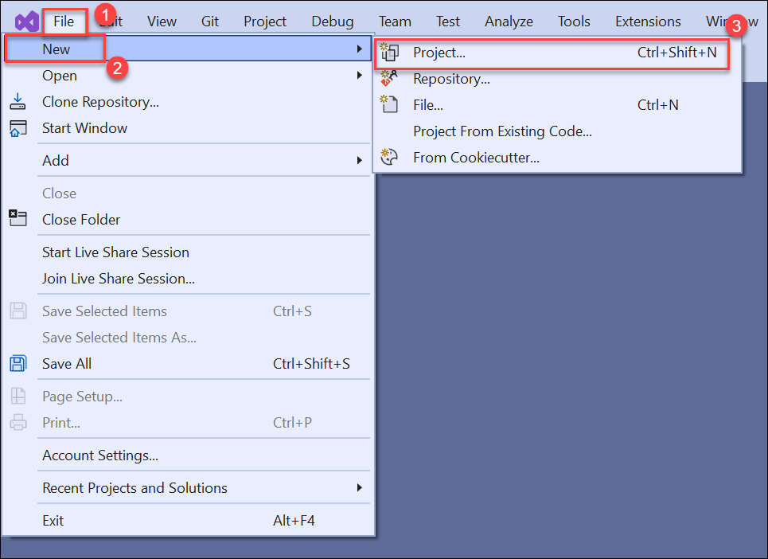

2.  On the **Recent project templates** page of the **Create a new project** pane, use the search textbox to locate the **Class Library (1)** template, select the template for **C# (2)**, and click **Next (3)**. 
    
    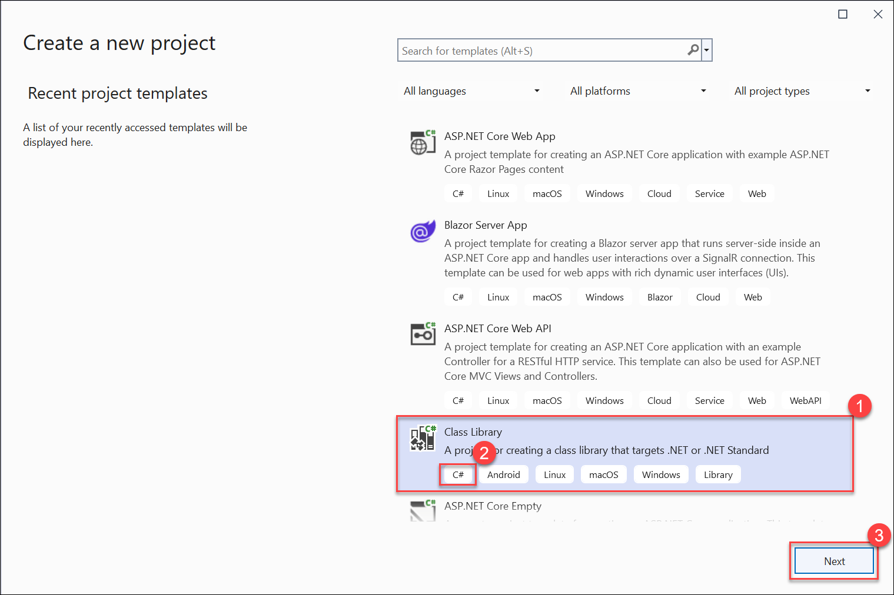

3.  On the **Class Library** page of the **Configure your new project** pane, specify the following settings and click **Next (5)**:

    | Setting | Value |
    | --- | --- |
    | Project name | **EShopOnWeb.Shared (1)** |
    | Location | accept the default value (2) |
    | Solution | **Create new solution (3)** |
    | Solution name | **EShopOnWeb.Shared (4)** |
    
    > **Note**: Make sure not to select **.NET Standard**.

    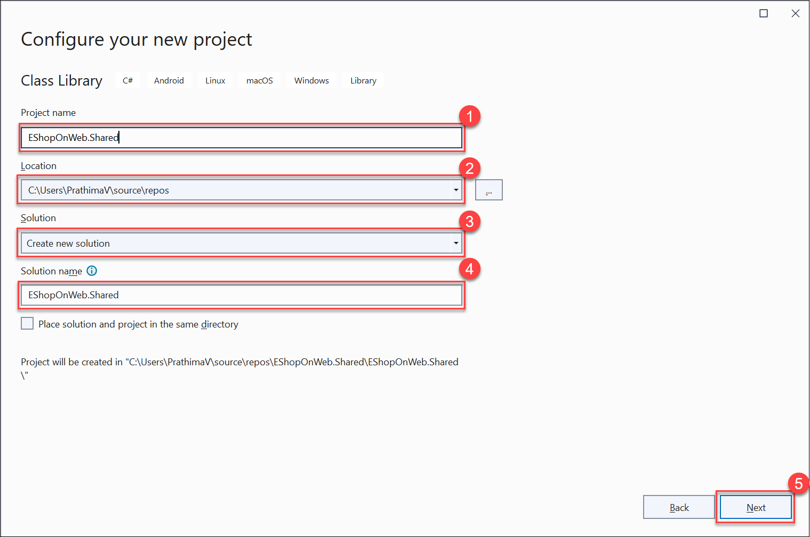
    
4.  Click Next. Accept **.NET 6.0 (Long Term Support) (1)** as Framework option and click **Create (2)**.
    
    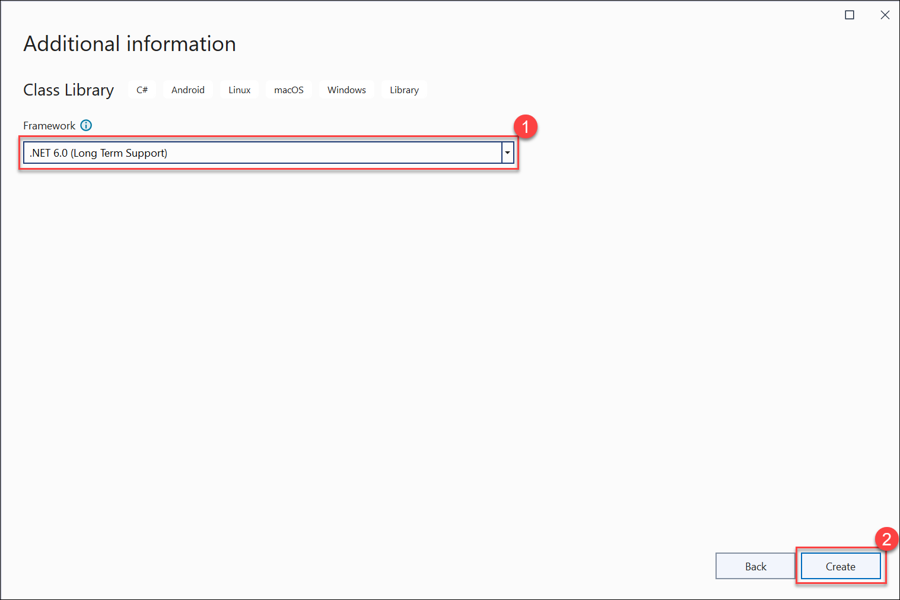

5.  Within the Visual Studio interface, in the **Solution Explorer** pane, right-click **Class1.cs (1)**, in the right-click menu, select **Delete (2)**, and, when prompted for confirmation, click **OK**.
    
    .png)
   
6.  Within the Visual Studio interface, in the **Solution Explorer** pane, right-click the **EShopOnWeb.Shared (1)** project node and select **Properties (2)**.
    
    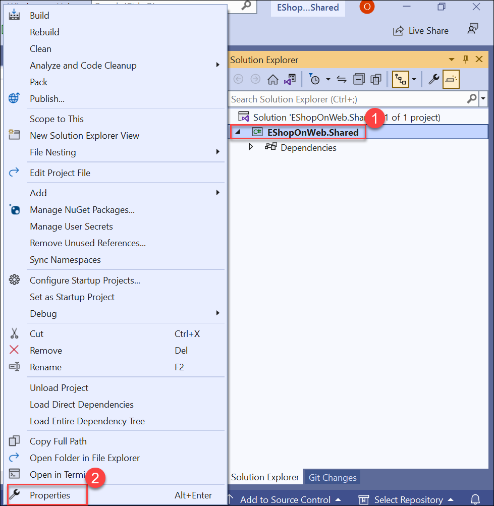

7.  Press **Ctrl+Shift+B** or **Right-click** on the **EShopOnWeb.Shared Project (1)** and select **Build (2)** to build the project.. 

    > **Note**: In the next task we'll use **NuGet.exe** to generate a NuGet package directly from the built project, but it requires the project to be built first.

    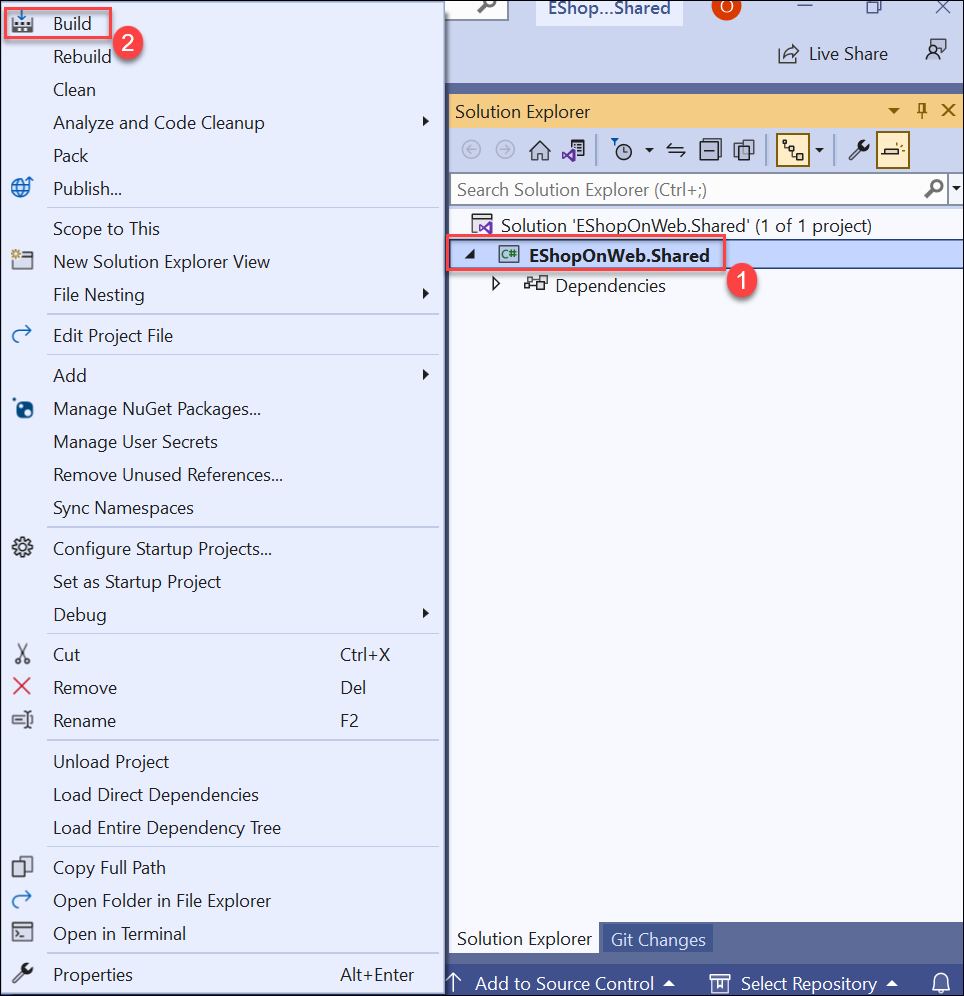
    
    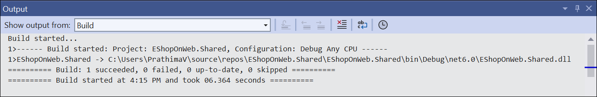
   
8.  Switch to the web browser displaying the Azure DevOps portal. 
9.  Navigate to the **Connect to feed** pane, in the **NuGet** section and select **NuGet.exe**. This will display the **NuGet.exe** pane.
10. On the **NuGet.exe (2)** pane, click **Get the tools (3)**.

     .png)
    
11. On the **Get the tools** pane, click the **Download the latest NuGet** link. This will automatically open another browser tab displaying the **Available NuGet Distribution Versions** page.   

12. On the **Available NuGet Distribution Versions** page, select the latest version and download the executable to the local **Downloads** folder.

    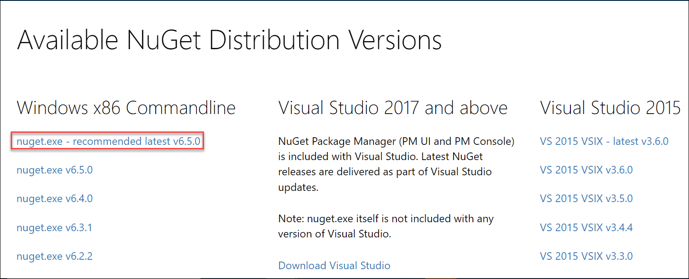


13. Switch to the **Visual Studio** window. In the **Solution Explorer** pane, right-click the **EShopOnWeb.Shared (1)** project folder and, in the right-click menu, select **Open Folder in File Explorer (2)**.

    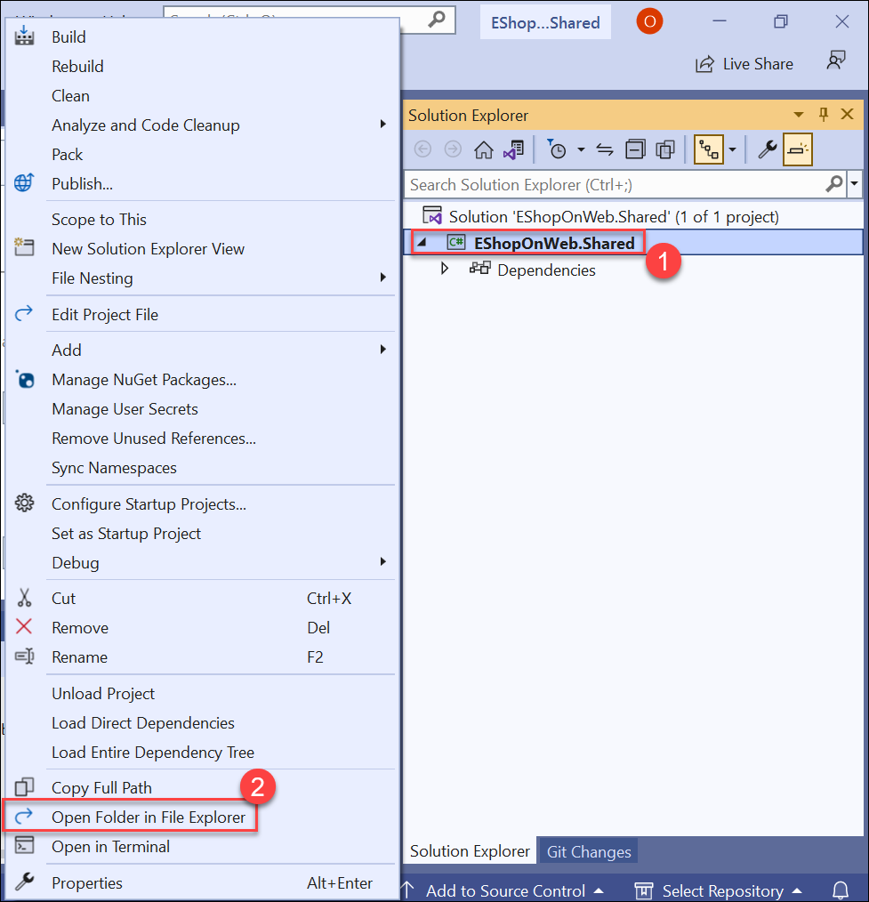

14. Within the File Explorer window, move the downloaded **nuget.exe** file from the **Downloads** folder into the folder containing the **EShopOnWeb.Shared** file.

    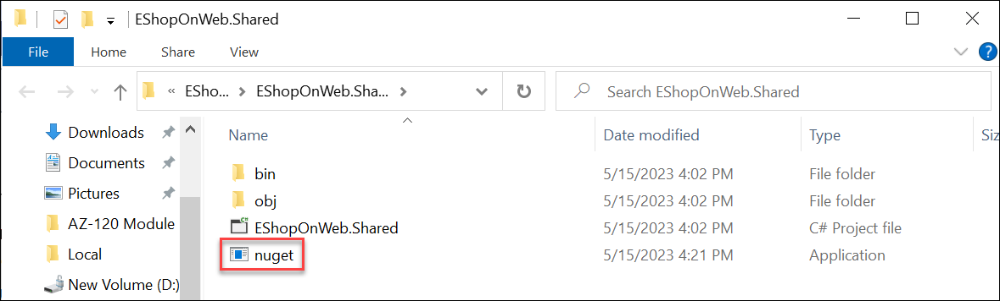
    
15. Before running PowerShell command in step no-17 and 18, please perform below steps:

    i. From the start menu search and select **Edit the system environment variable** and on Systems properties select **Environment variable**.
        
       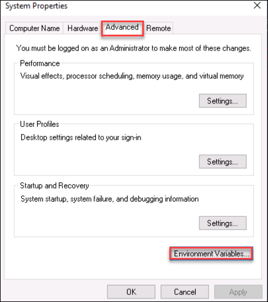
         
    ii. On **Environment variable** page under User variables for azureuser click **New** and on New User Variable, enter **NUGET_ENABLE_LEGACY_CSPROJ_PACK (1)** in **Variable name** field and enter **true (2)** in  **Variable value** field and click on **OK** for all wizards.
         
       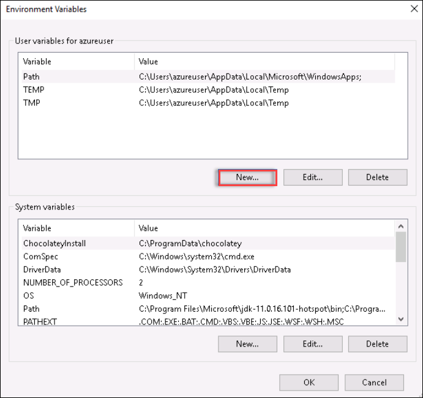
         
       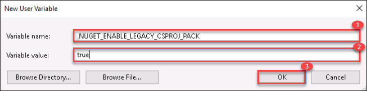

16.  Navigate to File Explorer in the same File Explorer window, select the **File (1)** menu header, in the dropdown menu, select **Open Windows PowerShell (2)**, and, in the cascading menu, click **Open Windows PowerShell as administrator (3)**. 
   
     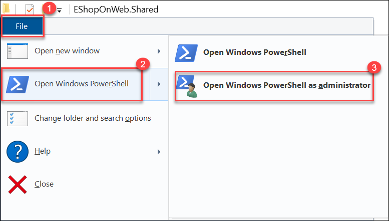
    
17.  Run the following command.

     >**Note**: Navigate to file explorer and copy the path and replace the [path]  with path which you copied from file explorer.
     
     ```
      cd [path]
     ```

      .png)
      
19.  In the **Administrator: Windows PowerShell** window, run the following to create a **.nupkg** file from the project.

     ```
      ./nuget.exe pack ./EShopOnWeb.Shared.csproj
     ```

     > **Note**: Disregard any warnings displayed in the **Administrator: Windows PowerShell** window.
     > **Note**: This is a shortcut to package the NuGet bits for deployment. NuGet is highly customizable. To learn more, refer to the [NuGet package creation page](https://docs.microsoft.com/en-us/nuget/create-packages/overview-and-workflowhttps:/docs.microsoft.com/en-us/nuget/create-packages/overview-and-workflow).

20.  NuGet builds a minimal package based on the information it is able to identify from the project. For example, note that the name is **ESopOnWeb.Shared.1.0.0.nupkg**. That version number was retrieved from the assembly.

     .png)
       
     >**Note**: If you prompted with the **Error NU5133: NuGet.exe file on path C:\Users\xxxxx\source\repos\EShopOnWeb.Shared\EShopOnWeb.Shared\nuget.exe needs to be unblocked after downloading** then we need to unblock the **nuget.exe(1)** file which we downloaded to the **EShareOnWeb.Shared** folder by selecting **Properties(2)**.

     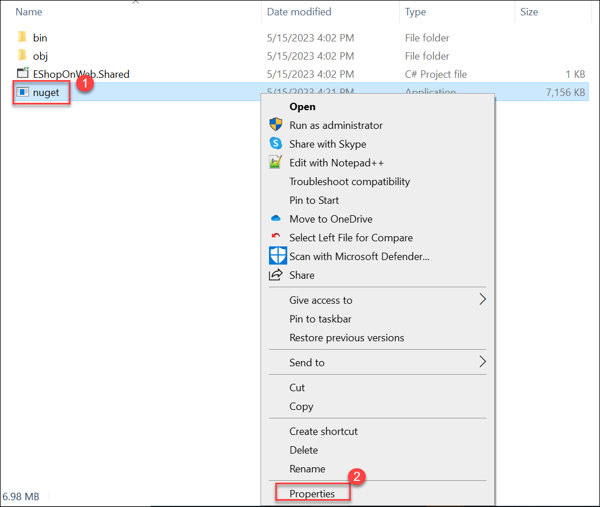

18. Check the **Unblock (1)** and click on **Apply (2)** to save the changes and click on **OK (3)**.

     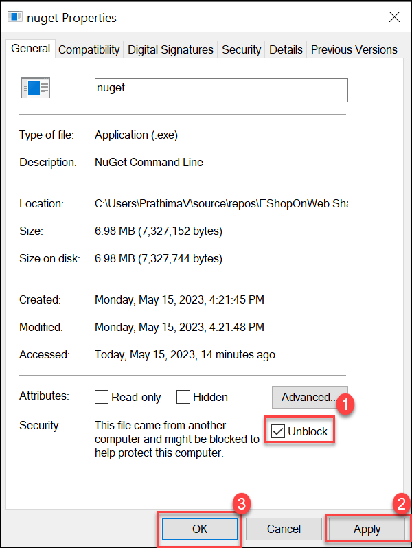
    
19. Now again run the **PowerShell command** from the **step 18** and it will create package successfully.
    
     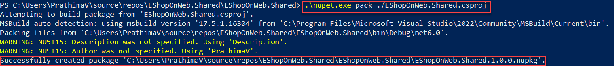

20. After the successful creation of the package, run the following to publish the package to the **EShopOnWebShared** feed. If it Prompted to sign in window login with the following credentials.
    
    > **Email/Username**: <inject key="AzureAdUserEmail"></inject>
    
    > **Password**: <inject key="AzureAdUserPassword"></inject>

    > **Note**: You need to provide an **API Key**, which can be any non-empty string. We're using **AzDO** here. When prompted, sign in to your Azure DevOps organization.

    ```
    ./nuget.exe push -source "EShopOnWebShared" -ApiKey AzDO EShopOnWeb.Shared.1.0.0.nupkg
    ```
    
    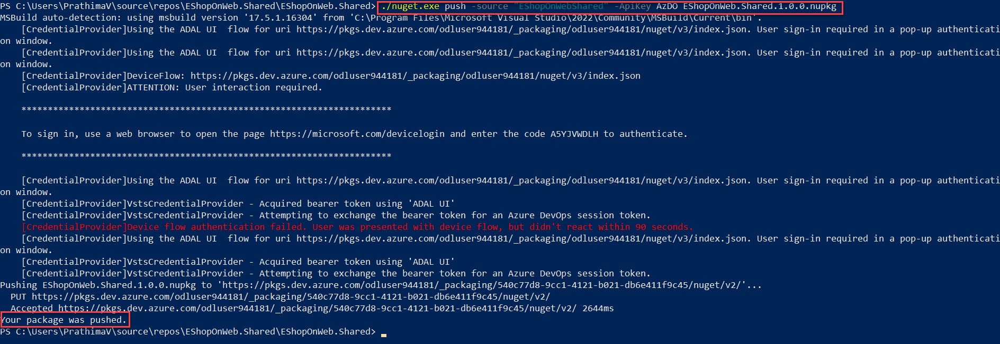

    >**Note**: If you encounter following error **Response status code does not indicate success: 409 (Conflict - 'EShopOnWeb.Shared 1.0.0' cannot be published to the feed because it exists in at least one of the feed's upstream sources. Publishing this copy would prevent you from using 'EShopOnWeb.Shared 1.0.0' from 'NuGet Gallery'. For more information, see https://go.microsoft.com/fwlink/?linkid=864880 (DevOps Activity ID: 439FD43A-8013-498D-A85E-5D95C93668B8)).** Please follow the following steps.

     - Navigate to the Azure DevOps Portal, browse to **Artifacts**. 
     
     - Select the **odluser** Feed > **Settings** icon.
        .png)
     
     - Switch to Upstream Sources tab and select **NuGet Gallery** and click on **Delete**.
        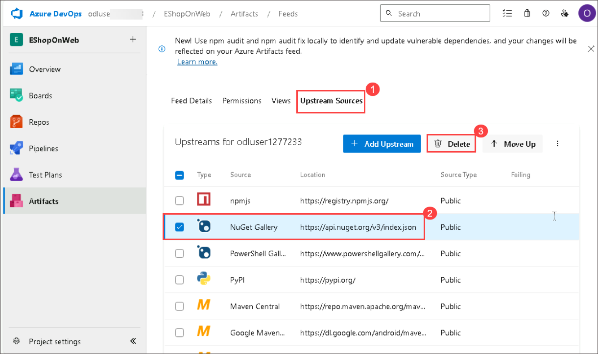
     
     - Click on the ellipse button and select Save to save the changes.
        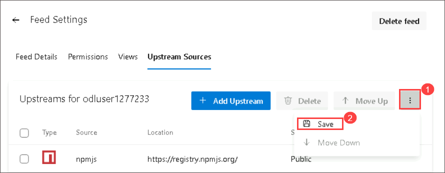
        
22.  Wait for the confirmation of the successful package push operation.      
23.  Switch to the web browser window displaying the Azure DevOps portal and, in the vertical navigational pane, select **Artifacts**.
24.  On the **Artifacts(1)** hub pane, click the dropdown list in the upper left corner and, in the list of feeds, select the **EShopOnWeb(2)** entry.

     > **Note**: The **EShopOnWebShared** feed should include the newly published NuGet package. 
    png)
    
25.  Click the NuGet package to display its details.

      .png)

## Task 3: Import an Open-Source NuGet package to the Azure DevOps Package Feed

Besides developing your own packages, why not using the Open Source NuGet (<https://www.nuget.org>) DotNet Package library? With a few million packages available, there will always be something useful for your application.

In this task, we will use a generic "Newtonsoft.Json" sample package, but you can use the same approach for other packages in the library.

1. From the same PowerShell window, navigate to the **EShopOnWeb.Shared** folder, run the following **dotnet** command to install the sample package:

    ```powershell
    dotnet add package Newtonsoft.Json
    ```

1. Check the output of the install process. It shows the different Feeds it will try to download the package:

    ```powershell
    Feeds used:
      https://api.nuget.org/v3/registration5-gz-semver2/newtonsoft.json/index.json
      https://pkgs.dev.azure.com/<AZURE_DEVOPS_ORGANIZATION>/eShopOnWeb/_packaging/eShopOnWebShared/nuget/v3/index.json
    ```

1. Next, it will show additional output regarding the actual installation process itself.

    ```powershell
    Determining projects to restore...
    Writing C:\Users\AppData\Local\Temp\tmpxnq5ql.tmp
    info : X.509 certificate chain validation will use the default trust store selected by .NET for code signing.
    info : X.509 certificate chain validation will use the default trust store selected by .NET for timestamping.
    info : Adding PackageReference for package 'Newtonsoft.Json' into project 'c:\EShopOnWeb\eShopOnWeb.Shared\EShopOnWeb.Shared.csproj'.
    info :   GET https://api.nuget.org/v3/registration5-gz-semver2/newtonsoft.json/index.json
    info :   OK https://api.nuget.org/v3/registration5-gz-semver2/newtonsoft.json/index.json 124ms
    info : Restoring packages for c:\eShopOnWeb\eShopOnWeb.Shared\eShopOnWeb.Shared.csproj...
    info :   GET https://api.nuget.org/v3/vulnerabilities/index.json
    info :   OK https://api.nuget.org/v3/vulnerabilities/index.json 84ms
    info :   GET https://api.nuget.org/v3-vulnerabilities/2024.02.15.23.23.24/vulnerability.base.json
    info :   GET https://api.nuget.org/v3-vulnerabilities/2024.02.15.23.23.24/2024.02.17.11.23.35/vulnerability.update.json
    info :   OK https://api.nuget.org/v3-vulnerabilities/2024.02.15.23.23.24/vulnerability.base.json 14ms
    info :   OK https://api.nuget.org/v3-vulnerabilities/2024.02.15.23.23.24/2024.02.17.11.23.35/vulnerability.update.json 30ms
    info : Package 'Newtonsoft.Json' is compatible with all the specified frameworks in project 'c:\EShopOnWeb\EShopOnWeb.Shared\eShopOnWeb.Shared.csproj'.
    info : PackageReference for package 'Newtonsoft.Json' version '13.0.3' added to file 'c:\EShopOnWeb\EShopOnWeb.Shared\EShopOnWeb.Shared.csproj'.
    info : Writing assets file to disk. Path: c:\eShopOnWeb\eShopOnWeb.Shared\obj\project.assets.json
    log  : Restored c:\eShopOnWeb\eShopOnWeb.Shared\eShopOnWeb.Shared.csproj (in 294 ms).
    ```

1. The Newtonsoft.Json package got installed in the Packages as **Newtonsoft.Json**. From the Visual Studio **Solution Explorer**, navigate to the **EShopOnWeb.Shared** Project, expand Dependencies, and notice the **Newtonsoft.Json** under the Packages. Click on the little arrow to the left of the Packages, to open the folder and file list.

## Task 4: Upload the Open-Source NuGet package to Azure Artifacts

Let's consider this package an "approved" package for our DevOps team to reuse, by uploading it to the Azure Artifacts Package feed created earlier.

1. From the Visual Studio, right-click the new **Newtonsoft.Json** package, and select **Open Folder in File Explorer** from the context menu. You will see the new **Newtonsoft.Json** package with the extension **.nupkg**.
2. Copy the full path from the address bar of the File Explorer window.
3. From the PowerShell window, execute the following command replacing the path with the one you copied:

    ```powershell
    dotnet nuget push --source "EShopOnWebShared" --api-key az C:\eShopOnWeb\eShopOnWeb.Shared\Newtonsoft.Json\newtonsoft.json.13.0.3.nupkg
    ```

    > **Note**:  This results in an error message:

    ```text
    Response status code does not indicate success: 409 (Conflict - 'Newtonsoft.Json 1.3.0.17' cannot be published to the feed because it exists in at least one of the feed's upstream sources. Publishing this copy would prevent you from using 'Newtonsoft.Json 1.3.0.17' from 'NuGet Gallery'. For more information, see https://go.microsoft.com/fwlink/?linkid=864880 (DevOps Activity ID: AE08BE89-C2FA-4FF7-89B7-90805C88972C)).
    ```

   >**Note** :When you created the Azure DevOps Artifacts Package Feed, by design, it allows for **upstream sources**, such as nuget.org in the dotnet example. However, nothing blocks your DevOps team to create an **"internal-only"** Package Feed.

1. Navigate to the Azure DevOps Portal, browse to **Artifacts**, and select the **eShopOnWebShared** Feed.

1. Click **Search Upstream Sources**.

1. In the **Go to an Upstream Package** window, select **NuGet** as Package Type, and enter **Newtonsoft.Json** in the search field.

1. Confirm by pressing the **Search** button.

1. This results in a list of all Newtonsoft.Json packages with the different versions available.

1. Click the **left arrow key** to return to the **EShopOnWebShared** Feed.

1. Click the cogwheel to open **Feed Settings**. Within the Feed Settings page, select **Upstream Sources**.

1. Notice the different Upstream Package Managers for different development languages. Select **NuGet Gallery** from the list. Press the **Delete** button, followed by pressing the **Save** button.

1. With these saved changes, it will be possible to upload the **Newtonsoft.Json** package using the NuGet.exe from the PowerShell Window, by relaunching the following command:

    ```text
     dotnet nuget push --source "EShopOnWebShared" --api-key az C:\EShopOnWeb\EShopOnWeb.Shared\Newtonsoft.Json\newtonsoft.json.13.0.3.nupkg
    ```

    > **Note**: This should now result in a successful upload.

    ```text
    Pushing newtonsoft.json.13.0.3.nupkg to 'https://pkgs.dev.azure.com/<AZURE_DEVOPS_ORGANIZATION>/_packaging/5faffb6c-018b-4452-a4d6-72c6bffe79db/nuget/v2/'...
    PUT https://pkgs.dev.azure.com/<AZURE_DEVOPS_ORGANIZATION>/_packaging/5faffb6c-018b-4452-a4d6-72c6bffe79db/nuget/v2/
    Accepted https://pkgs.dev.azure.com/<AZURE_DEVOPS_ORGANIZATION>/_packaging/5faffb6c-018b-4452-a4d6-72c6bffe79db/nuget/v2/ 3160ms
    Your package was pushed.
    ```

1. From the Azure DevOps Portal, **refresh** the Artifacts Package Feed page. The list of packages shows both the **EShopOnWeb.Shared** custom-developed package, as well as the **Newtonsoft.Json** public sourced package.
1. From the Visual Studio **EShopOnWeb.Shared** Solution, right-click the **EShopOnWeb.Shared** Project, and select **Manage NuGet Packages** from the context menu.
1. From the NuGet Package Manager window, validate the **Package Source** is set to **EShopOnWebShared**.
1. Click **Browse**, and wait for the list of NuGet Packages to load.
1. This list will also show both the **EShopOnWeb.Shared** custom-developed package, as well as the **Newtonsoft.Json** public sourced package.

    > **Congratulations** on completing the lab! Now, it's time to validate it. Here are the steps:
    > - Select the **Lab Validation** tab located at the upper right corner of the lab guide section.
    > - Hit the Validate button for the corresponding task. If you receive a success message, you have successfully validated the lab. 
    > - If not, carefully read the error message and retry the step, following the instructions in the lab guide.
    > - If you need any assistance, please contact us at labs-support@spektrasystems.com. We are available 24/7 to help you out.

## Review

In this lab, you learned how to work with Azure Artifacts by using the following steps:

- created and connect to a feed.
- created and publish a NuGet package.
- imported a NuGet package.
- updated a NuGet package.

### You have successfully completed the lab.
