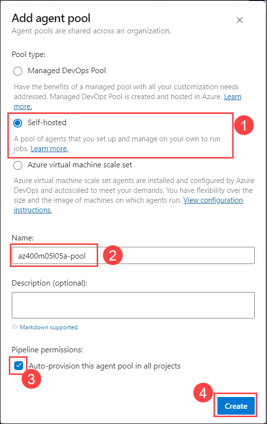
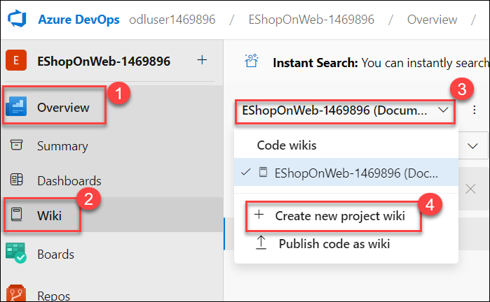
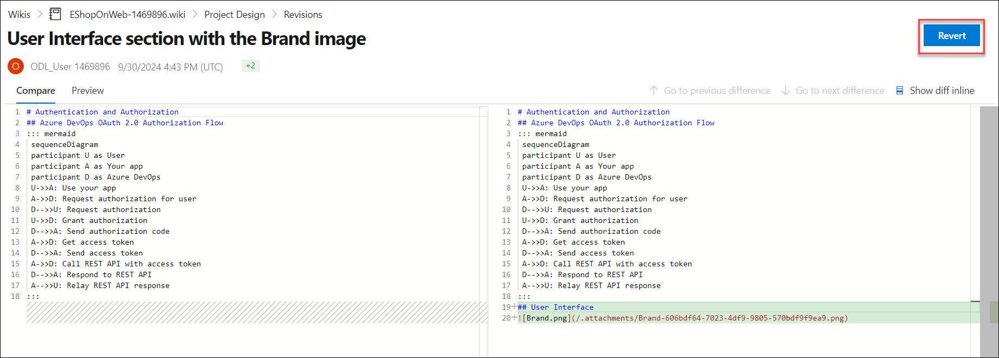
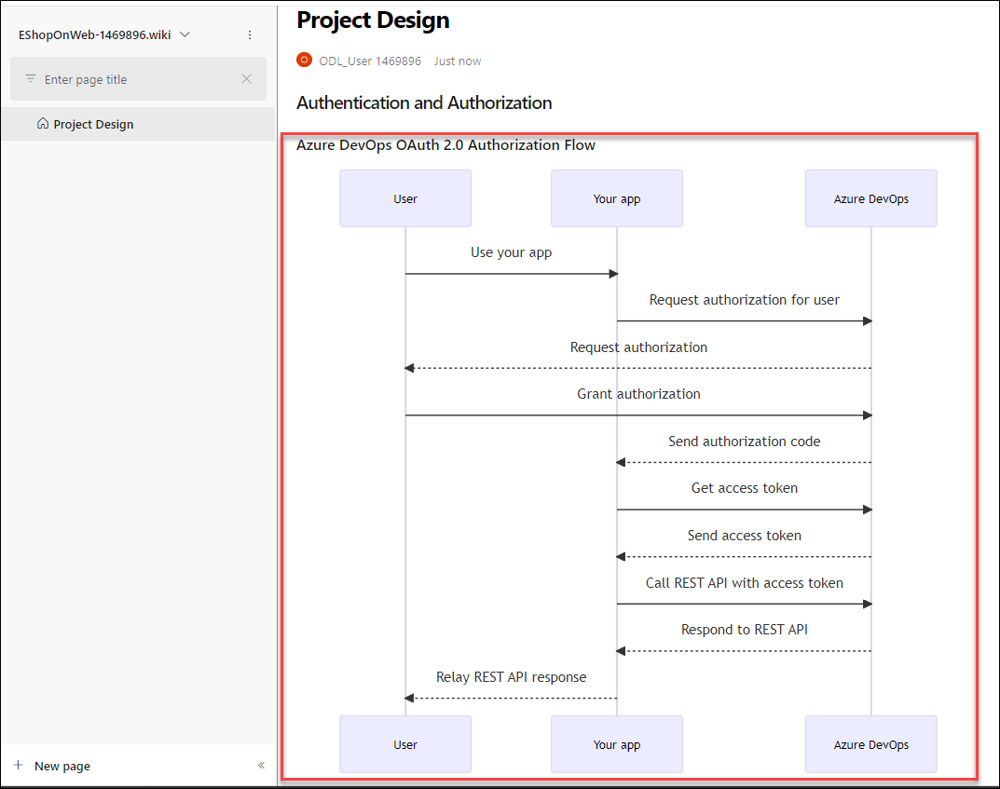
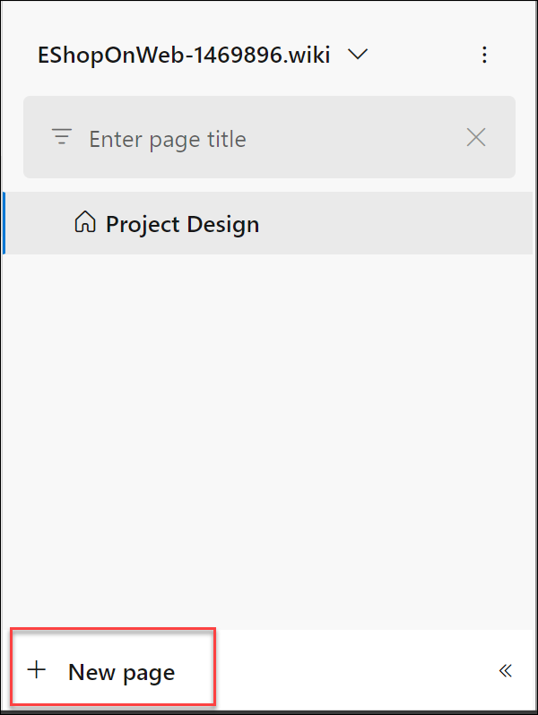
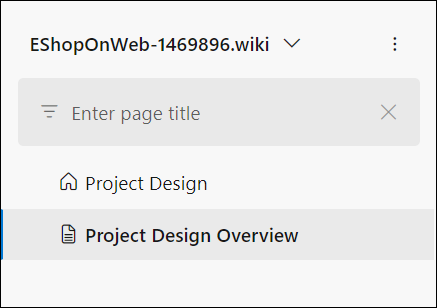
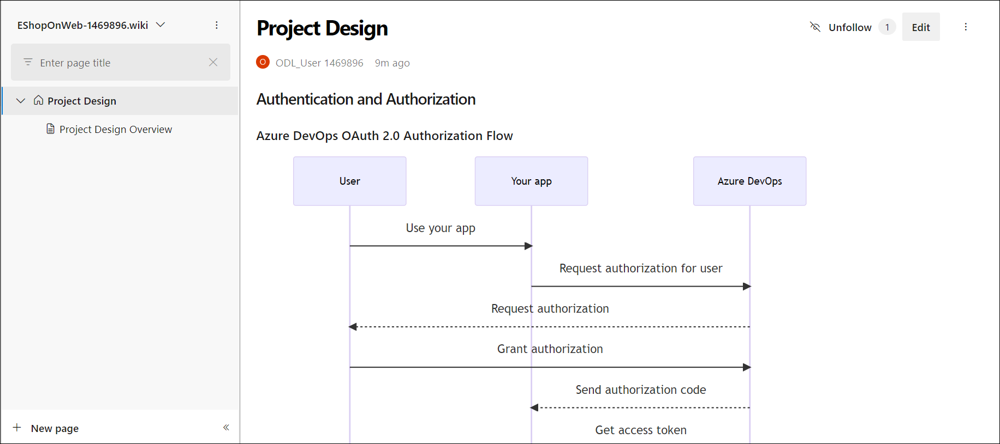

# Lab 2: Sharing Team Knowledge using Azure Project Wikis

## Lab overview

In this lab, you will create and configure wiki in an Azure DevOps, including managing markdown content and creating a Mermaid diagram.

## Objectives

After you complete this lab, you will be able to:

- Create a wiki in an Azure Project
- Add and edit markdown
- Create a Mermaid diagram

## Estimated timing: 60 minutes

## Architecture Diagram
 
  

# Exercise 0: Configure the lab prerequisites

In this exercise, you will set up the prerequisites for the lab, which consist of the pre-configured **EShopOnWeb-<inject key="DeploymentID"> </inject>** team project based on an Azure DevOps Demo Generator template and a team created in Microsoft Teams.
=======
## Set up an Azure DevOps organization. 

1. On your lab VM open **Edge Browser** on desktop and navigate to [Azure DevOps](https://go.microsoft.com/fwlink/?LinkId=307137), and if prompted sign with the credentials.

    * Email/Username: <inject key="AzureAdUserEmail"></inject>

    * Password: <inject key="AzureAdUserPassword"></inject>

2. In the pop-up for *Help us protect your account*, select **Skip for now (14 days until this is required)**.

3. On the next page accept defaults and click on continue.

    

4. On the **Almost Done...** page fill the captcha and click on continue. 

    

## Task 1: Configure the EShopOnWeb project

In this task, you will create a new project named **EShopOnWeb-<inject key="DeploymentID"> </inject>** in Azure DevOps Organization.

1.  Click **Sign in** and sign in with the credentials provided in environment details tab.
    
    > **Email/Username**: <inject key="AzureAdUserEmail"></inject>
    
    > **Password**: <inject key="AzureAdUserPassword"></inject>

2.  On the **Create New Project** page, in the **New Project Name** textbox, type **EShopOnWeb-<inject key="DeploymentID"> </inject> (1)**, select visibility as **Private (2)** and then click **Create Project (3)**

     
    
# Exercise 1: Publish code as wiki

In this exercise, you will step through publishing an Azure DevOps repository as wiki and managing the published wiki.

> **Note**: Content that you maintain in a Git repository can be published to an Azure DevOps wiki. For example, content written to support a software development kit, product documentation, or README files can be published directly to a wiki. You have the option of publishing multiple wikis within the same Azure DevOps team project.

## Task 1: Publish a branch of an Azure DevOps repo as wiki

In this task, you will create Azure Repository and publish a branch of an Azure DevOps repo as wiki.

> **Note**: If your published wiki corresponds to a product version, you can publish new branches as you release new versions of your product. 
    
1.  In the vertical menu on the left side of the **EShopOnWeb-<inject key="DeploymentID"> </inject>** pane, click **Repos**.

     

2.  Click on the **Files (1)** pane, we can see that **EShopOnWeb-<inject key="DeploymentID"> </inject> is empty. Add some code!**. So click **Initialize (2)** to initialize the repository for the first time.

     
    
3.  Click the **Files (1)** pane. In the branch dropdown list , select **main (2)** branch, and review the content of the main branch.

     

4.  We will store the Wiki source files in a separate folder within the Repos current folder structure. From within Repos, select **Files**. Notice the **EShopOnWeb-<inject key="DeploymentID"> </inject> (1)** Repo title on top of the folder structure. Select the **ellipsis (2)**. 

     

5.  Choose **+New(1) / Folder (2)**, and provide **Documents (3)** as title for the New Folder name. As a repo doesn't allow you to create an empty folder, provide **READ.ME (4)** as New file name. Click to **Create (5)** folder.

     

     
    
7.  The **READ.ME (1)** file will open in the built-in view mode. Since this is stored **'as code' (2)**, you need to **Commit** the changes by clicking the **Commit (3)** button.

     

8.  In the Azure DevOps vertical menu on the left side, click **Overview (1)**, in the Overview section, select **Wiki (2)**, select **Publish code as wiki (3)**.
    
     

9.  On the **Publish code as wiki** pane, specify the following **settings** and click **Publish (5)**.
     | Setting | Value |
     | ------- | ----- |
     | Repository | **EShopOnWeb-<inject key="DeploymentID"> </inject> (1)** |
     | Branch | **main (2)** |
     | Folder | **/Documents (3)** |
     | Wiki name | **EShopOnWeb-<inject key="DeploymentID"> </inject> (Documents) (4)** |

     > **Note**: This will automatically open the Wiki section, and publish the editor, where you can provide a Wiki page title, as well as adding the actual content. Notice you are encouraged to use MarkDown format, but make use of the ribbon to help you with some of the MarkDown layout syntax.
    
     

10.  In the Wiki Page **Title** field, enter **Welcome to our Online Retail Store!**
    
      

11.  In the **body (1)** of the Wiki Page, paste in the following text and **Save (2)** it:
    
      ```
      ##Welcome to Our Online Retail Store!
      At our online retail store, we offer a **wide range of products** to meet the **needs of our customers**. Our selection includes everything       from *clothing and accessories to electronics, home decor, and more*.

      We pride ourselves on providing a seamless shopping experience for our customers. Our website offers the following benefits:
      1. user-friendly,
      2. and easy to navigate, 
      3. allowing you to find what you're looking for,
      4. quickly and easily. 

      We also offer a range of **_payment and shipping options_** to make your shopping experience as convenient as possible.

      ### about the team
      Our team is dedicated to providing exceptional customer service. If you have any questions or concerns, our knowledgeable and friendly           support team is always available to assist you. We also offer a hassle-free return policy, so if you're not completely satisfied with your       purchase, you can easily return it for a refund or exchange.

      ### Physical Stores
      |Location|Area|Hours|
      |--|--|--|
      | New Orleans | Home and DIY  |07.30am-09.30pm  |
      | Seattle | Gardening | 10.00am-08.30pm  |
      | New York | Furniture Specialists  | 10.00am-09.00pm |

      ## Our Store Qualities
      - We're committed to providing high-quality products
      - Our products are offered at affordable prices 
      - We work with reputable suppliers and manufacturers 
      - We ensure that our products meet our strict standards for quality and durability. 
      - Plus, we regularly offer sales and discounts to help you save even more.

      #Summary
      Thank you for choosing our online retail store for your shopping needs. We look forward to serving you!
      ```
     
      
      
12.  This sample text gives you an overview of several of the common MarkDown syntax features, ranging from Title and subtitles (##), bold            (**), italic (*), how to create tables, and more.

13.  **Refresh** your browser, or select any other DevOps portal option and return to the **Overview(1)** and **Wiki(2)** section. Notice you are now presented with the **EshopOnWeb-<inject key="DeploymentID"> </inject> (Documents)** Wiki, as well as having the **Welcome to our Online Retail Store(3)** as **HomePage** of the Wiki.
      
     
    
   > - **Congratulations** on completing the task! Now, it's time to validate it. Here are the steps
   > - Hit the Validate button for the corresponding task. If you receive a success message, you can proceed to the next task. 
   > - If not, carefully read the error message and retry the step, following the instructions in the lab guide.
   > - If you need any assistance, please contact us at labs-support@spektrasystems.com. We are available 24/7 to help you out.
   
   <validation step="27c2ac30-3be6-4f7f-889e-214781b039da" />

## Task 2: Manage content of a published wiki
In this task, you will manage content of the wiki you published in the previous task.

1. In the vertical menu on the left side, click **Repos (1)**, ensure that the dropdown menu in the upper section of the **Files (2)** pane displays the **EShopOnWeb-<inject key="DeploymentID"> </inject> (3)** repo and **main (4)** branch, in the repo folder hierarchy, select the **Documents (5)** folder, and select the **Welcome-to-our-Online-Retail-Store!.md (6)** file.

    

2. Notice how the MarkDown format is visible here as raw text format, allowing you to continue editing the file content from here as well.

   > **Note**: Since the Wiki source files are handled as source code, remember all practices from traditional source control (Clone, Pull Requests, Approvals and more), can now also be applied to Wiki pages.


# Exercise 2: Create and manage a project wiki

In this exercise, you will step through creating and managing a project wiki.

> **Note**: You can create and manage wiki independently of the existing repos. 

## Task 1: Create a project wiki including a Mermaid diagram and an image

In this task, you will create a project wiki and add to it a Mermaid diagram and an image.

1.  On your lab VM, in the Azure DevOps portal displaying the **Overview (1)** and **Wiki (2)** pane of the **EShopOnweb-<inject key="DeploymentID"> </inject>** project, with the content of the **EShopOnWeb-<inject key="DeploymentID"> </inject> (Documents) (3)** wiki selected, at the top of the pane, click the **EShopOnWeb-<inject key="DeploymentID"> </inject> (Documents)** dropdown list header, and, in the drop down list, select **Create new project wiki (4)**. 

     

2.  In the Page title text box, type **Project Design**.

     

3.  Place the cursor in the body of the page, click the left-most icon in the toolbar representing the header setting and, in the dropdown list, click **Header 1**. This will automatically add the hash character (**#**) at the beginning of the line.

     
     

4.  Directly after the newly added **#** character, type **Authentication and Authorization** and press the **Enter** key.

     

5.  Click the left-most icon in the toolbar representing the header setting and, in the dropdown list, click **Header 2**. This will automatically add the hash character (**##**) at the beginning of the line.

     

     
6.  Directly after the newly added **##** character, type **Azure DevOps OAuth 2.0 Authorization Flow** and press the **Enter** key.

     

7.  **Copy and paste** the following code to insert a mermaid diagram on your wiki.

    ```
    ::: mermaid
     sequenceDiagram
     participant U as User
     participant A as Your app
     participant D as Azure DevOps
     U->>A: Use your app
     A->>D: Request authorization for user
     D-->>U: Request authorization
     U->>D: Grant authorization
     D-->>A: Send authorization code
     A->>D: Get access token
     D-->>A: Send access token
     A->>D: Call REST API with access token
     D-->>A: Respond to REST API
     A-->>U: Relay REST API response
    :::
    ```

    >**Note**: For details regarding the Mermaid syntax, refer to [About Mermaid](https://mermaid-js.github.io/mermaid/#/)

    


8.  To the right of the editor pane, in the preview pane, click **Load diagram** and review the outcome. 

     >**Note**: The output should resemble the flowchart that illustrates how to [Authorize access to REST APIs with OAuth 2.0](https://docs.microsoft.com/en-us/azure/devops/integrate/get-started/authentication/oauth?view=azure-devops)

     

     

9.  In the upper right corner of the editor pane, click the down-facing caret next to the **Save** button and, in the dropdown menu, click **Save with revision message**. 

     

10.  In the **Save page** dialog box, type **Authentication and authorization section with the OAuth 2.0 Mermaid diagram** and click **Save**.
     
      

11.  On the **Project Design** editor pane, place the cursor at the end of the Mermaid element you added earlier in this task, press the **Enter** key to add an extra line, click the left-most icon in the **toolbar (1)** representing the header setting and, in the dropdown list, click **Header 2 (2)**. This will automatically add the double hash character (**##(3)**) at the beginning of the line.
   
      

12.  Directly after the newly added **##** character, type **User Interface** and press the **Enter** key.
    
      

13.  Download any image from Google by searching **brand.png (1)** and select the **image** to download.
    
      
 
14.  Right click on the image, select **save image as** and save it to the **Desktop (1)** and type File name as **Brand.png (2)** and **Save (3)** it in your lab VM.
    
      

15.  On the **Project Design (1)** editor pane, in the toolbar, click the **paper clip icon (2)** representing the **Insert a file** action, in the **Open** dialog box, navigate to the **Desktop (3)** folder, select the **Brand.png (4)** file you downloaded in the previous exercise, and click **Open (5)**.
     
      
      

16.  Back on the **Project Design** editor pane, review the preview pane and verify that the image is properly displayed.
17.  In the upper right corner of the editor pane, click the down-facing caret next to the **Save** button and, in the dropdown menu, click **Save with revision message**. 
    
      

18.  In the **Save page** dialog box, type **User Interface section with the Brand image** and click **Save**.
    
19.  Back on the editor pane, in the upper right corner, click **Close**. 
     
      

   > - **Congratulations** on completing the task! Now, it's time to validate it. Here are the steps
   > - Hit the Validate button for the corresponding task. If you receive a success message, you can proceed to the next task. 
   > - If not, carefully read the error message and retry the step, following the instructions in the lab guide.
   > - If you need any assistance, please contact us at labs-support@spektrasystems.com. We are available 24/7 to help you out.
   
   <validation step="d5c34a98-999e-48a2-930a-4074ff99a0e2" />

## Task 2: Manage a project wiki

In this task, you will manage the newly created project wiki.

>**Note**: You will start by reverting the most recent change to the wiki page.

1.  On you lab VM, in the Azure DevOps portal displaying the **Wiki pane** of the **EShopOnWeb-<inject key="DeploymentID"> </inject>** project, with the content of the **Project Design(1)** wiki selected, in the upper right corner, click the vertical **ellipsis symbol (2)** and, in the dropdown menu, click **View revisions (3)**.

     

2.  On the **Revisions** pane, click the entry representing the most recent change. 

     
     
3.  On the resulting pane, review the comparison between the previous and the current version of the document, click **Revert**, when prompted for the confirmation, click **Revert** again, and then click **Browse Page**.
    
     

     

     

4.  Back on the **Project Design** pane, verify that the change was successfully reverted.

     >**Note**: Now you will add another page to the project wiki and set it as the wiki home page.

     


5.  On the **Project Design** pane, at the bottom left corner, click **+ New page**.

     

6.  On the page editor pane, in the **Page title** text box, type **Project Design Overview**, click **Save**, and then click **Close**.

    

7.  Back in the pane listing the pages within the **Project Design** project wiki, locate the **Project Design Overview** entry, select it with the mouse pointer, drag and drop it above the **Project Design** page entry. 

     
    
     

8.  Verify that the **Project Design Overview** entry is listed as the top level page with the home icon designating it as the wiki home page.

    

## Review

In this lab, you created and configured Wiki in an Azure DevOps, including managing markdown content and creating a Mermaid diagram.

### You have successfully completed the lab.
