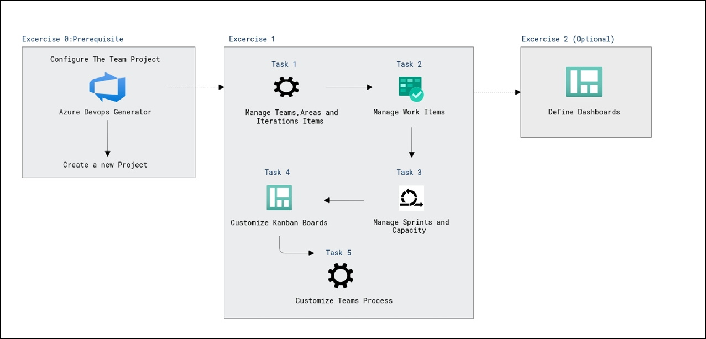

# Lab Scenario Preview: AZ-400: Get started on a DevOps transformation journey

## Lab 01: Agile Planning and Portfolio Management with Azure Boards

### Lab overview

In this lab, you will learn about the agile planning and portfolio management tools and processes provided by Azure Boards and how they can help you quickly plan, manage, and track work across your entire team. You will explore the product backlog, sprint backlog, and task boards which can be used to track the flow of work during the course of an iteration. We will also take a look at how the tools have been enhanced in this release to scale for larger teams and organizations.

### Objectives

After you complete this lab, you will be able to:

-   Manage teams, areas, and iterations
-   Manage work items
-   Manage sprints and capacity
-   Customize Kanban boards
-   Define dashboards
-   Customize team process

### Architecture Diagram

  

>**Note**: Once you understand the lab's content, you can start the Hands-on Lab by clicking the **Launch** button located at the top right corner which leads you to the lab environment and lab guide interface. You can also have a detailed preview of the full lab guide [here](https://experience.cloudlabs.ai/#/labguidepreview/0e3e76c8-92f9-4b85-bdc7-51134b2964fe), prior to launching your environment.
