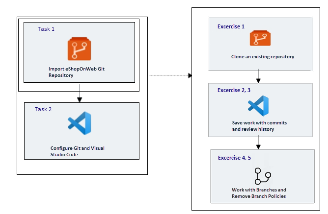

# Lab Scenario Preview: AZ-400: Work with Azure Repos and GitHub

## Lab 02: Version Controlling with Git in Azure Repos

### Lab overview

Azure DevOps supports two types of version control, Git and Team Foundation Version Control (TFVC). Here is a quick overview of the two version control systems:

- **Team Foundation Version Control (TFVC)**: TFVC is a centralized version control system. Typically, team members have only one version of each file on their dev machines. Historical data is maintained only on the server. Branches are path-based and created on the server.

- **Git**: Git is a distributed version control system. Git repositories can live locally (such as on a developer's machine). Each developer has a copy of the source repository on their dev machine. Developers can commit each set of changes on their dev machine and perform version control operations such as history and compare without a network connection.

Git is the default version control provider for new projects. You should use Git for version control in your projects unless you have a specific need for centralized version control features in TFVC.

In this lab, you will learn how to establish a local Git repository, which can easily be synchronized with a centralized Git repository in Azure DevOps. In addition, you will learn about Git branching and merging support. You will use Visual Studio Code, but the same processes apply for using any Git-compatible client.

### Objectives

After you complete this lab, you will be able to:

-   Clone an existing repository
-   Save work with commits
-   Review history of changes
-   Work with branches by using Visual Studio Code

### Architecture Diagram

   

>**Note**: Once you understand the lab's content, you can start the Hands-on Lab by clicking the **Launch** button located at the top right corner which leads you to the lab environment and lab guide interface. You can also have a detailed preview of the full lab guide [here](https://experience.cloudlabs.ai/#/labguidepreview/0f2474c8-6e12-4351-9dab-77d7c162af1f), prior to launching your environment.
