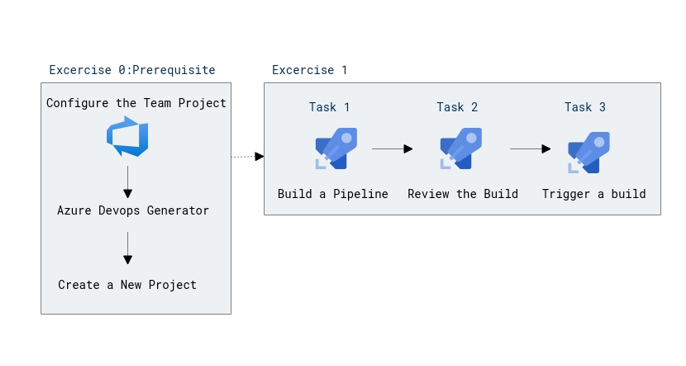
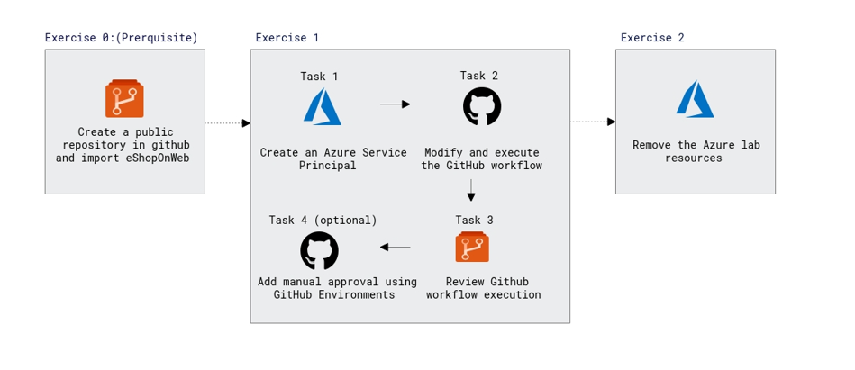

# Lab Scenario Preview: AZ-400: Implement CI with Azure Pipelines and GitHub Actions - Part A

## Lab 03: Configuring Agent Pools and Understanding Pipeline Styles

### Lab overview

YAML-based pipelines allow you to fully implement CI/CD as code, in which pipeline definitions reside in the same repository as the code that is part of your Azure DevOps project. YAML-based pipelines support a wide range of features that are part of the classic pipelines, such as pull requests, code reviews, history, branching, and templates. 

Regardless of the choice of the pipeline style, to build your code or deploy your solution by using Azure Pipelines, you need an agent. An agent hosts compute resources that runs one job at a time. Jobs can be run directly on the host machine of the agent or in a container. You have an option to run your jobs using Microsoft-hosted agents, which are managed for you, or implementing a self-hosted agent that you set up and manage on your own. 

In this lab, you will learn how to implement and use self-hosted agents with YAML pipelines.

### Objectives

After you complete this lab, you will be able to:

- implement YAML-based pipelines
- implement self-hosted agents

### Architecture Diagram

   
   
## Lab 04: Enabling Continuous Integration with Azure Pipelines

### Lab overview

In this lab, you will learn how to configure continuous integration (CI) and continuous deployment (CD) for your applications using Build and Release in Azure Pipelines. This scriptable CI/CD system is both web-based and cross-platform, while also providing a modern interface for visualizing sophisticated workflows. Although we won’t demonstrate all of the cross-platform possibilities in this lab, it is important to point out that you can also build for iOS, Android, Java (using Ant, Maven, or Gradle) and Linux.

### Objectives

After you complete this lab, you will be able to:

-   Create a basic build pipeline from a template
-   Track and review a build
-   Invoke a continuous integration build

### Architecture Diagram

  
  
## Lab 05: Implementing GitHub Actions for CI/CD

### Lab overview

In this lab, you will learn how to implement a GitHub Action workflow that deploys an Azure web app by using DevOps Starter.

### Objectives

After you complete this lab, you will be able to:

- Implement a GitHub Action workflow by using DevOps Starter
- Explain the basic characteristics of GitHub Action workflows

### Architecture Diagram

   

