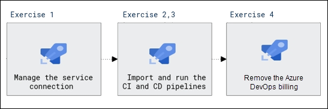

# Lab Scenario Preview: AZ-400: Implement CI with Azure Pipelines and GitHub Actions - Part B

## Lab 05: Implementing GitHub Actions for CI/CD

### Lab overview

In this lab, you will learn how to implement a GitHub Action workflow that deploys an Azure web app by using DevOps Starter.

### Objectives

After you complete this lab, you will be able to:

- Implement a GitHub Action workflow by using DevOps Starter
- Explain the basic characteristics of GitHub Action workflows

### Architecture Diagram

   

## Lab 06: Deploying Docker containers to Azure App Service web apps

### Lab overview

In this lab, you will learn how to use an Azure DevOps CI/CD pipeline to build a custom Docker image, push it to Azure Container Registry, and deploy it as a container to Azure App Service. 

### Objectives

After you complete this lab, you will be able to:

- Build a custom Docker image by using an Microsoft hosted Linux agent
- Push an image to Azure Container Registry
- Deploy a Docker image as a container to Azure App Service by using Azure DevOps

### Architecture Diagram

   

>**Note**: Once you understand the lab's content, you can start the Hands-on Lab by clicking the **Launch** button located at the top right corner which leads you to the lab environment and guide. You can also have a detailed preview the full lab guide [here](https://experience.cloudlabs.ai/#/labguidepreview/5694c962-b934-4d3b-9588-16880d4b7b71), prior to launching your environment.
