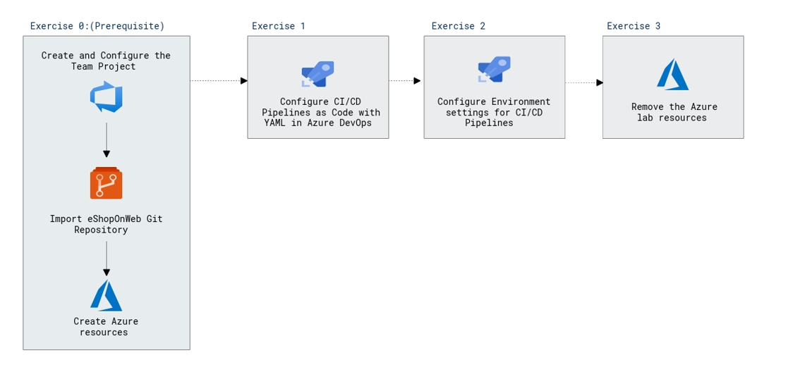
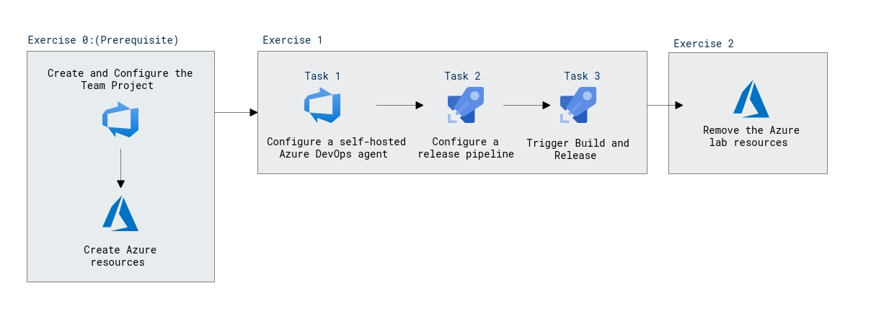
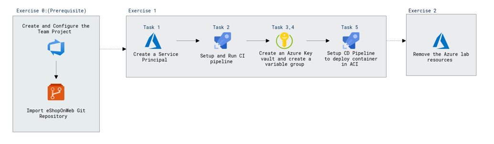
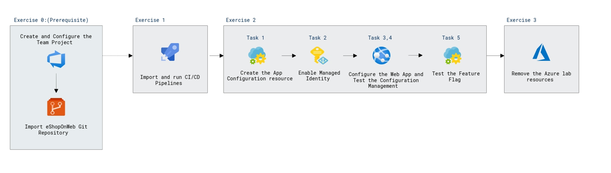

# Lab Scenario Preview: AZ-400: Implement a secure continuous deployment using Azure Pipelines

## Lab 08: Configuring Pipelines as Code with YAML

### Lab overview

Azure DevOps supports two types of version control, Git and Team Foundation Version Control (TFVC). Here is a quick overview of the two version control systems:

- **Team Foundation Version Control (TFVC)**: TFVC is a centralized version control system. Typically, team members have only one version of each file on their dev machines. Historical data is maintained only on the server. Branches are path-based and created on the server.

- **Git**: Git is a distributed version control system. Git repositories can live locally (such as on a developer's machine). Each developer has a copy of the source repository on their dev machine. Developers can commit each set of changes on their dev machine and perform version control operations such as history and compare without a network connection.

Git is the default version control provider for new projects. You should use Git for version control in your projects unless you have a specific need for centralized version control features in TFVC.

In this lab, you will learn how to establish a local Git repository, which can easily be synchronized with a centralized Git repository in Azure DevOps. In addition, you will learn about Git branching and merging support. You will use Visual Studio Code, but the same processes apply for using any Git-compatible client.

### Objectives

After you complete this lab, you will be able to:

-   configure CI/CD pipelines as code with YAML in Azure DevOps

### Architecture Diagram

   
   
## Lab 09: Setting Up and Running Functional Tests

### Lab overview

[Selenium](http://www.seleniumhq.org/) is a portable open source software-testing framework for web applications. It has the capability to operate on almost every operating system. It supports all modern browsers and multiple languages including .NET (C#), Java.

In this lab, you will learn how to execute Selenium test cases on a C# web application, as part of the Azure DevOps Release pipeline. 

### Objectives

After you complete this lab, you will be able to:

- Configure a self-hosted Azure DevOps agent
- Configure release pipeline
- Trigger build and release
- Run tests in Chrome and Firefox

### Architecture Diagram

## Lab 10: Integrating Azure Key Vault with Azure DevOps

### Lab overview

Azure Key Vault provides secure storage and management of sensitive data, such as keys, passwords, and certificates. Azure Key Vault includes supports for hardware security modules, as well as a range of encryption algorithms and key lengths. By using Azure Key Vault, you can minimize the possibility of disclosing sensitive data through source code, which is a common mistake made by developers. Access to Azure Key Vault requires proper authentication and authorization, supporting fine grained permissions to its content.

In this lab, you will see how you can integrate Azure Key Vault with an Azure DevOps pipeline by using the following steps:

- create an Azure Key vault to store a MySQL server password as a secret.
- create an Azure service principal to provide access to secrets in the Azure Key vault.
- configure permissions to allow the service principal to read the secret.
- configure pipeline to retrieve the password from the Azure Key vault and pass it on to subsequent tasks.

### Objectives

After you complete this lab, you will be able to:

-   Create an Azure Active Directory (Azure AD) service principal.
-   Create an Azure key vault. 
-   Track pull requests through the Azure DevOps pipeline.

### Architecture Diagram

   
   
## Lab 11: Enable Dynamic Configuration and Feature Flags

### Lab overview

[Azure App Configuration](https://learn.microsoft.com/azure/azure-app-configuration/overview) provides a service to manage application settings and feature flags centrally. Modern programs, especially those running in a cloud, generally have many distributed components. Spreading configuration settings across these components can lead to hard-to-troubleshoot errors during application deployment. Use App Configuration to store all the settings for your application and secure their accesses in one place.

### Objectives

After you complete this lab, you will be able to:

- Enable dynamic configuration
- Manage feature flags

### Architecture Diagram

  

