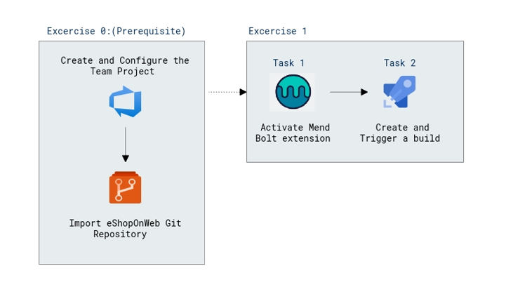

# Lab Scenario Preview: AZ-400: Implement security and validate code bases for compliance - Part A

## Lab 13: Implement Security and Compliance in an Azure Pipeline

### Lab overview

In this lab, you will use **WhiteSource Bolt with Azure DevOps** to automatically detect vulnerable open source components, outdated libraries, and license compliance issues in your code. You will leverage WebGoat, an intentionally insecure web application, maintained by OWASP designed to illustrate common web application security issues.

[WhiteSource](https://www.whitesourcesoftware.com/) is the leader in continuous open source software security and compliance management. WhiteSource integrates into your build process, irrespective of your programming languages, build tools, or development environments. It works automatically, continuously, and silently in the background, checking the security, licensing, and quality of your open source components against WhiteSource constantly-updated definitive database of open source repositories.

WhiteSource provides WhiteSource Bolt, a lightweight open source security and management solution developed specifically for integration with Azure DevOps and Azure DevOps Server. Note that WhiteSource Bolt works per project and does not offer real-time alert capabilities, which requires **Full platform**, generally recommended for larger development teams that want to automate their open source management throughout the entire software development lifecycle (from the repositories to post-deployment stages) and across all projects and products.

Azure DevOps integration with WhiteSource Bolt will enable you to:

- Detect and remedy vulnerable open source components.
- Generate comprehensive open source inventory reports per project or build.
- Enforce open source license compliance, including dependencies’ licenses.
- Identify outdated open source libraries with recommendations to update.

### Objectives

After you complete this lab, you will be able to:

- Activate WhiteSource Bolt
- Run a build pipeline and review WhiteSource security and compliance report

### Architecture Diagram

   

>**Note**: Once you understand the lab's content, you can start the Hands-on Lab by clicking the **Launch** button located at the top right corner which leads you to the lab environment and guide. You can also have a detailed preview the full lab guide [here](https://experience.cloudlabs.ai/#/labguidepreview/07b47b5c-983f-4f4e-b876-0a707d62aebe), prior to launching your environment.
