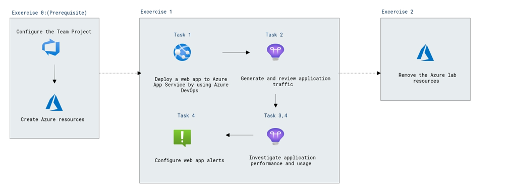

# Lab Scenario Preview: AZ-400: Implement continuous feedback - Part A

## Lab 16: Monitoring Application Performance with Application Insights

### Lab overview

Application Insights is an extensible Application Performance Management (APM) service for web developers on multiple platforms. You can use it to monitor your live web applications. It automatically detects performance anomalies, includes powerful analytics tools to help you diagnose issues, and helps you continuously improve performance and usability. It works for apps on a wide variety of platforms including .NET, Node.js and Java EE, hosted on-premises, hybrid, or any public cloud. It integrates with your DevOps process with connection points available in a variety of development tools. It also allows you to monitor and analyze telemetry from mobile apps through integration with Visual Studio App Center.

In this lab, you'll learn about how you can add Application Insights to an existing web application, as well as how to monitor the application via the Azure portal.

### Objectives

After you complete this lab, you will be able to:

- Deploy Azure App Service web apps
- Generate and monitor Azure web app application traffic by using Application Insights
- Investigate Azure web app performance by using Application Insights
- Track Azure web app usage by using Application Insights
- Create Azure web app alerts by using Application Insights

### Architecture Diagram

   
